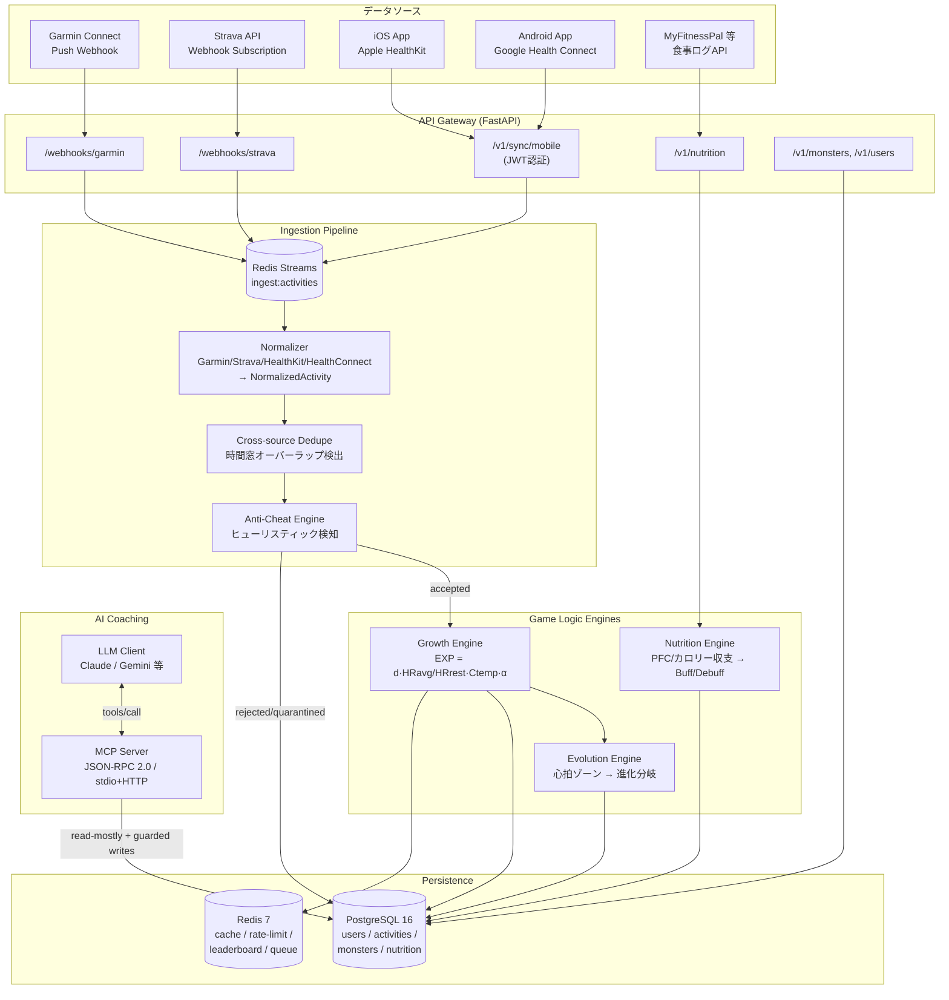

# Project MonsterRun — Backend Architecture

ランニングデータと連動して進化するデジタル生命体育成ゲームのサーバーサイド設計図。

- **Stack**: FastAPI (Python 3.12) / SQLAlchemy 2.0 (async) / PostgreSQL 16 / Redis 7
- **Scope**: データインジェスト、成長数理エンジン、栄養連携、アンチチート、MCPサーバー
- **Out of scope**: フロントエンド (WebGL/Three.js)

---

## 1. アーキテクチャ構成図



### 処理フロー（アクティビティ1件のライフサイクル）

```
Webhook/Sync受信 → 署名検証 → 生ペイロードを raw_payloads に保存(監査用)
  → Redis Streams へ enqueue → ワーカーが Normalizer でパース
  → NormalizedActivity(共通スキーマ) へ正規化 → 重複排除(external_id + 時間窓)
  → Anti-Cheat スコアリング → accepted なら Growth Engine で EXP/進化P計算
  → exp_ledger に記帳(冪等) → monsters を更新 → WebSocket/Pushで通知
```

### 設計原則

| 原則 | 実装 |
|------|------|
| 冪等性 | `(source, external_id)` の一意制約 + `exp_ledger` による二重付与防止 |
| 監査可能性 | 生Webhookペイロードは `raw_payloads` に永続化。EXPは台帳方式で再計算可能 |
| チートは削除でなく隔離 | `status=quarantined` で保持し、閾値・アルゴリズム改善後に再判定できる |
| トークン保護 | OAuthトークンは Fernet (AES-128-CBC+HMAC) でアプリケーション層暗号化 |
| LLMアクセス最小権限 | MCPは read-mostly。書込系ツールは冪等キー必須 + サーバー側バリデーション |

---

## 2. Redis キー設計

| キー | 型 | 用途 | TTL |
|------|-----|------|-----|
| `ingest:activities` | Stream | インジェストキュー（consumer group: `workers`） | maxlen 100k |
| `user:{id}:monster` | Hash | モンスターステータスのキャッシュ | 300s |
| `user:{id}:hr_baseline` | Hash | 安静時心拍・最大心拍のローリング値 | 7d |
| `ratelimit:webhook:{source}:{key}` | String | Webhookレート制限（INCR+EXPIRE） | 60s |
| `dedupe:activity:{user}:{bucket}` | Set | 時間窓バケットの重複検出 | 48h |
| `leaderboard:weekly_exp` | ZSet | 週間EXPリーダーボード | 8d |
| `mcp:idempotency:{key}` | String | MCP書込ツールの冪等キー | 24h |

---

## 3. ディレクトリ構成

```
monsterrun-backend/
├── README.md                  ← このファイル（設計図）
├── pyproject.toml
├── docker-compose.yml
├── .env.example
├── migrations/
│   └── 001_initial_schema.sql ← PostgreSQL DDL（本番マイグレーション）
├── mcp/
│   └── tools.json             ← MCPツール定義（JSON Schema）
├── app/
│   ├── main.py                ← FastAPI エントリポイント
│   ├── config.py              ← Pydantic Settings
│   ├── db.py                  ← async SQLAlchemy / Redis 接続
│   ├── models.py              ← ORM モデル（DDLと1:1対応）
│   ├── schemas/
│   │   ├── activity.py        ← NormalizedActivity + モバイル送信スキーマ
│   │   └── nutrition.py
│   ├── api/
│   │   ├── webhooks_garmin.py
│   │   ├── webhooks_strava.py
│   │   ├── mobile_sync.py     ← HealthKit / Health Connect 受信
│   │   ├── nutrition.py
│   │   └── monsters.py
│   ├── ingestion/
│   │   ├── base.py            ← Normalizer 抽象基底
│   │   ├── garmin.py
│   │   ├── strava.py
│   │   ├── apple_healthkit.py
│   │   ├── google_health_connect.py
│   │   └── pipeline.py        ← ワーカー：dequeue→正規化→判定→反映
│   ├── engine/
│   │   ├── growth.py          ← EXP計算（初心者優遇カーブ）
│   │   ├── evolution.py       ← 心拍ゾーン進化分岐
│   │   ├── nutrition.py       ← PFC/収支 → コンディション/Buff
│   │   └── anticheat.py       ← ヒューリスティックアンチチート
│   ├── mcp_server/
│   │   └── server.py          ← JSON-RPC 2.0 MCPサーバー
│   └── security/
│       └── oauth.py           ← トークン暗号化・リフレッシュ
└── tests/
    ├── test_growth.py
    └── test_anticheat.py
```

---

## 4. 外部連携仕様サマリ

### Garmin Connect Developer Program
- **Push API (Webhook)**: `POST /webhooks/garmin/activities`。Garminは登録済みエンドポイントに `activityDetails` / `dailies` をpush。受信後 **即座に 200 を返し**、処理はキューへ（3秒以内に応答しないと再送・最終的に配信停止されるため）。
- 認証: OAuth 2.0 PKCE（旧OAuth1から移行済み前提）。`userAccessToken` ↔ 内部ユーザーの対応表を `wearable_connections` に保持。

### Strava API
- **Webhook Subscription**: 作成時に `GET` で `hub.challenge` エコーバック検証（`/webhooks/strava` が対応）。イベントは `object_type=activity` の `create/update/delete` のみで**中身は含まれない**ため、受信後に `GET /activities/{id}` をトークンで取得（fetch-on-event方式）。
- レート制限: 100 req/15min, 1000/day → Redisでバックオフ管理。

### Apple HealthKit / Google Health Connect
- サーバー直結APIは存在しないため、**モバイルアプリがバックグラウンド同期で `POST /v1/sync/mobile` に送信**（JWT認証、バッチ形式、クライアント側で HKWorkout / ExerciseSession 単位に整形）。
- スキーマは `app/schemas/activity.py` の `HealthKitWorkoutPayload` / `HealthConnectSessionPayload` を参照。歩数・アクティブエネルギー・心拍サンプル・GPS軌跡を含む。

### 食事ログ（MyFitnessPal 等）
- MFPの公式APIはパートナー限定のため、アダプタ層（`NutritionProvider`）で抽象化し、手入力/CSV/他社API（Cronometer等）を差し替え可能に。`POST /v1/nutrition/logs` が共通受け口。

---

## 5. 成長数理エンジン仕様

### EXP計算式

```
EXP = d × (HR_avg / HR_rest) × C_temp × α × novice_bonus
```

- `d`: 距離 (km)
- `HR_avg / HR_rest`: 相対心拍努力。**初心者は同じペースでも心拍が上がりやすい**ため、この比が自然に大きくなり優遇される。上限クリップ（3.5）でチート/異常値を抑制
- `C_temp`: 環境補正（WBGT近似。暑熱・寒冷で最大1.15倍）
- `α`: グローバル調整定数（デフォルト 10.0）
- `novice_bonus`: 生涯累積距離に対する指数減衰ボーナス（開始時 ×1.5 → 1000km で ×1.0 に漸近）。初心者の立ち上がり体験を強化

### 進化分岐（心拍ゾーン蓄積）

Karvonen法の心拍予備能 (HRR%) で5ゾーンに分割し、滞在時間を進化ポイントへ変換:

| ゾーン | HRR% | 蓄積先 |
|--------|------|--------|
| Z1–Z2 (LSD) | <70% | `stamina_points` → **スタミナ/防御型** 系統 |
| Z3 | 70–80% | 両系統に半分ずつ |
| Z4–Z5 (HIIT) | >80% | `speed_points` → **スピード/攻撃型** 系統 |

進化ゲージ満了時、`speed_points / stamina_points` 比で分岐先を決定（拮抗時は「バランス型」）。

### 栄養 → コンディション

- エネルギー収支 = 摂取kcal − (BMR + アクティブkcal)
- PFC実績 vs 目標（P30/F25/C45）の乖離をスコア化
- 例: タンパク質 ≥1.6g/kg → `protein_boost`（EXP+10%）、過度なカロリー欠損が連続 → `underfueled`（EXP−30% + 休養提案）※過剰減量の抑止をゲームメカニクスに組込み

---

## 6. アンチチートエンジン仕様

スコアベース（0–100）。各ヒューリスティックが重み付きフラグを加算し、閾値超過で `quarantined`。

| # | 検知対象 | ヒューリスティック | 重み |
|---|---------|-------------------|------|
| H1 | 乗り物移動 | 移動平均速度 > 25km/h が 120秒以上継続 | 40 |
| H2 | 乗り物移動 | 速度 ≥15km/h なのに HR が安静時+15bpm 未満 | 35 |
| H3 | 物理シェイカー | 歩数から逆算したストライド長が 0.35–2.6m の生理的範囲外 | 30 |
| H4 | 物理シェイカー | 歩数増加中に GPS変位ほぼゼロ & HR平坦 | 30 |
| H5 | GPS偽装 | 隣接GPS点間の瞬間速度スパイク（テレポート）/ 加速度 > 3.0 m/s² | 25 |
| H6 | 多重申告 | 複数ソースで時間窓が重複する活動（dedupeで正規化、EXPは1回のみ） | — |

閾値: score ≥ 50 → `quarantined`（EXP付与なし・再判定可能）、25–49 → `flagged`（付与するが監査ログ）、<25 → `accepted`。

---

## 7. MCPサーバー仕様（→ `mcp/tools.json`）

- プロトコル: MCP (JSON-RPC 2.0)。stdio と Streamable HTTP の両対応
- 認可: HTTP時は `Authorization: Bearer <service_token>` + ツール毎スコープ（`read:status` / `write:exp`）
- 読取ツール: `get_user_status`, `get_monster_status`, `get_recent_activities`, `get_nutrition_summary`
- 書込ツール: `apply_training_exp`, `grant_coaching_buff` — **冪等キー必須**、サーバー側で上限クランプ（LLMの幻覚による無限EXP付与を構造的に防止）
- PII最小化: 氏名・メール等はツール応答から除外。user_id は不透明ID

---

## 8. 起動方法

```bash
cp .env.example .env
docker compose up -d postgres redis
psql "$DATABASE_URL" -f migrations/001_initial_schema.sql
uv sync                      # または pip install -e .
uvicorn app.main:app --reload            # APIサーバー
python -m app.ingestion.pipeline         # インジェストワーカー
python -m app.mcp_server.server          # MCPサーバー (stdio)
pytest                                   # テスト
```
