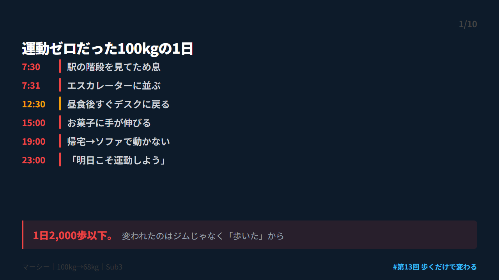
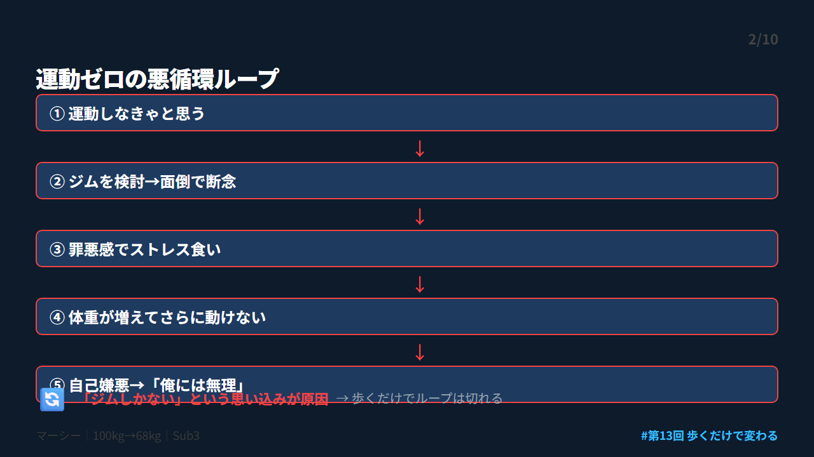
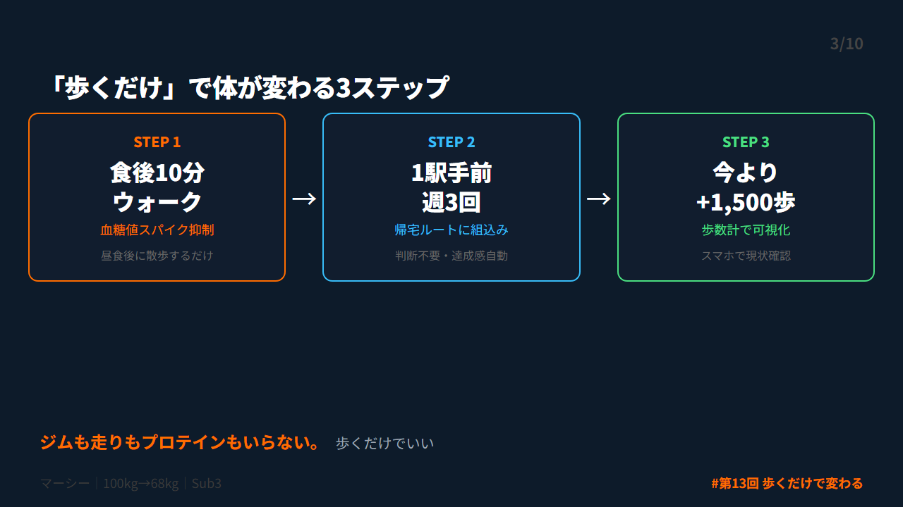
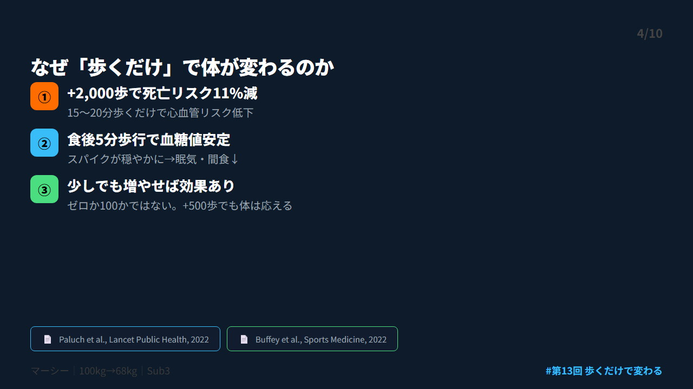
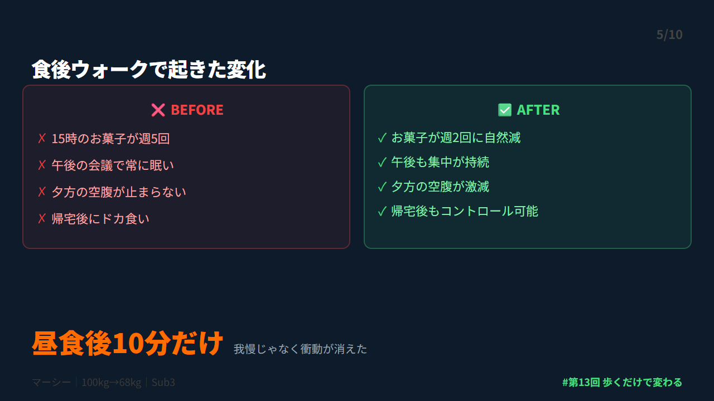
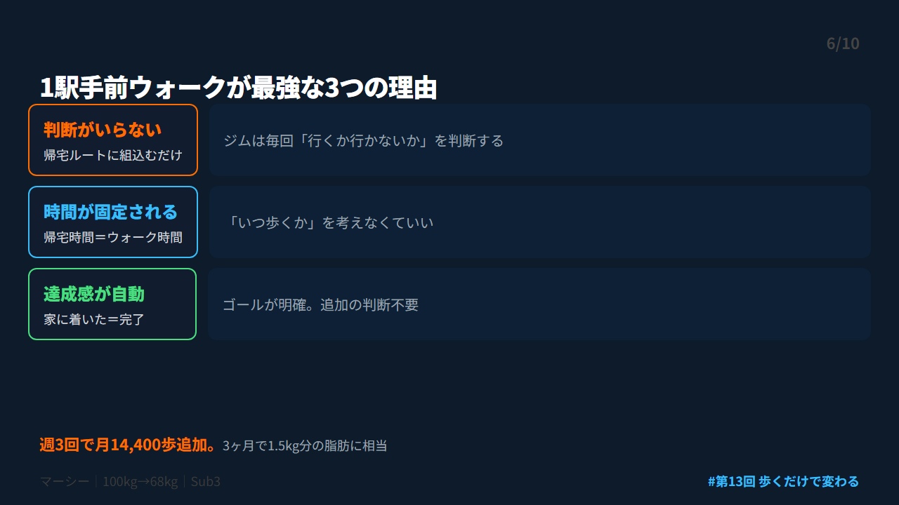
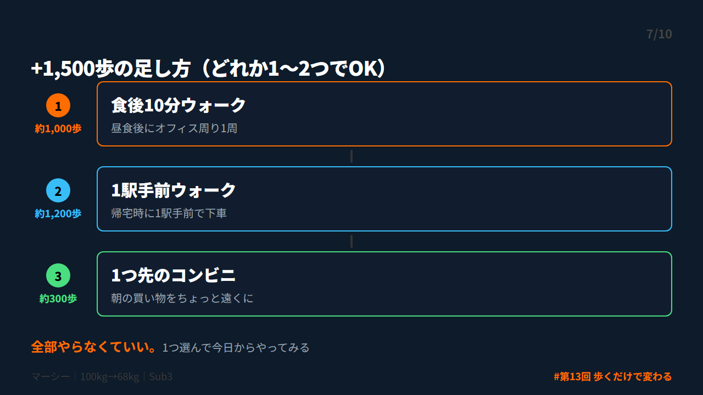
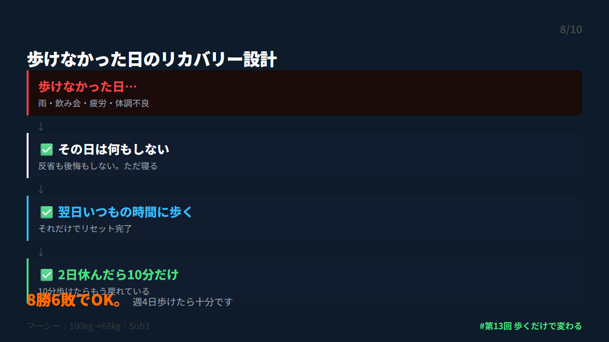
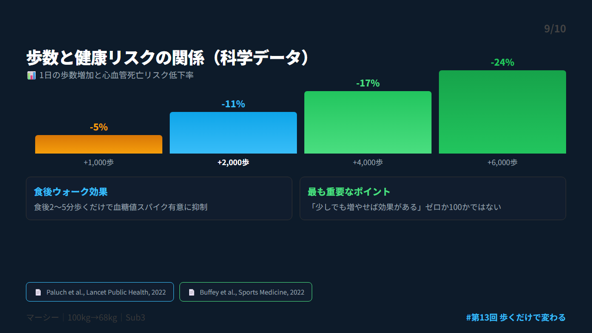
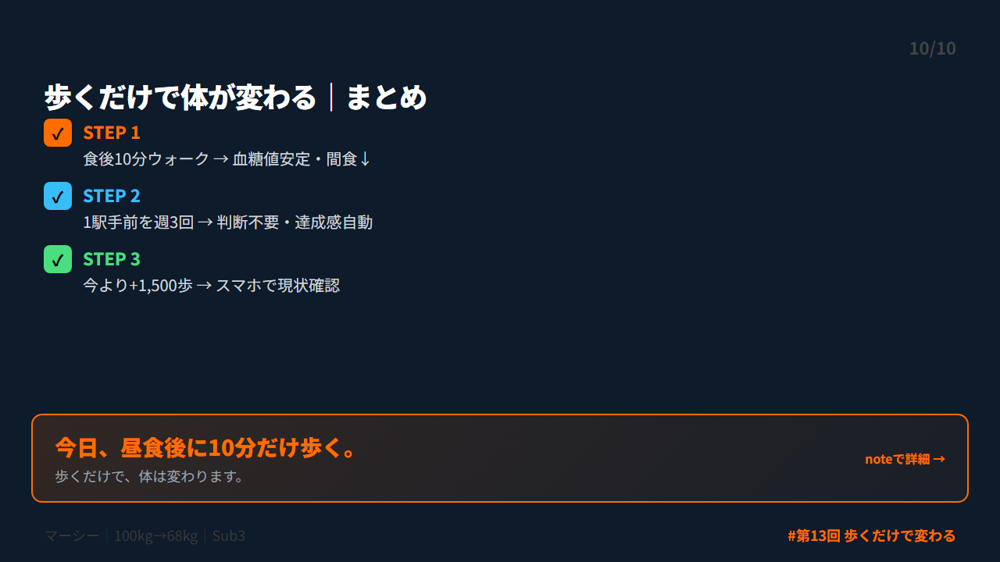

# 第 X投稿スレッド（10本）

## 投稿1/10｜共感

```
駅の階段を見て、ため息をつく。
「また今日もエスカレーターか」

100kgだった頃、2階に上がるだけで息が切れてた。
1日の歩数は2,000歩以下。
ジムの体験に行っても場違いで1回でやめた。

変われたのはジムに通えたからじゃない。
帰り道に15分歩いただけです。

↓続き（2/10）

#ダイエット #メタボ #習慣化 #ウォーキング #運動習慣
```



---

## 投稿2/10｜原因

```
運動ゼロから抜け出せない悪循環。

①運動しなきゃと思う
②ジムを検討→面倒で断念
③罪悪感でストレス食い
④体重が増えてさらに動けない
⑤自己嫌悪…

このループ、意志の問題じゃなかった。
「ジムしかない」という思い込みが原因でした。

↓続き（3/10）

#ダイエット #メタボ #習慣化 #ウォーキング #運動習慣
```



---

## 投稿3/10｜解決策

```
歩くだけで体は変わる。

Lancet Public Health 2022年の大規模研究で判明：
+2,000歩/日で心血管死亡リスク約11%減。

時間にして約15〜20分。
ジムも走りもプロテインもいらない。
「歩くだけ」が科学的に最もラクで効く運動でした。

↓続き（4/10）

#ダイエット #メタボ #習慣化 #ウォーキング #運動習慣
```



---

## 投稿4/10｜仕組み

```
食後に10分歩くだけで血糖値が変わる。

Sports Medicine 2022年の研究：
食後2〜5分の軽い歩行で血糖値スパイクが有意に抑制。

つまり食後に10分歩けば：
・午後の眠気↓
・間食欲求↓
・脂肪蓄積↓

一石三鳥。散歩レベルでOKです。

↓続き（5/10）

#ダイエット #メタボ #習慣化 #ウォーキング #運動習慣
```



---

## 投稿5/10｜効果

```
食後ウォークで僕に起きた変化。

・15時のお菓子が週5→週2に
・午後の会議で眠くならなくなった
・夕方の空腹感が激減
・帰宅後のドカ食いが減った

やったことは昼食後にオフィスの周り1周。
10分もかからない。我慢じゃなく衝動が消えた。

↓続き（6/10）

#ダイエット #メタボ #習慣化 #ウォーキング #運動習慣
```



---

## 投稿6/10｜設計

```
1駅手前ウォークが最強な3つの理由。

①判断がいらない
→帰宅ルートに組み込むだけ

②時間が固定される
→「いつ歩くか」を迷わない

③達成感が自動で得られる
→家に着いた＝完了

週3回で月14,400歩追加。3ヶ月で1.5kg分の脂肪。

↓続き（7/10）

#ダイエット #メタボ #習慣化 #ウォーキング #運動習慣
```



---

## 投稿7/10｜実践

```
今日から始める+1,500歩の足し方。

食後10分ウォーク → 約1,000歩
1駅手前 → 約1,200歩
1つ先のコンビニ → 約300歩

どれか1つか2つでOK。
僕は2,000歩→3,500歩→5,000歩→8,000歩と増えた。
最初の目標はたった+1,500歩でした。

↓続き（8/10）

#ダイエット #メタボ #習慣化 #ウォーキング #運動習慣
```



---

## 投稿8/10｜復帰

```
歩けない日は、普通にある。

雨の日。飲み会の日。疲れた日。
僕も週7日歩いてるわけじゃない。

週4日歩けたら十分。
8勝6敗でOK。

崩れたら翌日また歩くだけ。
100kgから68kgになれたのは
崩れるたびに翌日歩き始めたから。

↓続き（9/10）

#ダイエット #メタボ #習慣化 #ウォーキング #運動習慣
```



---

## 投稿9/10｜深掘り

```
歩数と健康の関係を数字で見る。

+2,000歩/日 → 心血管死亡リスク11%減
+4,000歩/日 → 全死亡リスク有意に低下
食後5分歩行 → 血糖値スパイク抑制

出典：
Paluch et al., Lancet Public Health 2022
Buffey et al., Sports Medicine 2022

↓続き（10/10）

#ダイエット #メタボ #習慣化 #ウォーキング #運動習慣
```



---

## 投稿10/10｜今夜やること

```
【まとめ｜歩くだけで体が変わる3ステップ】

✅ 食後10分ウォーク → 血糖値安定・間食欲求↓
✅ 1駅手前を週3回 → 判断不要・達成感自動
✅ 今より+1,500歩 → スマホで現状確認→目標設定

今日、昼食後に10分だけ歩いてみてください。
歩くだけで、体は変わります。

詳しくはnoteに書きました👇
https://note.com/mash_anti_metabo

#ダイエット #メタボ #習慣化 #ウォーキング #運動習慣
```



---


