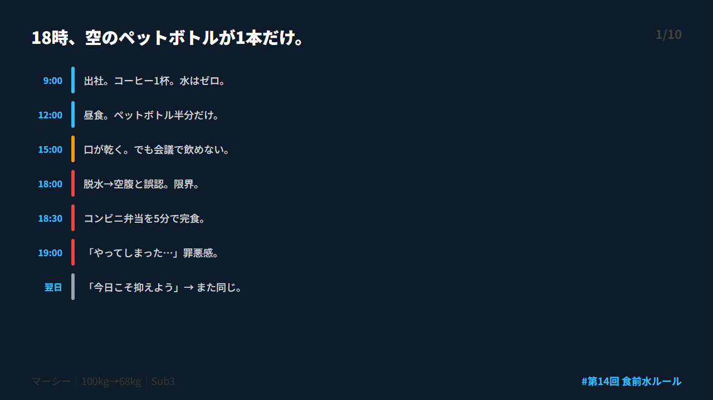
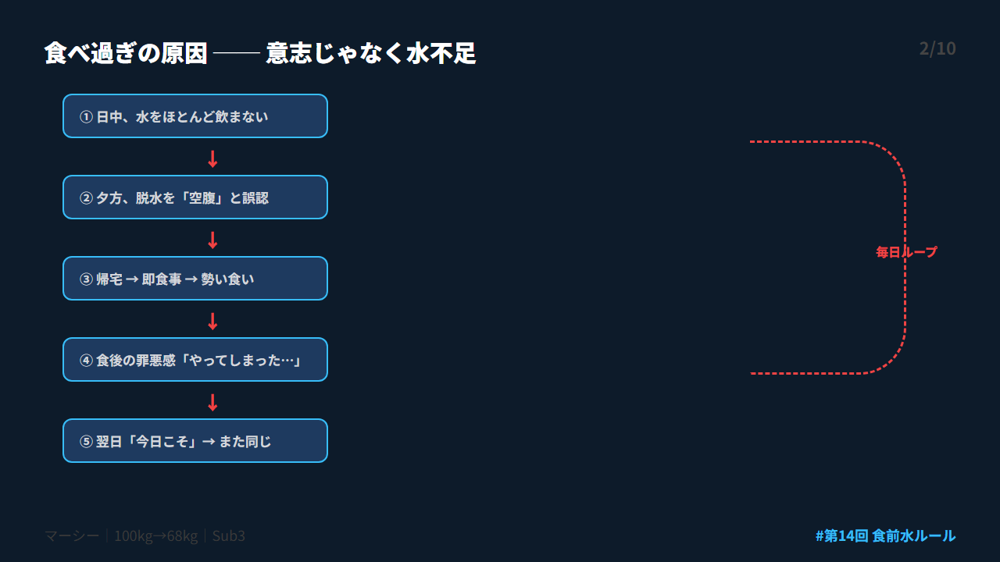
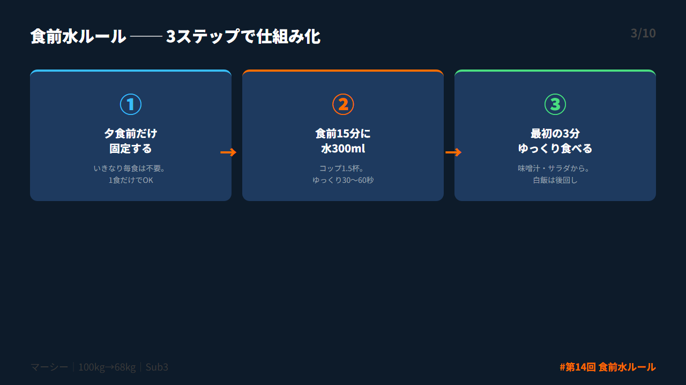
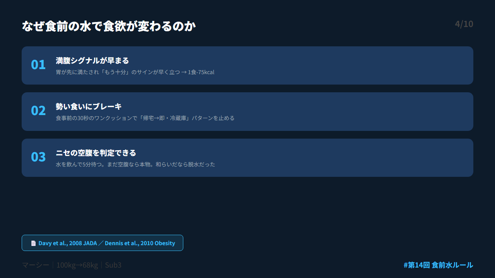
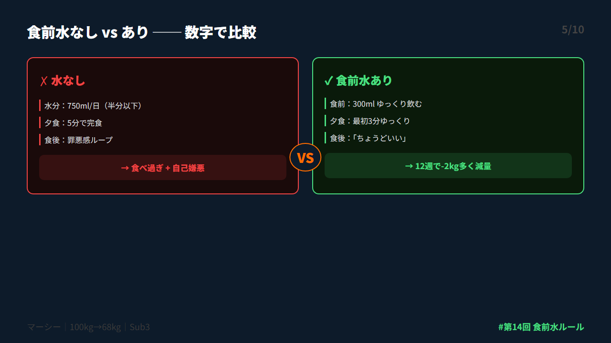
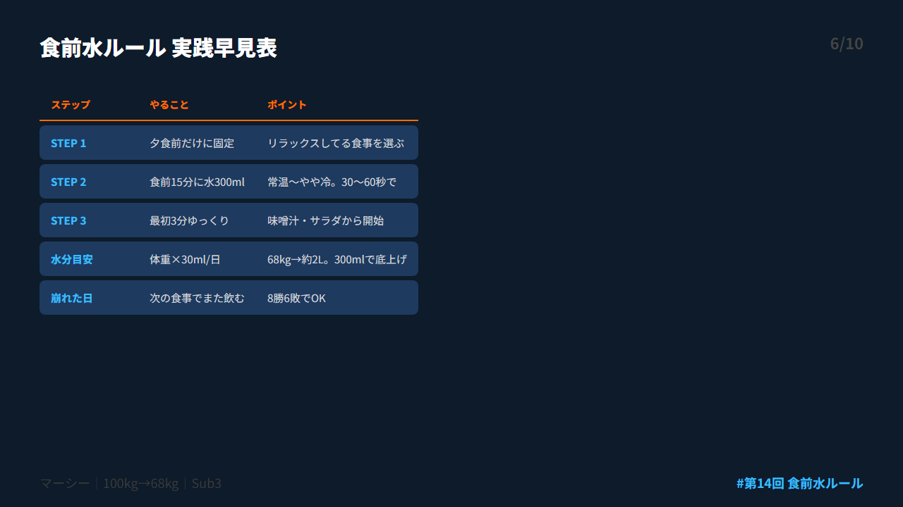
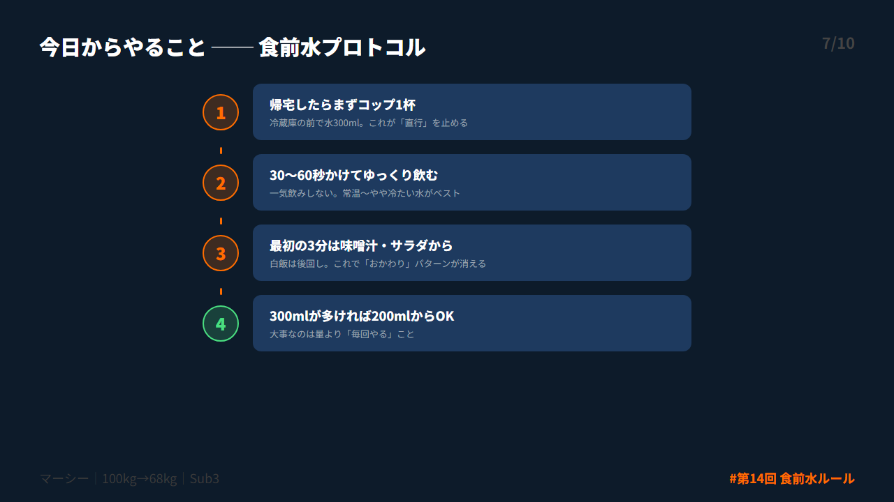
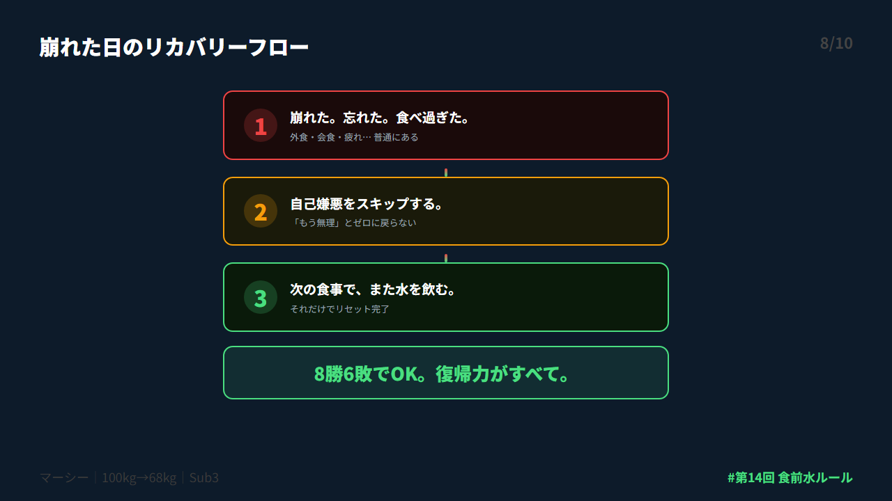
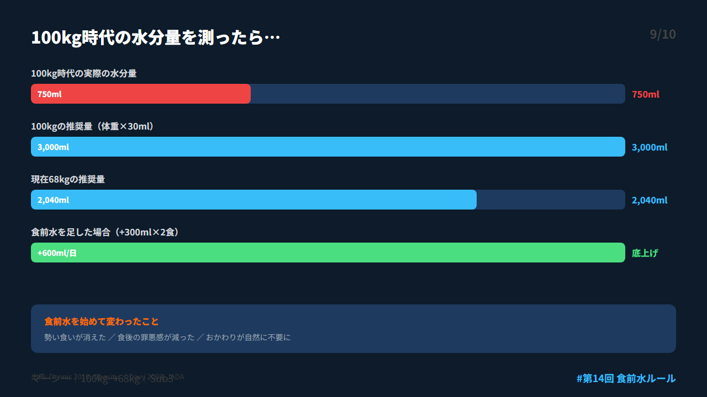
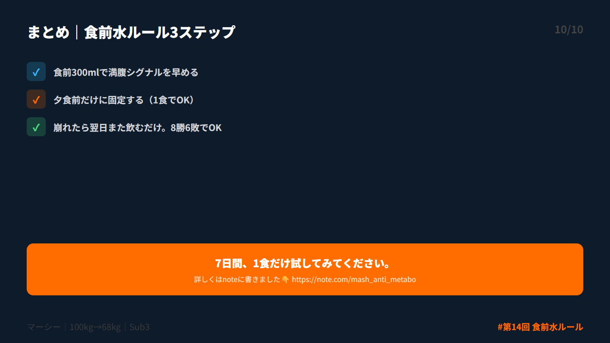

# 第 X投稿スレッド（10本）

## 投稿1/10｜共感

```
18時、デスクに空のペットボトルが1本。
「今日も全然飲んでなかった…」

でも喉の渇きより先に、腹が減ってる。
コンビニ弁当を5分で食べ切って、食後の罪悪感。

100kgだった頃、毎日これを繰り返してた。
原因は「水」だった。

↓続き（2/10）

#ダイエット #メタボ #習慣化 #食事管理 #水分補給
```



---

## 投稿2/10｜原因

```
夕食の食べ過ぎ、意志の弱さじゃなかった。

①日中、水をほぼ飲まない
②夕方、脱水を空腹と誤認
③帰宅→即食事→勢い食い
④罪悪感→翌日も同じ

体が「食べろ」と誤信号を出してただけ。
水不足が全ての始まりだった。

↓続き（3/10）

#ダイエット #メタボ #習慣化 #食事管理 #水分補給
```



---

## 投稿3/10｜解決策

```
結論：食前に水300mlを飲むだけ。

これだけで食欲の暴走は抑えやすくなる。

食事を変える前に、食事の「前」を変える。
大きな努力の前に、小さな前処理。

3ステップで仕組み化できます。

↓続き（4/10）

#ダイエット #メタボ #習慣化 #食事管理 #水分補給
```



---

## 投稿4/10｜仕組み

```
食前の水が効く科学的理由。

①満腹シグナルが早まる
→ 1食-75kcal（Davy 2008, JADA）

②勢い食いにブレーキ
→ 30秒のワンクッション

③ニセの空腹を判定
→ 水を飲んで5分待つだけ

↓続き（5/10）

#ダイエット #メタボ #習慣化 #食事管理 #水分補給
```



---

## 投稿5/10｜効果

```
食前水の効果、数字で見ると。

❌ 水なし：脱水→誤認→5分で完食→罪悪感
✅ 水あり：300ml→ゆっくり開始→適量で満足

12週間で約2kg多く減量（Dennis 2010, Obesity誌）
月に換算すると脂肪-300g。

↓続き（6/10）

#ダイエット #メタボ #習慣化 #食事管理 #水分補給
```



---

## 投稿6/10｜設計

```
食前水ルール、実践早見表。

STEP1：夕食前だけに固定
STEP2：食前15分に水300ml
STEP3：最初の3分ゆっくり食べる

水分目安：体重×30ml/日
（68kg→約2L、100kg→約3L）

↓続き（7/10）

#ダイエット #メタボ #習慣化 #食事管理 #水分補給
```



---

## 投稿7/10｜実践

```
今日からやること。

①帰宅したら冷蔵庫の前で水300ml
②30〜60秒かけてゆっくり飲む
③最初の3分は味噌汁・サラダから

300mlが多ければ200mlでOK。
大事なのは量より「毎回やる」こと。

↓続き（8/10）

#ダイエット #メタボ #習慣化 #食事管理 #水分補給
```



---

## 投稿8/10｜復帰

```
忘れた日、普通にある。

外食で流れた。会食で飛んだ。
疲れてそれどころじゃなかった。

大丈夫。
次の食事でまた水を飲む。
それでリセット完了。

8勝6敗でOK。復帰力がすべて。

↓続き（9/10）

#ダイエット #メタボ #習慣化 #食事管理 #水分補給
```



---

## 投稿9/10｜深掘り

```
100kgだった頃の水分量を測ったら750ml。
推奨量の半分以下だった。

食前に水を入れ始めてから変わったこと：
・勢い食いが消えた
・食後の罪悪感が減った
・おかわりが自然に不要になった

↓続き（10/10）

#ダイエット #メタボ #習慣化 #食事管理 #水分補給
```



---

## 投稿10/10｜今夜やること

```
【まとめ｜食前水ルール3ステップ】

✅ 食前300mlで満腹シグナル早める
✅ 夕食前だけに固定する
✅ 崩れたら翌日また飲むだけ

7日間、1食だけ試してみてください。

詳しくはnoteに書きました👇
https://note.com/mash_anti_metabo

#ダイエット #メタボ #習慣化 #食事管理 #水分補給
```



---


