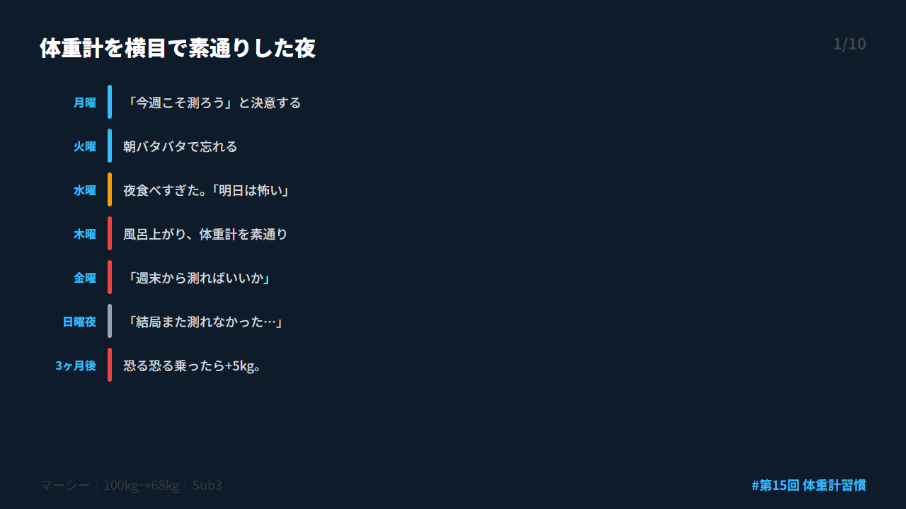
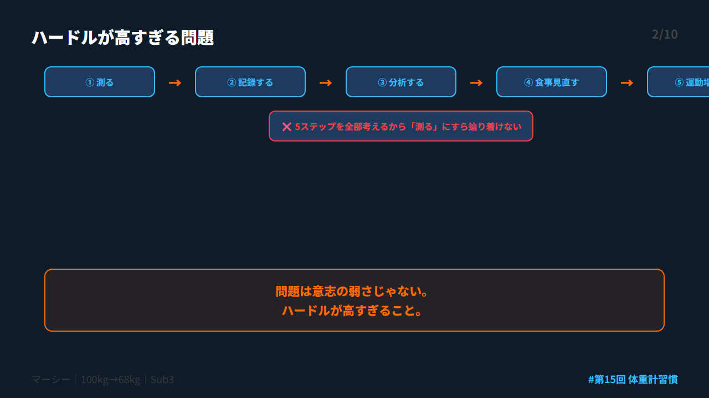
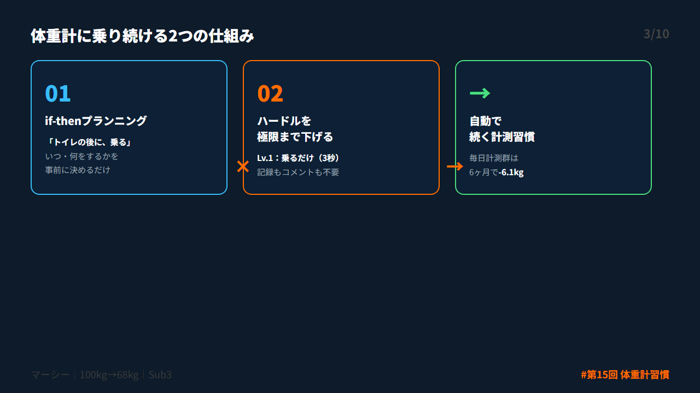
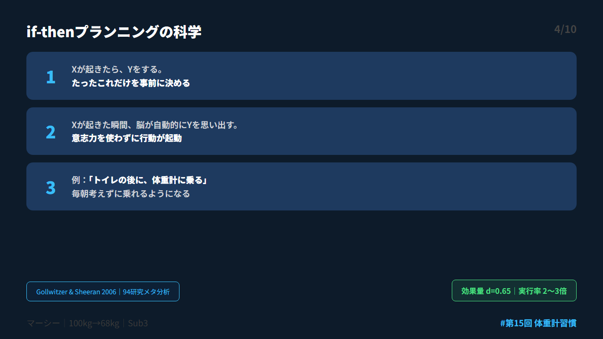
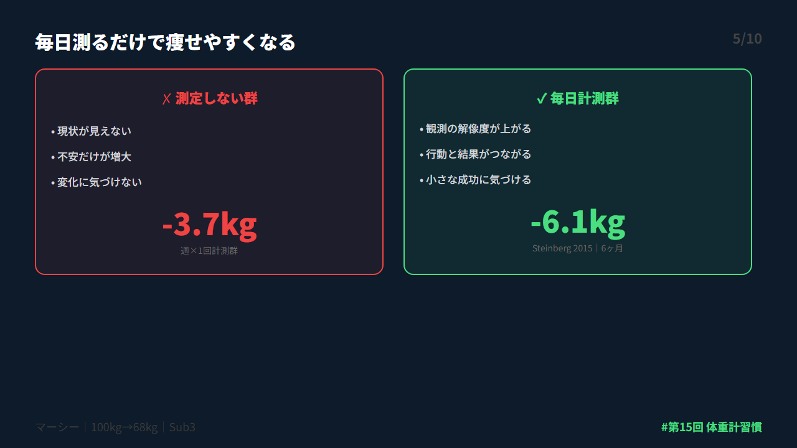
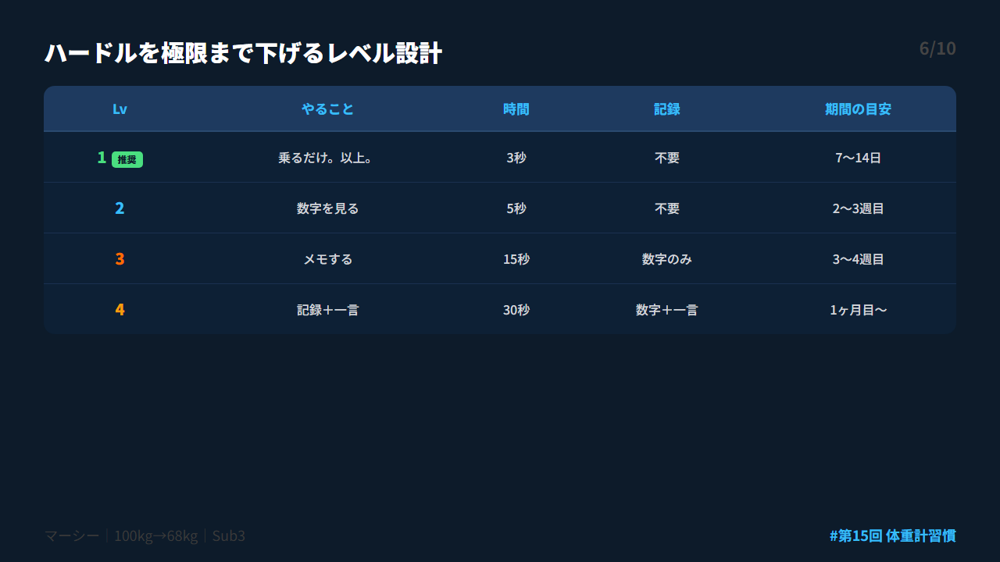
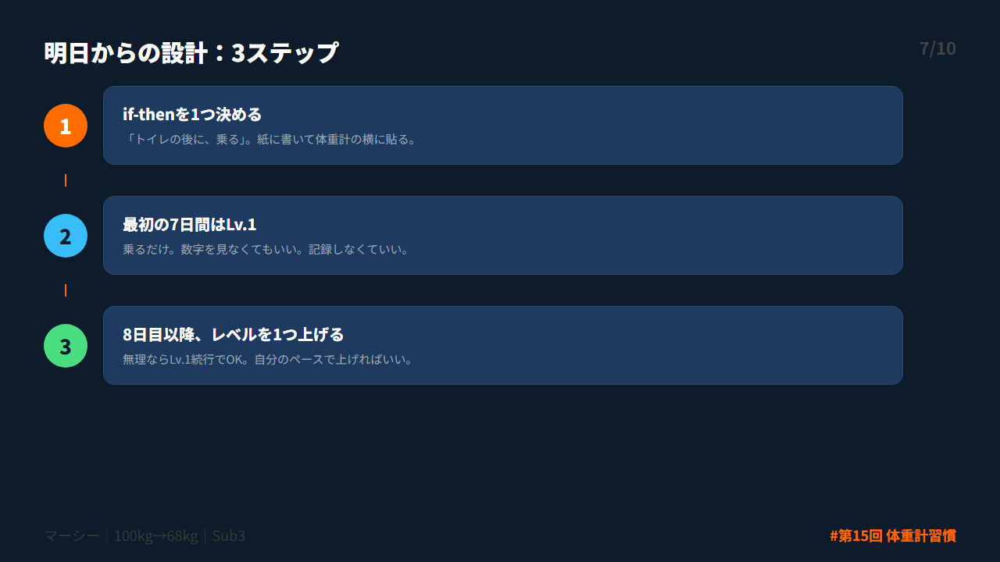
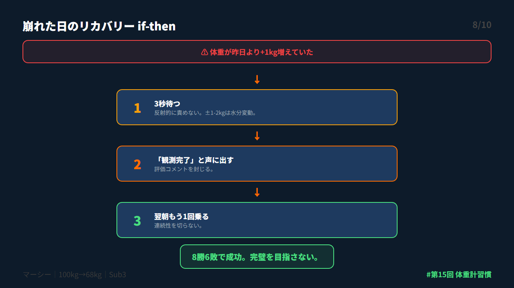
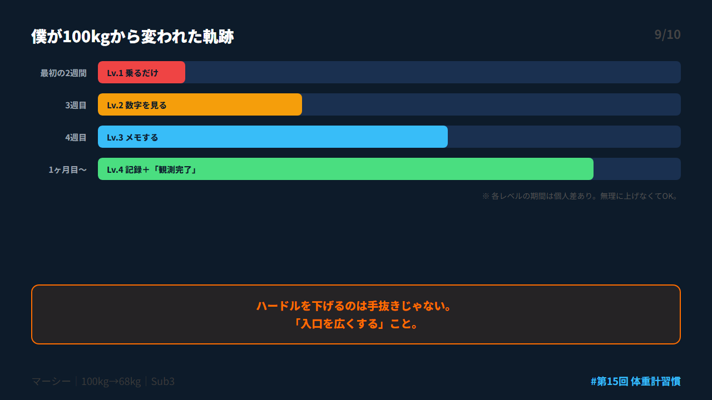
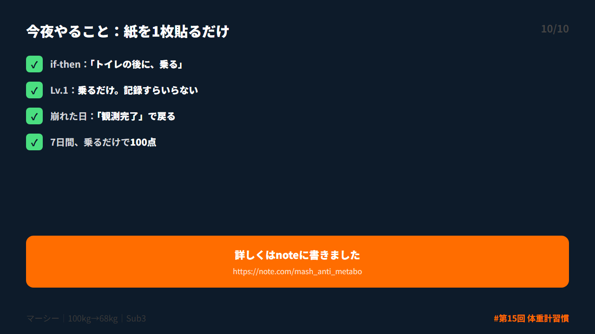

# 第 X投稿スレッド（10本）

## 投稿1/10｜共感

```
風呂上がり、体重計を横目で素通りした。

「乗ったら増えてるかも」
「見ないほうが、心はラク」

100kgだった頃、3ヶ月間乗れなかった。
3ヶ月後に恐る恐る乗ったら、5kg増えてた。

見なかった代償は、見た時より大きかった。

↓続き（2/10）

#ダイエット #メタボ #習慣化 #体重管理 #健康診断
```



---

## 投稿2/10｜原因

```
体重計が怖いのは、弱さじゃない。

ハードルが高すぎるだけ。

「測って→記録して→分析して→食事見直し」
この5ステップを全部セットで考えてる。

そりゃ怖い。
1つ目の「測る」にすら辿り着けない。

↓続き（3/10）

#ダイエット #メタボ #習慣化 #体重管理 #健康診断
```



---

## 投稿3/10｜解決策

```
結論。体重計に乗り続けるには2つだけ。

① if-thenプランニング
「トイレの後に、乗る」と決めるだけ

② ハードルを極限まで下げる
「乗るだけ。記録もいらない」

この2つで、測ることが“努力”じゃなくなる。

↓続き（4/10）

#ダイエット #メタボ #習慣化 #体重管理 #健康診断
```



---

## 投稿4/10｜仕組み

```
if-thenプランニングの研究結果。

「もしXしたら、Yする」と決めるだけで
目標達成率が2〜3倍に。

94研究のメタ分析で効果量d=0.65
（Gollwitzer & Sheeran 2006）

「明日から測ろう」は目標。
「トイレの後に測る」は計画。

↓続き（5/10）

#ダイエット #メタボ #習慣化 #体重管理 #健康診断
```



---

## 投稿5/10｜効果

```
毎日測るだけで痩せやすくなる。

❌ 測定しない群
→ 変化なし

✅ 毎日計測群（6ヶ月）
→ -6.1kg

✅ 週1回群（同期間）
→ -3.7kg

差は2.4kg。やったことは「測っただけ」。
（Steinberg 2015）

↓続き（6/10）

#ダイエット #メタボ #習慣化 #体重管理 #健康診断
```



---

## 投稿6/10｜設計

```
ハードルを極限まで下げるレベル設計。

Lv.1 乗るだけ（3秒）← ここから
Lv.2 数字を見る（5秒）
Lv.3 メモする（15秒）
Lv.4 一言書く（30秒）

最初の7日間はLv.1でOK。
「乗った」という事実だけを積む。

↓続き（7/10）

#ダイエット #メタボ #習慣化 #体重管理 #健康診断
```



---

## 投稿7/10｜実践

```
明日からやること、3ステップ。

① if-thenを1つ決める
「トイレの後に、乗る」

② 7日間レベル1
乗るだけ。記録しない。

③ 8日目にレベルを1つ上げる
無理ならLv.1を続けてOK。

紙に書いて体重計の横に貼る。

↓続き（8/10）

#ダイエット #メタボ #習慣化 #体重管理 #健康診断
```



---

## 投稿8/10｜復帰

```
増えてた日、普通にある。

リカバリーもif-thenで設計する。

「増えていたら→3秒待って→観測完了と言う」

① 3秒待つ（反射的に責めない）
② 「観測完了」と声に出す
③ 翌朝もう1回乗る

8勝6敗でOK。戻れたら勝ち。

↓続き（9/10）

#ダイエット #メタボ #習慣化 #体重管理 #健康診断
```



---

## 投稿9/10｜深掘り

```
100kgで3ヶ月乗れなかった僕が変われた理由。

最初の2週間、乗るだけだった。
記録もしない。数字も見ない。

2週間後、自然と数字を見るようになった。
3週間後、メモを始めた。

ハードルを下げるのは手抜きじゃない。
「入口を広くする」こと。

↓続き（10/10）

#ダイエット #メタボ #習慣化 #体重管理 #健康診断
```



---

## 投稿10/10｜今夜やること

```
【まとめ｜体重計に乗り続ける仕組み】

✅ if-then：「トイレの後に、乗る」
✅ Lv.1：乗るだけ。記録すらいらない
✅ 崩れた日：「観測完了」で戻る

体重計の横に紙を1枚貼ってください。

詳しくはnoteに書きました
https://note.com/mash_anti_metabo

#ダイエット #メタボ #習慣化 #体重管理 #健康診断
```



---


