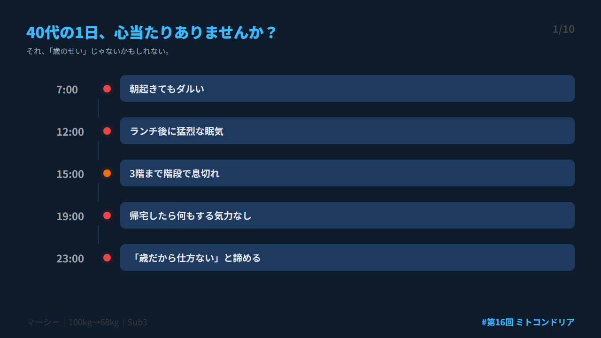
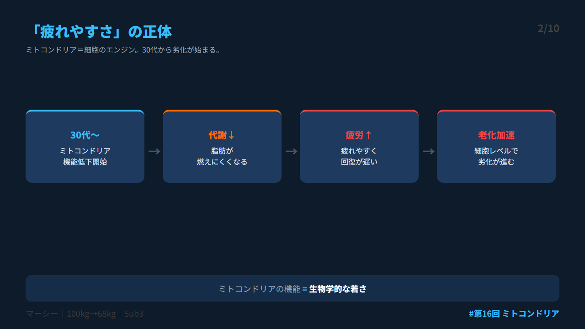
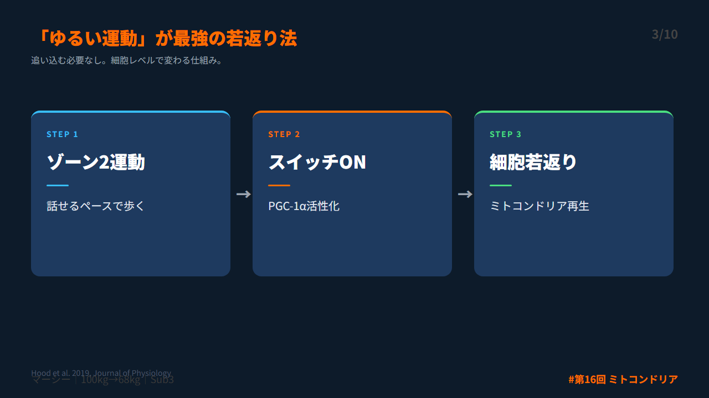
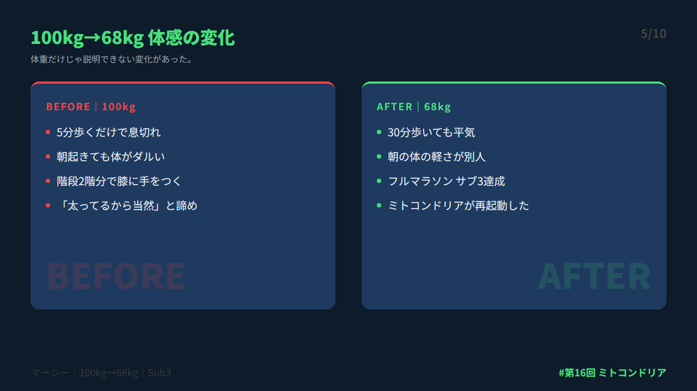
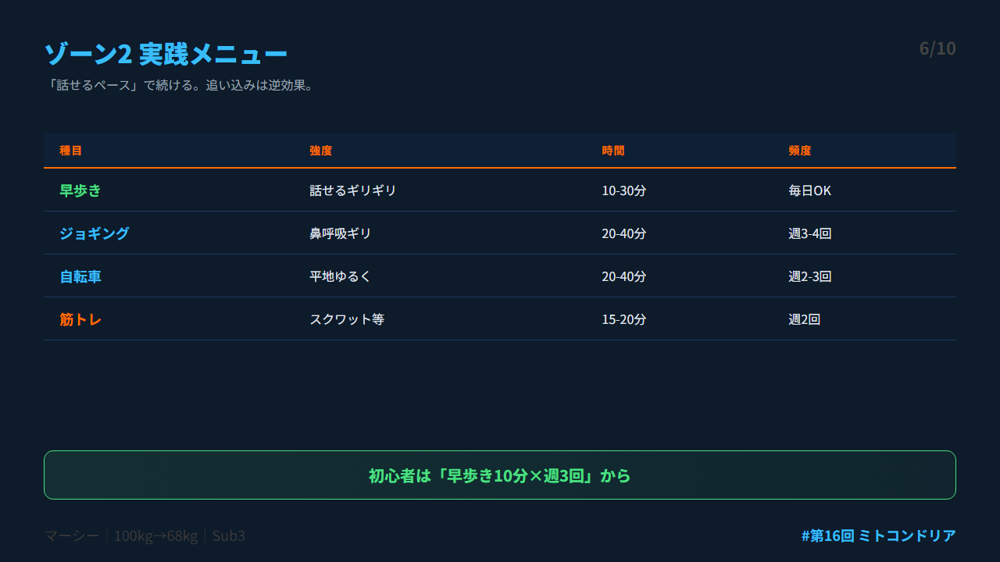
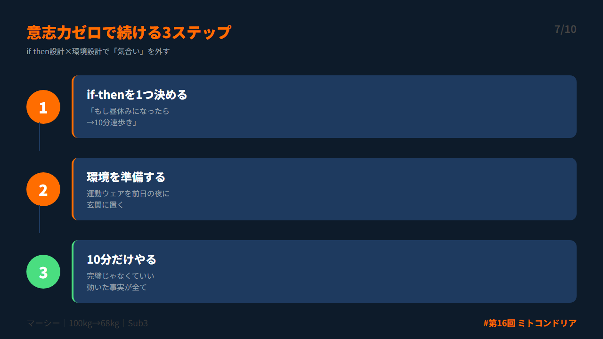
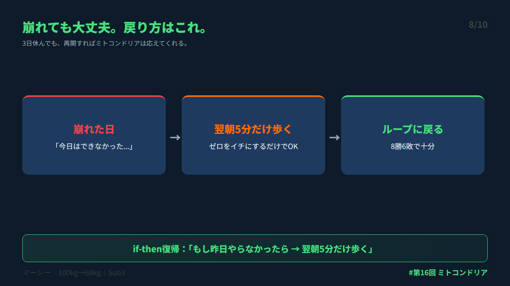
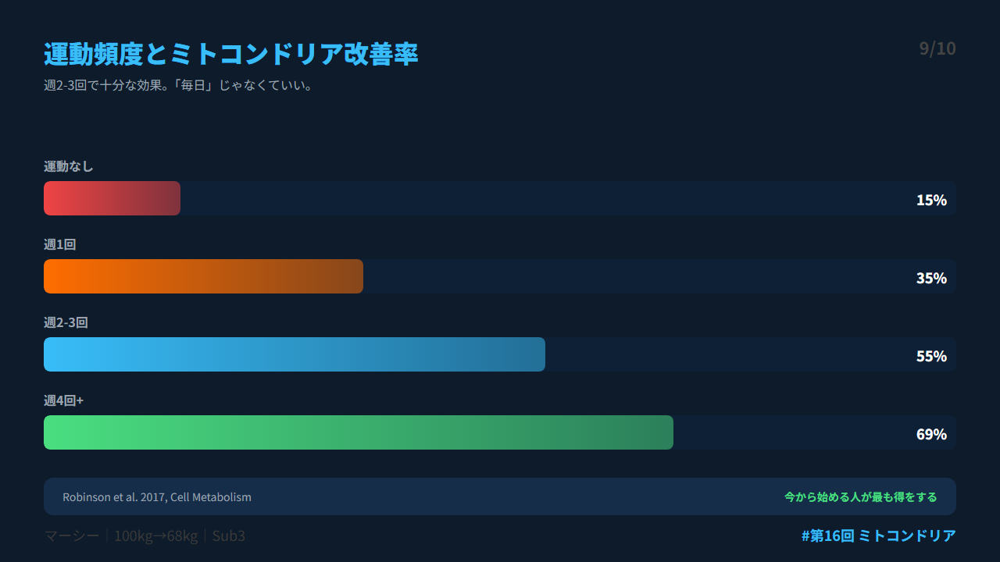
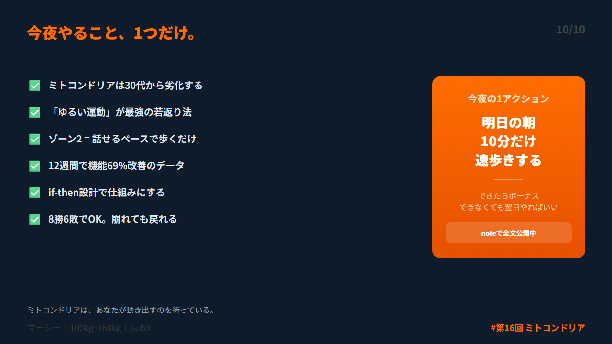

# 第 X投稿スレッド（10本）

## 投稿1/10｜共感

```
「最近、疲れやすくなった」
「階段で息が上がる」
「回復が遅い」

40代、こう感じていませんか？

実はこれ、歳のせいだけじゃない。あなたの細胞の中の「エンジン」が劣化しているサインです。

↓続き（2/10）

#ダイエット #メタボ #習慣化 #運動習慣 #Longevity
```



---

## 投稿2/10｜原因

```
そのエンジンの名前は「ミトコンドリア」。

中学の理科で習ったやつ。細胞の中でエネルギーを作る工場。

30代から機能が落ち始める。代謝が落ちる。脂肪が燃えにくくなる。疲れやすくなる。

これが「老化」の正体の一つ。

↓続き（3/10）

#ダイエット #メタボ #習慣化 #運動習慣 #Longevity
```



---

## 投稿3/10｜解決策

```
でも、このミトコンドリアは「再起動」できる。

方法は運動。しかも「ゆるい運動」が最強。

会話できるギリギリのペースで歩く。これだけで細胞レベルの若返りが始まる。

↓続き（4/10）

#ダイエット #メタボ #習慣化 #運動習慣 #Longevity
```



---

## 投稿4/10｜仕組み

```
2011年、カナダの研究チームがPNASに発表。

運動を続けたマウスの老化が逆転した。ミトコンドリアの数と機能が回復。

さらに2017年のMayo Clinic研究では、12週間の運動で高齢者のミトコンドリア機能が69%改善。

↓続き（5/10）

#ダイエット #メタボ #習慣化 #運動習慣 #Longevity
```


---

## 投稿5/10｜効果

```
僕は32歳・100kgの時、5分歩くだけで息切れしていた。

3ヶ月後、30分歩いても平気になった。体重だけじゃ説明できない変化だった。

今思うと、ミトコンドリアが活性化された瞬間だったと理解している。

↓続き（6/10）

#ダイエット #メタボ #習慣化 #運動習慣 #Longevity
```



---

## 投稿6/10｜設計

```
最も効果的な運動は「ゾーン2トレーニング」。

・早歩き（少し息が上がる程度）
・軽いジョギング
・自転車をゆるく漕ぐ

10分からでOK。追い込む必要なし。「ゆるく長く」が黄金ルール。

↓続き（7/10）

#ダイエット #メタボ #習慣化 #運動習慣 #Longevity
```



---

## 投稿7/10｜実践

```
続ける仕組みはif-then設計。

「もし昼休みになったら→10分速歩き」
「もし駅に着いたら→1駅手前で降りる」

もう一つ。運動ウェアを前日に玄関に置く。意志力に頼らず、環境で行動を変える。

↓続き（8/10）

#ダイエット #メタボ #習慣化 #運動習慣 #Longevity
```



---

## 投稿8/10｜復帰

```
「3日サボってしまった…」

大丈夫。ミトコンドリアは習慣的な刺激の積み重ねで変わる。3日休んでも再開すればまた動く。

復帰if-then：「もし昨日やらなかったら→翌朝5分だけ歩く」

8勝6敗でOK。

↓続き（9/10）

#ダイエット #メタボ #習慣化 #運動習慣 #Longevity
```



---

## 投稿9/10｜深掘り

```
運動は「カロリーを燃やすもの」じゃない。

「細胞を若返らせるもの」。

この認識の転換が、運動を「やらなきゃ」から「やりたい」に変えてくれる。

ミトコンドリアは、あなたが動き出すのを待っている。

↓続き（10/10）

#ダイエット #メタボ #習慣化 #運動習慣 #Longevity
```



---

## 投稿10/10｜今夜やること

```
今夜やること1つだけ。

「明日の朝、10分だけ速歩きする」と決める。

できたらボーナス。できなくても翌日やればいい。

ミトコンドリアの若返りは今日始まる。

詳しくはnoteで全文公開中
https://note.com/mash_anti_metabo

#ダイエット #メタボ #習慣化 #運動習慣 #Longevity
```



---


