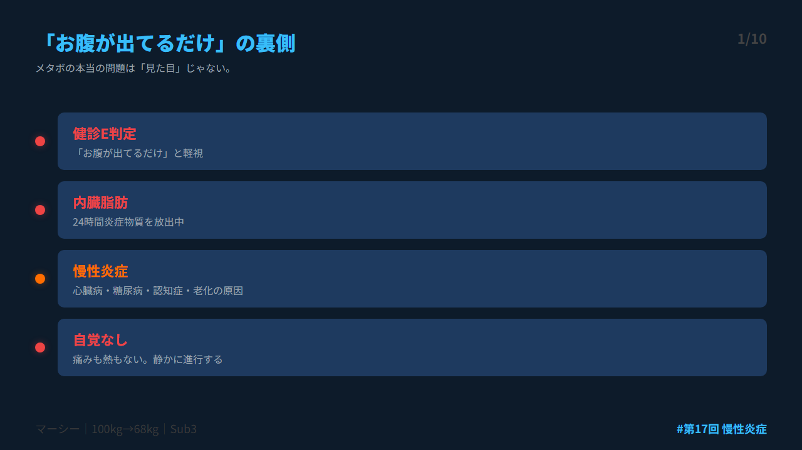
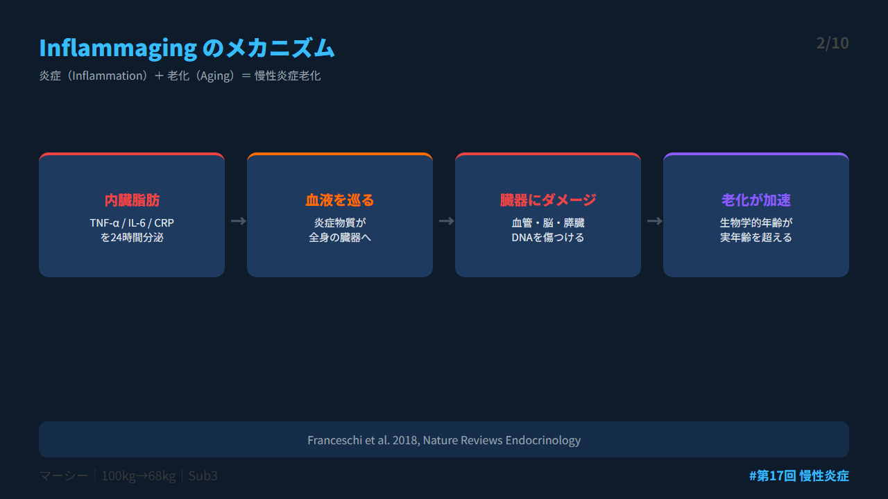
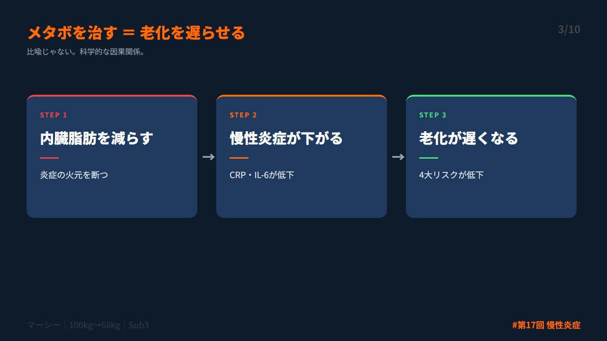
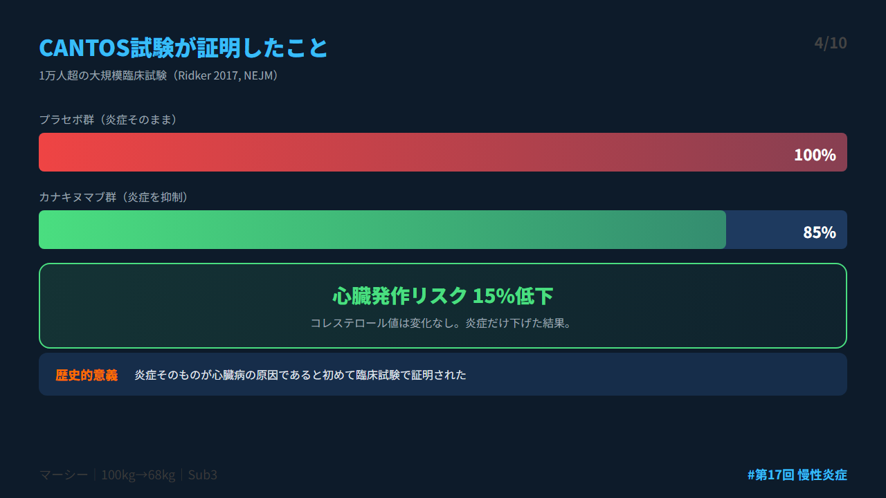
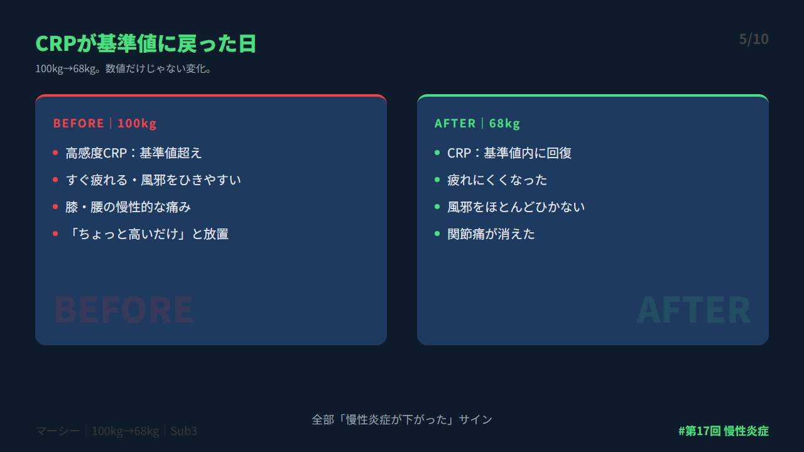
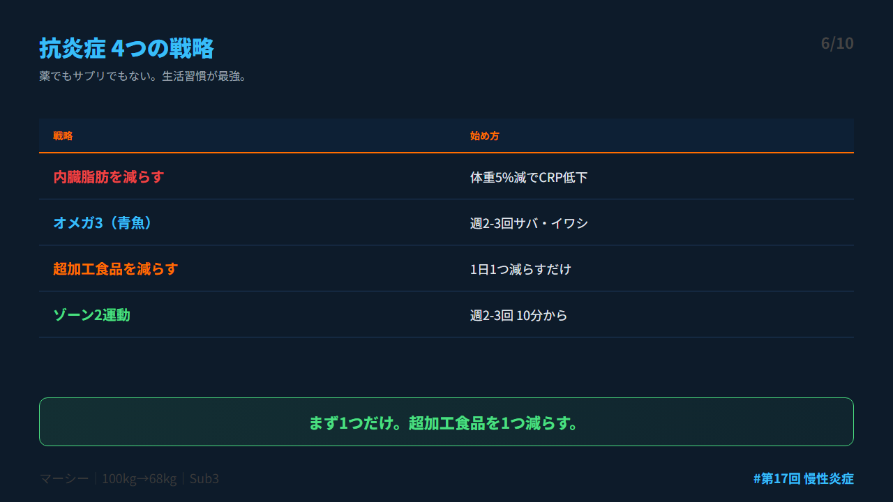
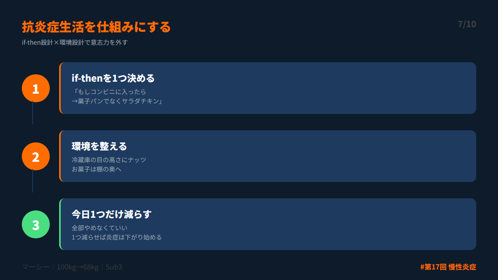
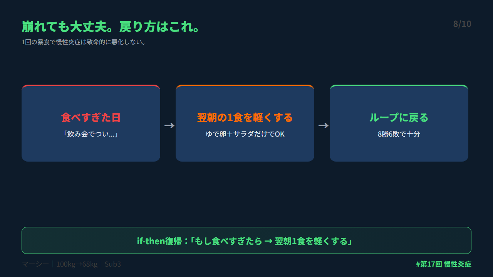
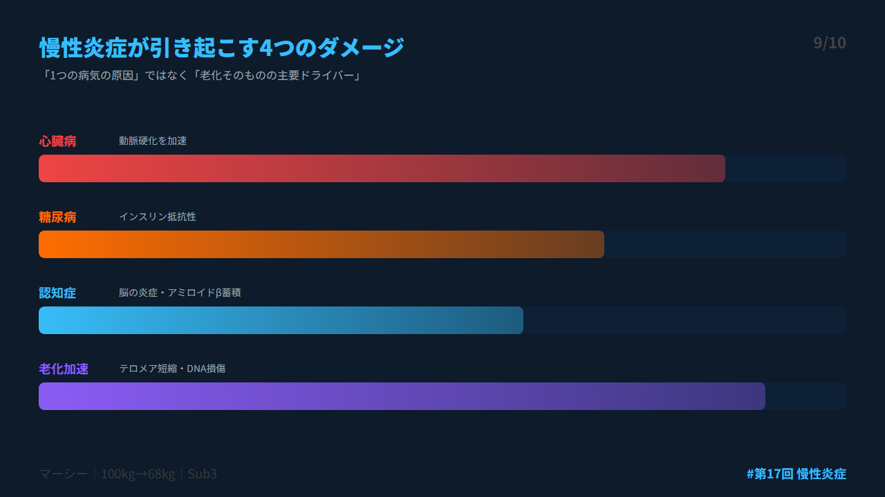
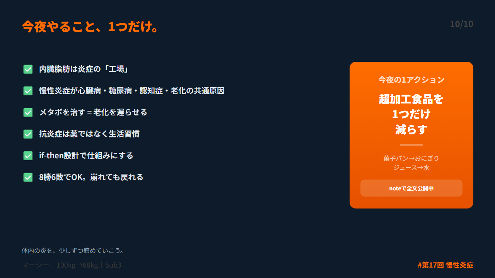

# 第 X投稿スレッド（10本）

## 投稿1/10｜共感

```
健診でE判定。
「お腹が出てるだけでしょ」と思った。

実は内臓脂肪は、24時間炎症物質を出し続ける「工場」だった。

この炎症が、心臓病・糖尿病・認知症・老化——全部の共通原因だと分かっている。

↓続き（2/10）

#ダイエット #メタボ #習慣化 #健康診断 #Longevity
```



---

## 投稿2/10｜原因

```
「Inflammaging（インフラメイジング）」

炎症＋老化の造語。2018年にNature Reviews誌で体系化された。

内臓脂肪からTNF-α、IL-6、CRPが24時間放出→全身を巡り臓器にダメージ→老化が加速。

↓続き（3/10）

#ダイエット #メタボ #習慣化 #健康診断 #Longevity
```



---

## 投稿3/10｜解決策

```
「メタボを治す＝老化を遅らせる」

これは比喩じゃない。科学的な因果関係。

内臓脂肪を減らす→慢性炎症が下がる→心臓病・糖尿病・認知症・老化リスクが下がる。

ダイエットの意味が変わる。

↓続き（4/10）

#ダイエット #メタボ #習慣化 #健康診断 #Longevity
```



---

## 投稿4/10｜仕組み

```
2017年、CANTOS試験（Ridker, NEJM）。

1万人以上の大規模臨床試験。炎症を抑える薬で心臓発作リスクが15%低下。

コレステロールは変えてない。炎症だけ下げた。

炎症そのものが心臓病の原因だと初めて臨床で証明された。

↓続き（5/10）

#ダイエット #メタボ #習慣化 #健康診断 #Longevity
```



---

## 投稿5/10｜効果

```
僕は32歳・100kgの時、高感度CRPが基準値超えだった。

意味すら分かってなかった。

68kgまで落とした後、CRPは基準値内に。疲れにくくなった。風邪を引かなくなった。関節痛が消えた。

全部「炎症が下がった」サインだった。

↓続き（6/10）

#ダイエット #メタボ #習慣化 #健康診断 #Longevity
```



---

## 投稿6/10｜設計

```
最も確実な「抗炎症」は生活習慣。

1. 内臓脂肪を減らす
2. オメガ3（青魚）を摂る
3. 超加工食品を減らす
4. ゾーン2運動

薬でもサプリでもない。この4つが全て。

↓続き（7/10）

#ダイエット #メタボ #習慣化 #健康診断 #Longevity
```



---

## 投稿7/10｜実践

```
続けるコツはif-then設計。

「もしコンビニに入ったら→菓子パンじゃなくサラダチキン」
「もし喉が渇いたら→ジュースじゃなく水」
「もし魚の選択肢があったら→青魚を選ぶ」

意志力ゼロ。仕組みで変える。

↓続き（8/10）

#ダイエット #メタボ #習慣化 #健康診断 #Longevity
```



---

## 投稿8/10｜復帰

```
「飲み会で食べすぎた...」

大丈夫。慢性炎症は1回の暴食で致命的には悪化しない。

復帰if-then：「もし昨日食べすぎたら→翌朝の1食だけ軽くする」

8勝6敗でOK。6割で炎症は下がる。

↓続き（9/10）

#ダイエット #メタボ #習慣化 #健康診断 #Longevity
```



---

## 投稿9/10｜深掘り

```
ダイエットの本当の目的は「見た目」じゃない。

「体内の炎を鎮めること」。

そう考えると、1kgの変化が持つ意味がまったく違って見える。

メタボを治すことは、未来の自分を守ること。

↓続き（10/10）

#ダイエット #メタボ #習慣化 #健康診断 #Longevity
```



---

## 投稿10/10｜今夜やること

```
今夜やること1つだけ。

「明日の食事から、超加工食品を1つ減らす」

菓子パン→おにぎり。ジュース→水。それだけでいい。

あなたの体内の炎を、少しずつ鎮めていこう。

noteで全文公開中
https://note.com/mash_anti_metabo

#ダイエット #メタボ #習慣化 #健康診断 #Longevity
```



---


