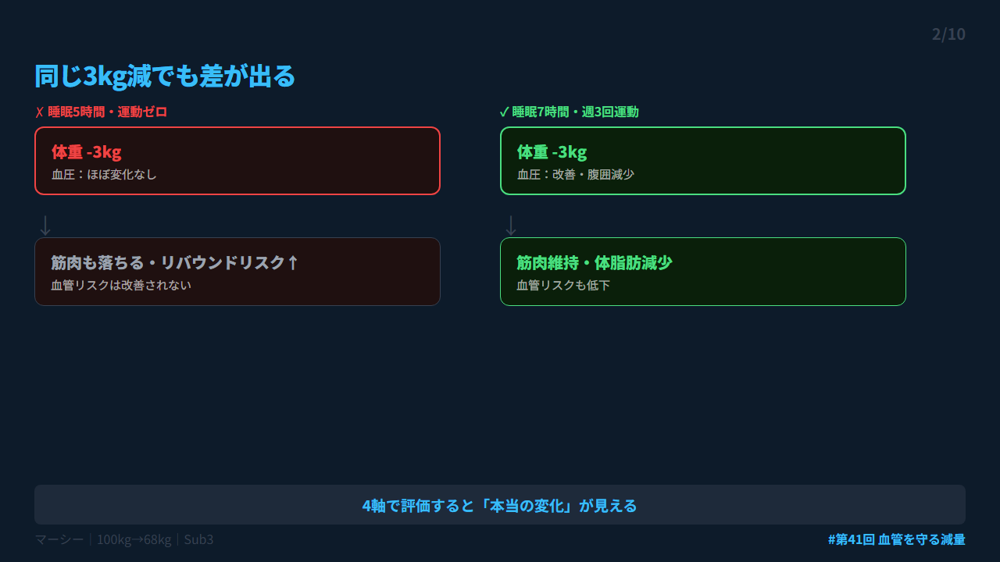
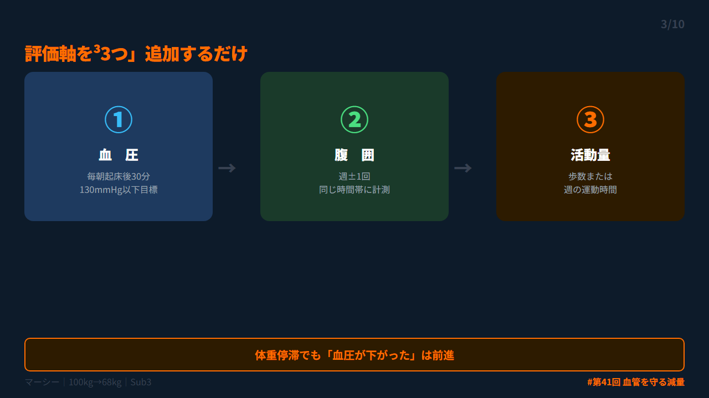
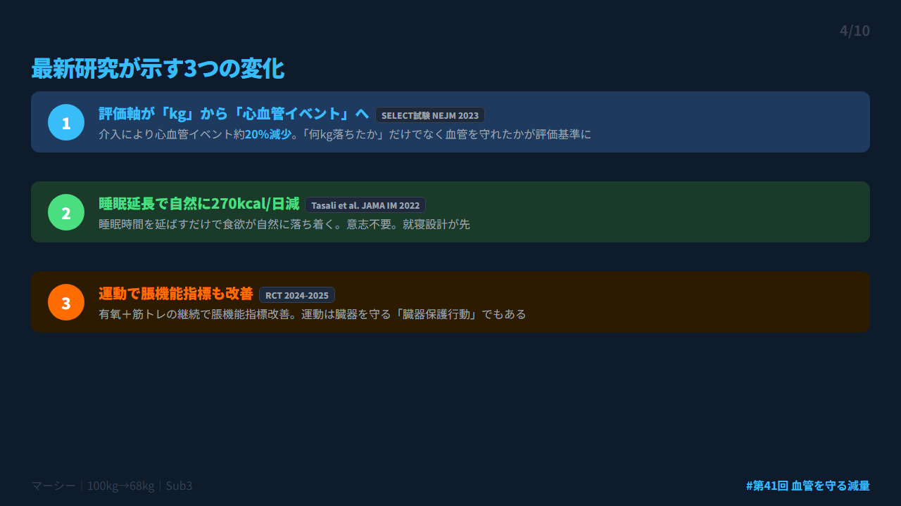
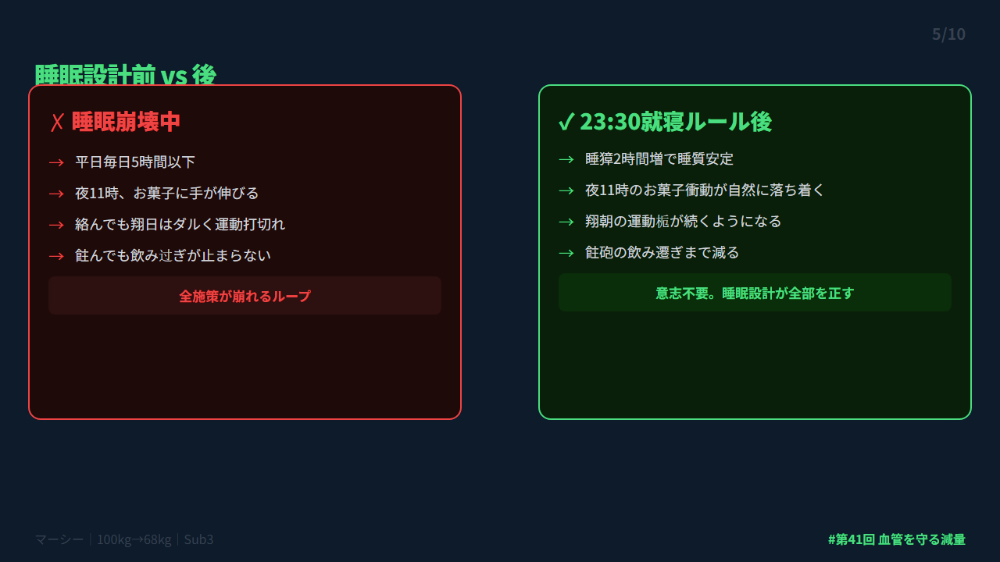
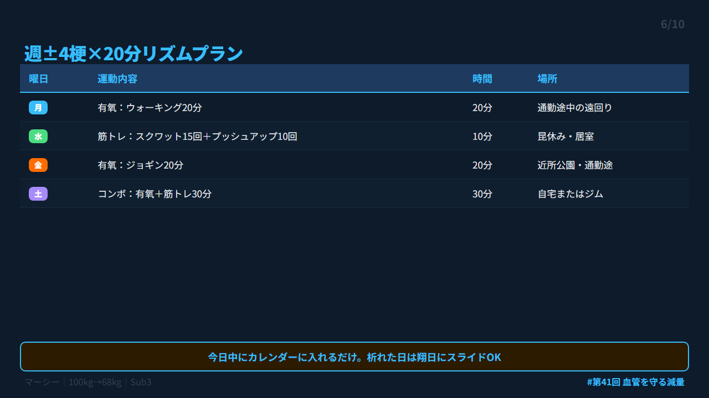
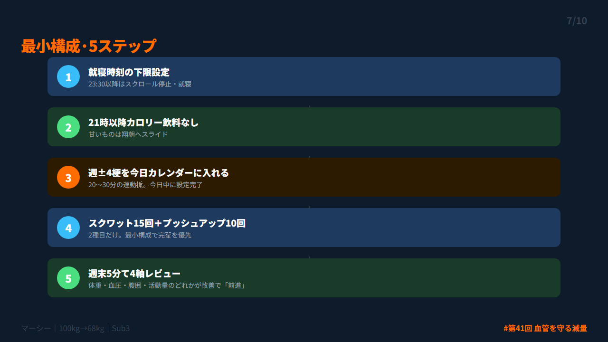
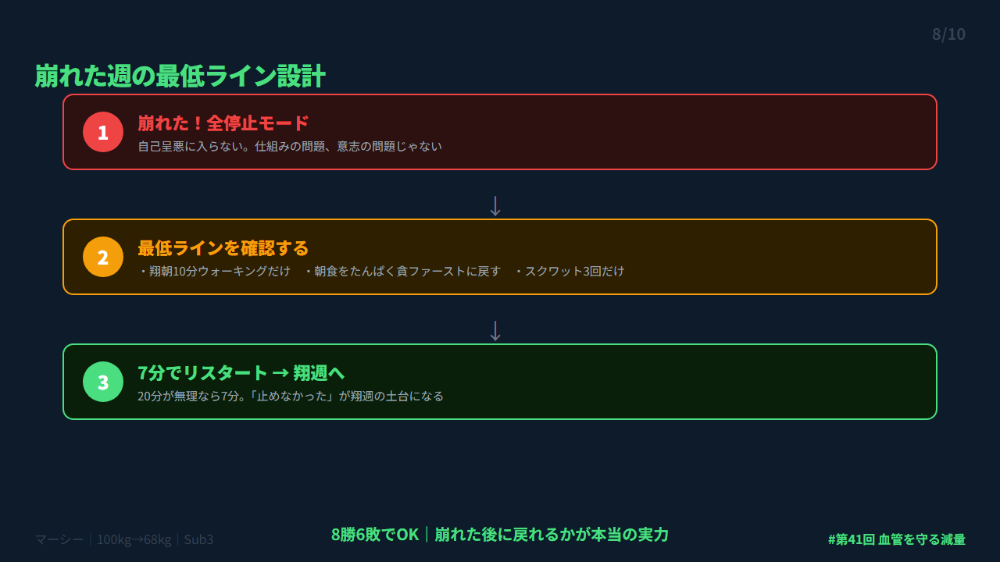
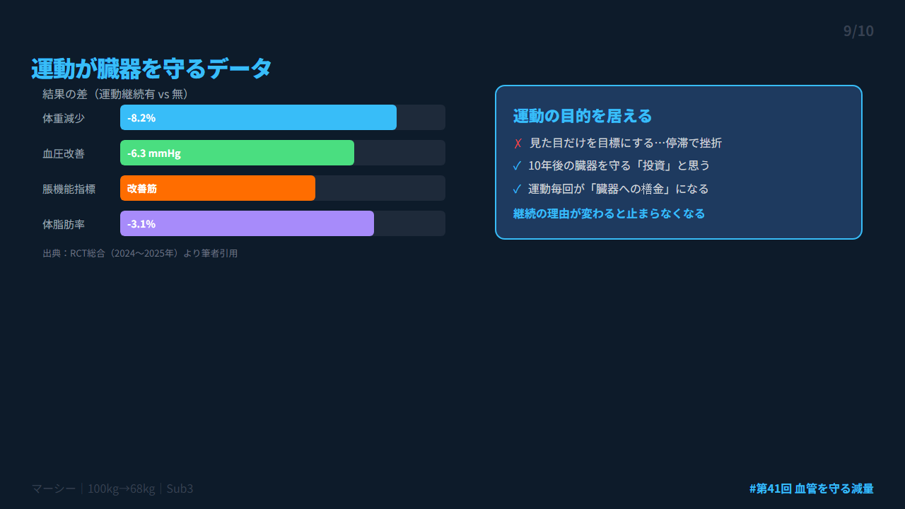
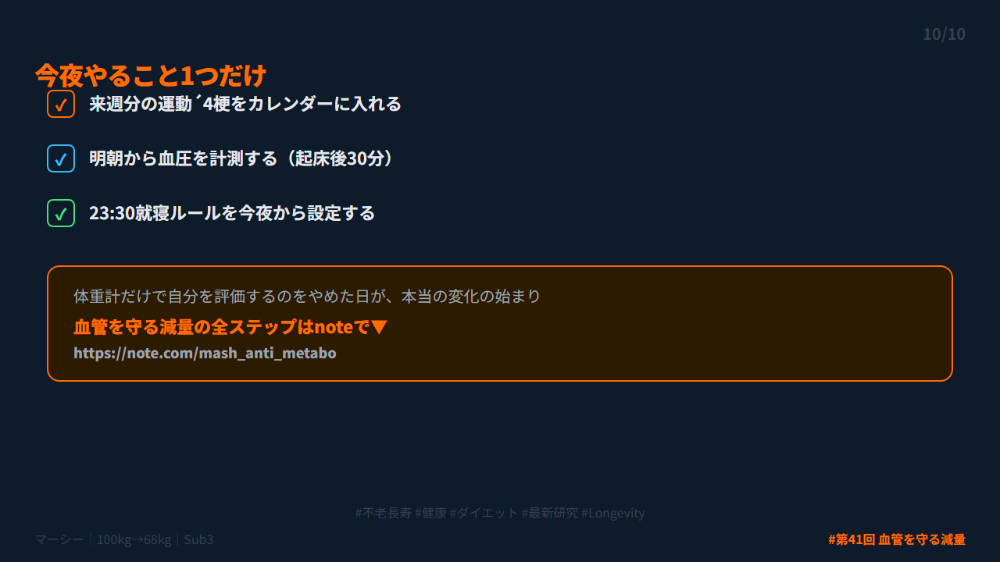

# 第41回 X投稿スレッド（10本）

## 投稿1/10｜共感

```
健診を終えた帰り道、ため息をついた経験はありますか。

「また今年もE判定…」
「体重は落としたのに、なんで変わらないのか」

実は、体重計だけを見ていると本質を外しやすい。

↓続き（2/10）
```


---

## 投稿2/10｜原因

```
同じ3kg減でも差が出る理由。

・睡眠5時間・運動ゼロ
→ 体重減でも血圧ほぼ変わらず

・睡眠7時間・週3回運動
→ 体重＋血管リスクが改善

「何kg減ったか」だけでは本当の変化は見えない。

↓続き（3/10）
```



---

## 投稿3/10｜解決策

```
体重計に「3つ」追加するだけで継続力が変わる。

①血圧（朝・起床後30分）
②腹囲（週1回）
③活動量（歩数 or 運動時間）

体重が停滞しても他のどれかが前進していれば「前進中」。

↓続き（4/10）
```



---

## 投稿4/10｜仕組み

```
最新研究が示す3つの事実。

①SELECT試験（NEJM,2023）
 介入で心血管イベントが約20％減少

②Tasali et al.（JAMA IM,2022）
 睡眠延長→自然に270kcal/日減少

③運動介入RCT（2024-25）
 有氧・筋トレで脹機能指標も改善

↓続き（5/10）
```



---

## 投稿5/10｜効果

```
「夜更かし」をやめるだけで食欲が落ち着く。

睡眠不足→グレリン↑→食欲増加→夜食
これが毎晩のループ。

意志で止めようとしても限界がある。
設計で止める。

「23:30就寝ルール」を今夜から決めるだけ。

↓続き（6/10）
```



---

## 投稿6/10｜設計

```
運動継続率を上げる唯一の方法。

「気が向いたらやる」→ ほぼやらない
「決まった梗に予約」→ 意志不要でやる

週4梗×20分をカレンダーに入れるだけ。
今週中に来週分を入れるのが最初の1アクション。

↓続き（7/10）
```



---

## 投稿7/10｜実践

```
最小構成の5ステップ。

1. 23:30就寝ルール設定
2. 21時以降カロリー飲料なし
3. 週4梗を今日カレンダーに入れる
4. スクワット15回＋プッシュアップ10回
5. 週末5分て4軸レビュー

全部やらなくていい。今日は1つだけ。

↓続き（8/10）
```



---

## 投稿8/10｜復帰

```
崩れた週は必ず来る。その時のために。

崩れた →「最低ラインに戻す」だけ

・翔朝10分ウォーキングだけ
・朝食をたんぱく貪ファーストに戻す
・スクワット3回だけ

「止めなかった」が翔週の土台になる。
8勝6敗でOK。

↓続き（9/10）
```



---

## 投稿9/10｜深掘り

```
運動は「見た目」だけでなく「臓器」を守る。

2024～25年の研究で、
有氧＋筋トレの継続が脹機能指標を改善したRCTが複数報告。

「ダイエット＝見た目」から
「ダイエット＝10年後の臓器を守る投資」に変えると継続の理由が変わる。

↓続き（10/10）
```



---

## 投稿10/10｜今夜やること

```
今夜やること1つだけ。

来週分の運動4梗をカレンダーに入れる。

体重計だけで自分を評価するのをやめた日が本当の変化の始まり。

血管を守る減量の全ステップはnoteで▼
https://note.com/mash_anti_metabo

#不老長寿 #健康 #ダイエット #最新研究 #Longevity
```



---

