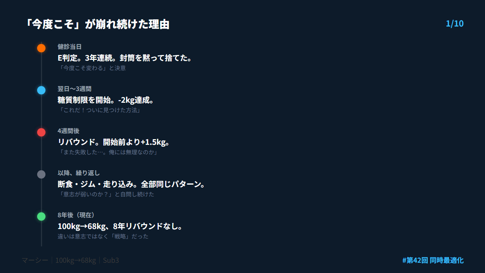
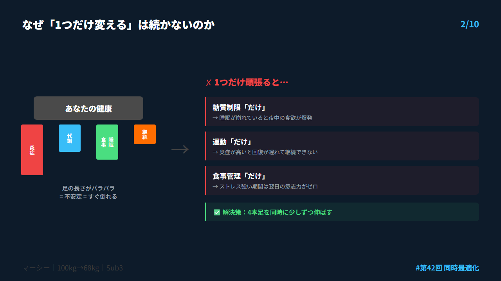
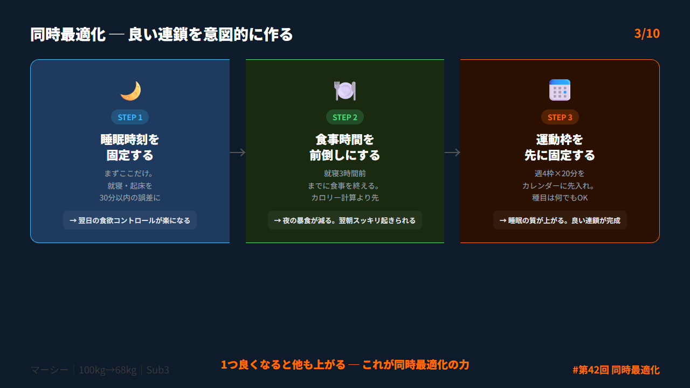
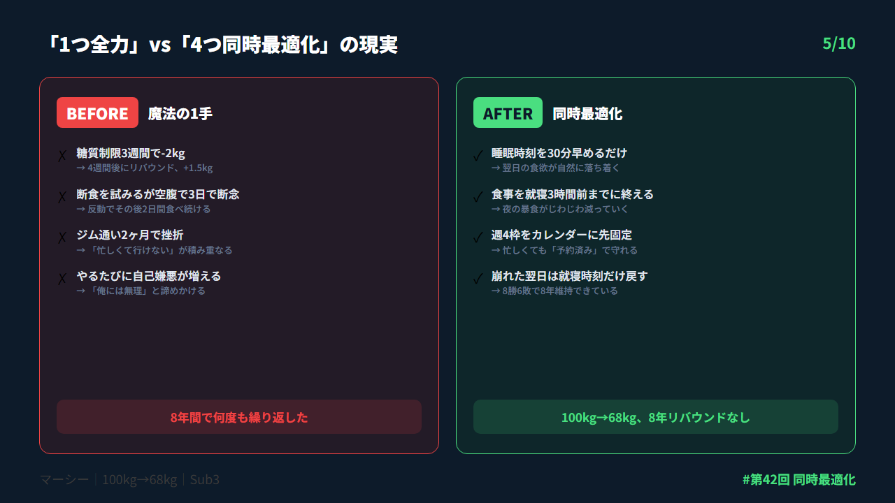
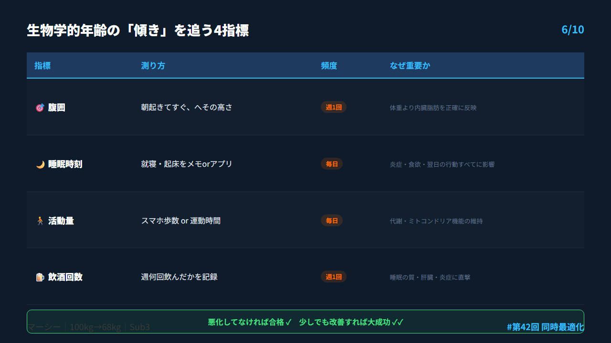
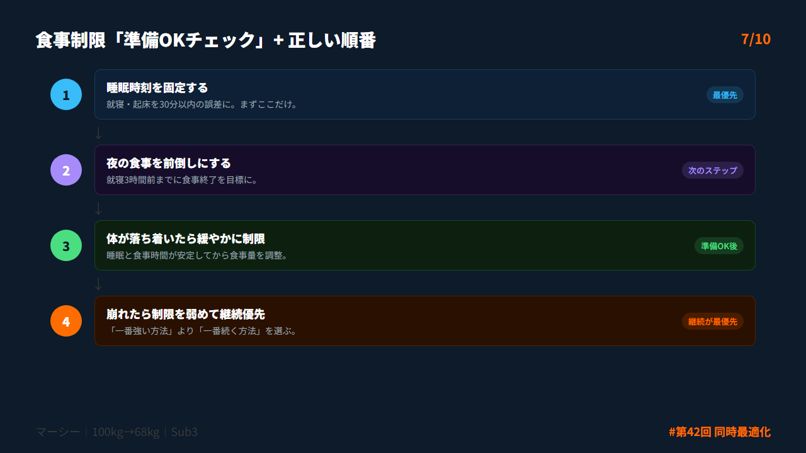
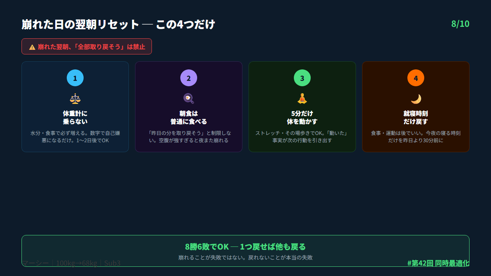
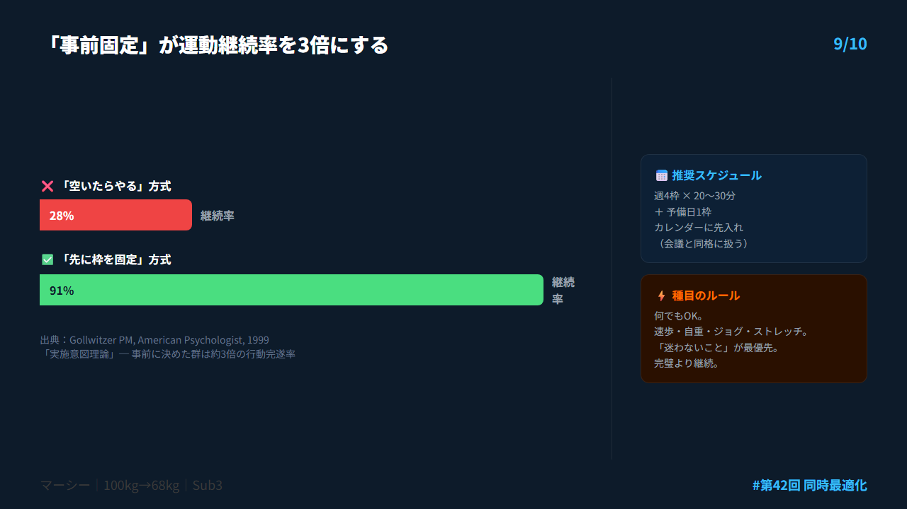

# 第42回 X投稿スレッド（10本）

## 投稿1/10｜共感

```
健診E判定3年連続。
「今度こそ」と糖質制限を始めた。3週間で-2kg。
「これだ！」と思った。

4週間後にはスタートより+1.5kg。

意志が弱いんじゃない。
「1つだけ変える」戦略が人体に合ってないだけ。
↓続き（2/10）
```



---

## 投稿2/10｜原因

```
なぜ「魔法の1手」は続かないか。

4本足の椅子を想像して。
1本だけ伸ばしても椅子は不安定。

人体も同じ。
糖質制限「だけ」→睡眠崩れると夜中の食欲が爆発
運動「だけ」→炎症が高いと回復が遅れて継続できない

1つ直しても他が崩れると全部戻る。
↓続き（3/10）
```



---

## 投稿3/10｜解決策

```
解決策は「同時最適化」。

炎症・代謝・睡眠食事・行動継続。
4つを同時に、それぞれ20%ずつ整える。

1つ全力でやるより4つを少しずつの方が
楽で続くしリバウンドしにくい。

理由は「良い連鎖」にある。
↓続き（4/10）
```



---

## 投稿4/10｜仕組み

```
良い連鎖の仕組み：

睡眠が少し整う
→翌日の食欲コントロールが楽になる
→夜の暴食が減る
→翌朝の運動意欲が上がる
→睡眠の質が上がる

悪い連鎖と同じように良い連鎖もある。
これを意図的に作るのが同時最適化。

（López-Otín et al., Nature Aging 2022）
↓続き（5/10）
```


---

## 投稿5/10｜効果

```
「1つだけ全力」vs「4つを20%ずつ」

❌ 糖質制限のみ
→3週間効果→4週間後リバウンド→前より重い

✅ 睡眠+食事時間+軽運動+就寝固定を20%ずつ
→8年リバウンドなし（僕の実績）

派手さはゼロ。でもこれが一番強い。
↓続き（6/10）
```



---

## 投稿6/10｜設計

```
生物学的年齢は「今何歳相当」より
「変化速度（傾き）」で見る。

追うべき4指標：
・腹囲（週1回・朝起きてすぐ）
・睡眠時刻（就寝・起床を記録）
・活動量（歩数or運動時間）
・飲酒回数（週何回）

悪化してなければ合格。
少しでも改善すれば大成功。
↓続き（7/10）
```



---

## 投稿7/10｜実践

```
食事制限は「準備ができた状態」でやること。

この状態で極端な制限→失敗しやすい：
・睡眠が崩れている
・仕事ストレスが強い
・過去に反動食いを繰り返してきた

正しい順番：
①睡眠時刻を固定する
②夜の食事を前倒しにする
③その後で緩やかに制限
↓続き（8/10）
```



---

## 投稿8/10｜復帰

```
崩れた日の翌朝リセット4ステップ。

1️⃣ 体重計に乗らない（2日後でOK）
2️⃣ 朝食は普通に食べる（制限しない）
3️⃣ 5分だけ体を動かす（ストレッチでOK）
4️⃣ 就寝時刻だけ戻す

「全部取り戻そう」とするとまた崩れる。
8勝6敗でOK。
↓続き（9/10）
```



---

## 投稿9/10｜深掘り

```
運動継続で最も効くのは「事前固定」。

空いたらやる → ほぼ負け
先に枠を取る → 勝ち

推奨：週4枠×20〜30分
+予備日1枠をカレンダーに固定

種目は何でもOK。速歩・自重・ストレッチ。
「迷わないこと」が最優先。

これを10年固定して8年リバウンドなし。
↓続き（10/10）
```



---

## 投稿10/10｜今夜やること

```
今日の行動は1つだけ。

今夜の就寝時刻を決めて
コメントで宣言してください。

（例：23:00就寝、22:45就寝）

ここが整うと明日の行動が整う。
できなかった日は翌日スライドでOK。

詳しくはnoteで👇
https://note.com/mash_anti_metabo
```


---

