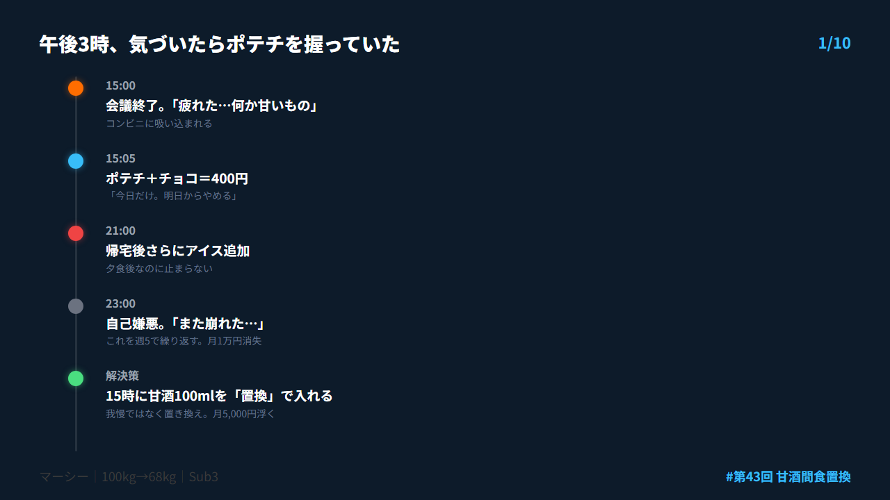
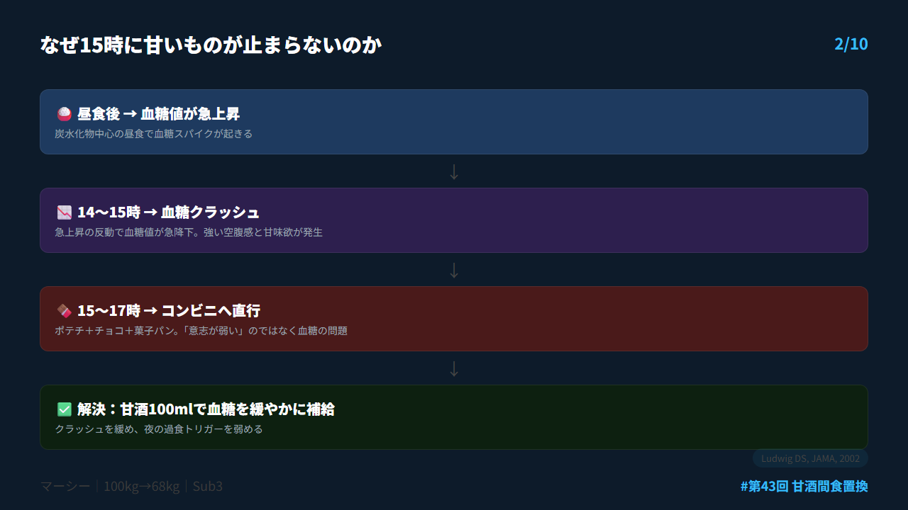
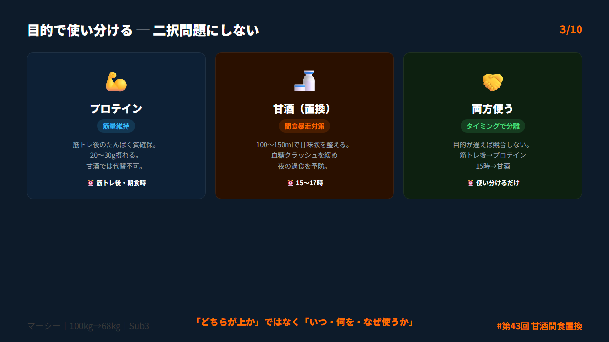
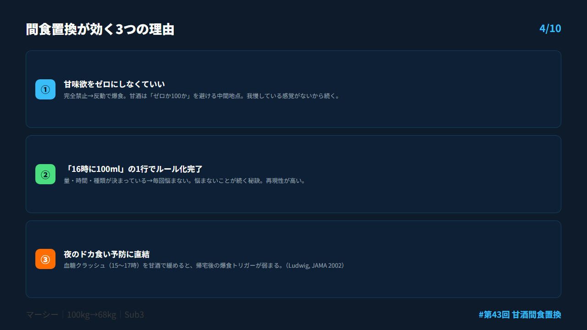
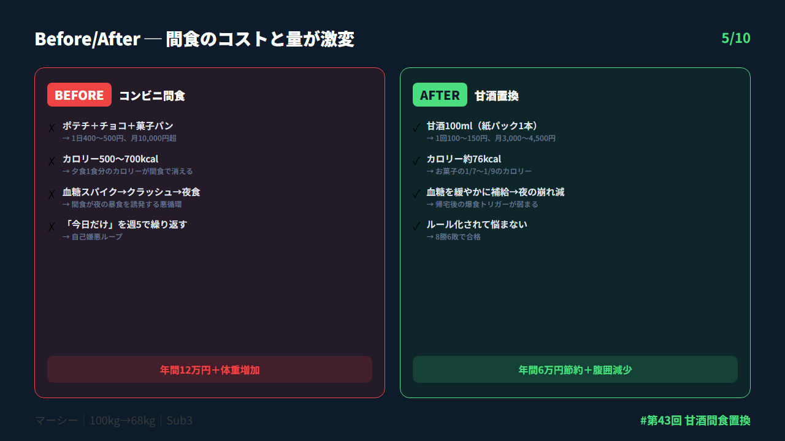
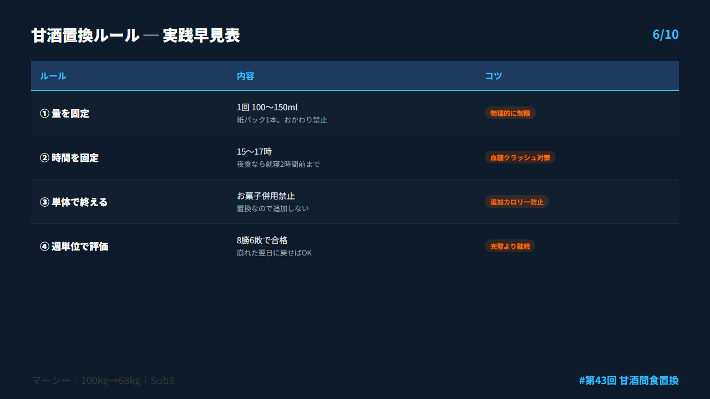
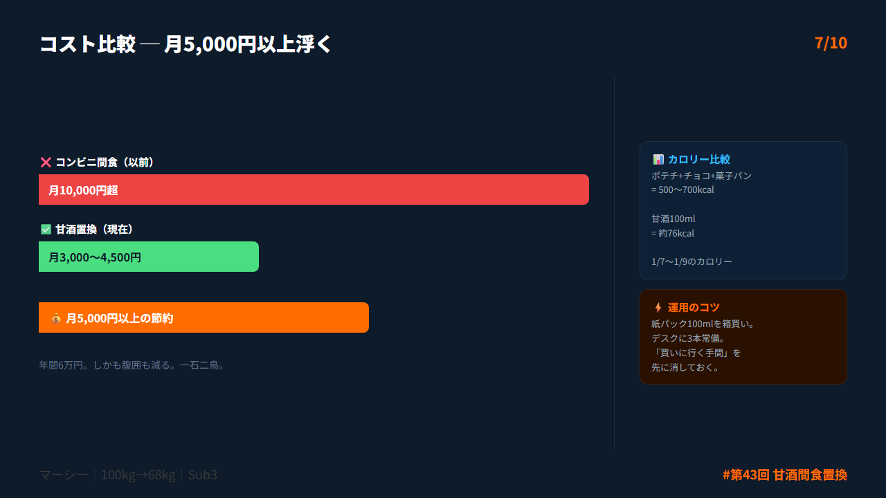
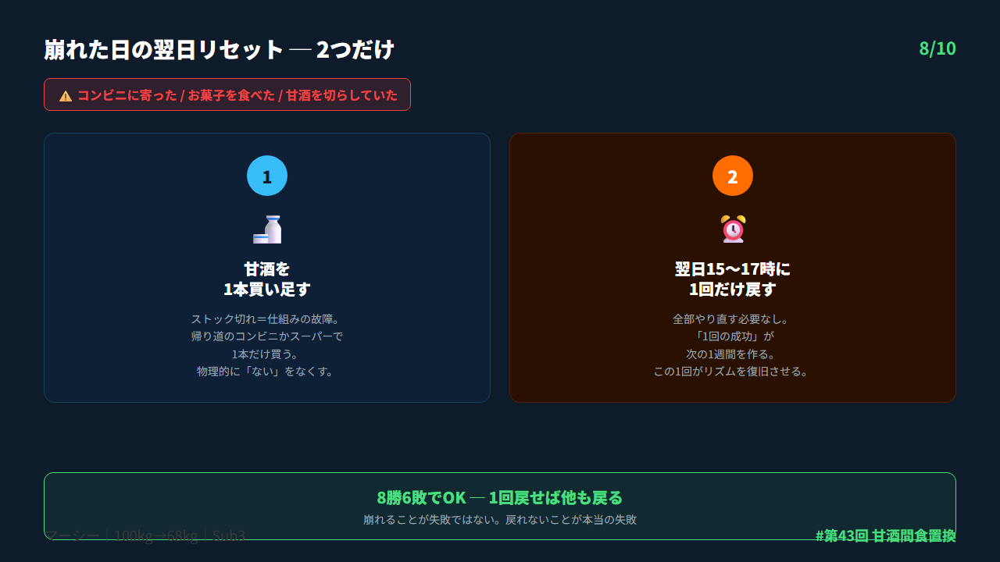
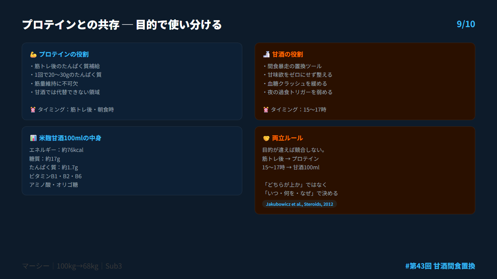
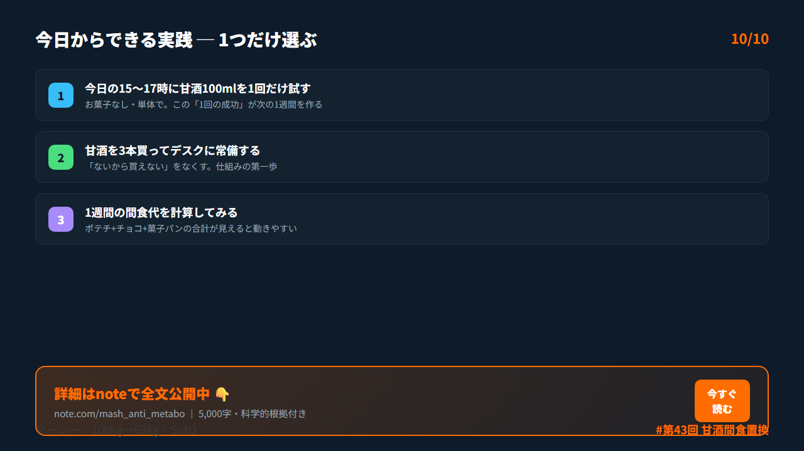

# 第43回 X投稿スレッド（10本）

## 投稿1/10｜共感

```
午後3時。会議が終わった。
気づいたらコンビニでポテチとチョコを握ってレジに並んでいた。

「今日だけ。明日からやめる」
何回言いましたか。

僕は100kgだった頃、週5でこれをやってました。
間食代だけで月1万円。

意志が弱いんじゃなかった。
↓続き（2/10）
```



---

## 投稿2/10｜原因

```
甘いもの欲が止まらない本当の原因。

昼食後に血糖値が急上昇→急降下する。
この「血糖クラッシュ」が15〜17時の
強烈な空腹と甘味欲を引き起こす。
（Ludwig, JAMA 2002）

我慢で消える問題じゃない。
「置き換え先」を用意するかどうかで決まる。
↓続き（3/10）
```



---

## 投稿3/10｜解決策

```
答えは「プロテインより甘酒」ではなく
"間食置換として甘酒を設計する"。

筋トレ後→プロテイン一択
15〜17時の間食→甘酒100mlで置換

勝負は「何を飲むか」じゃない。
「どこで何を置き換えるか」。

目的で分ければ両方使ってOK。
↓続き（4/10）
```



---

## 投稿4/10｜仕組み

```
甘酒置換のメリット3つ。

①甘味欲をゼロにしなくていい
→完全禁止は反動が大きい。中間地点が最強

②ルール化しやすい
→「16時に100ml」の1行で運用できる

③夜のドカ食い予防
→血糖クラッシュを緩めて帰宅後の爆食を減らす

我慢ゼロで夜の崩れが消える仕組み。
↓続き（5/10）
```



---

## 投稿5/10｜効果

```
甘酒の失敗パターンは4つだけ。

❌ コップになみなみ200ml超
❌ 夜11時に「追加」で飲む
❌ チョコと併用（体にいいからと油断）
❌ 量も時間もバラバラ

全部に共通するのは
「健康っぽい追加カロリー」になること。

逆に言えば、ここを固定すれば勝てる。
↓続き（6/10）
```



---

## 投稿6/10｜設計

```
そのまま使える甘酒置換ルール4つ。

① 量を固定：1回100〜150ml
② 時間を固定：15〜17時
③ 単体で終える：お菓子併用禁止
④ 週単位で評価：8勝6敗で合格

紙パック100mlをそのまま飲むのがコツ。
コップに注ぐと「もう少し…」が始まる。
物理的に量を制限する。
↓続き（7/10）
```



---

## 投稿7/10｜実践

```
コスト比較がエグい。

以前の間食：
ポテチ+チョコ+菓子パン＝1日400〜500円
→月10,000円超

甘酒置換後：
1回100〜150円
→月3,000〜4,500円

月5,000円以上浮く。年間6万円。
しかも腹囲も減る。一石二鳥。
↓続き（8/10）
```



---

## 投稿8/10｜復帰

```
崩れた日の翌日リセットは2つだけ。

1️⃣ 甘酒を1本買い足す
→ストック切れ＝仕組みの故障

2️⃣ 翌日の15〜17時に1回だけ甘酒に戻す
→「全部やり直し」は禁止

8勝6敗でOK。
1回の成功が次の1週間を作る。
↓続き（9/10）
```



---

## 投稿9/10｜深掘り

```
プロテインとの共存ルール。

筋トレ後→プロテイン（たんぱく質確保）
15〜17時→甘酒100ml（間食暴走対策）

目的が違えば競合しない。
「どちらが上か」ではなく
「いつ・何を・なぜ使うか」。

両方使ってOKです。
↓続き（10/10）
```



---

## 投稿10/10｜今夜やること

```
今日の行動は1つだけ。

今日か明日の15〜17時に
甘酒100mlを1回だけ試してください。
お菓子なし、単体で。

この「1回の成功」が次の1週間を作ります。

詳しくはnoteで👇
https://note.com/mash_anti_metabo
```



---

