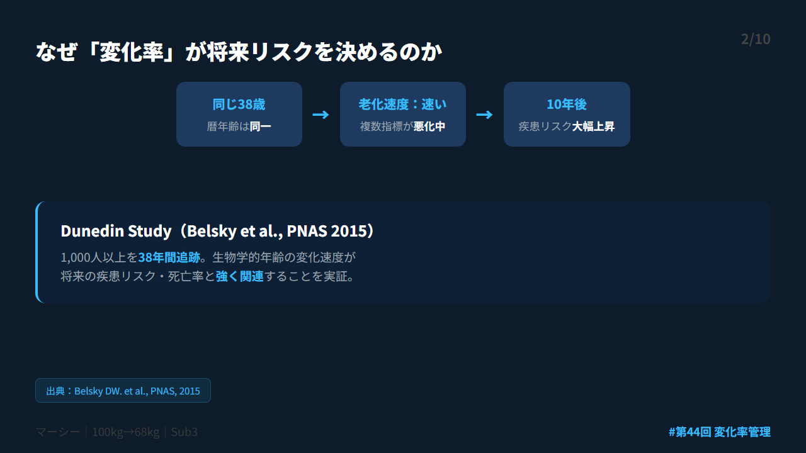
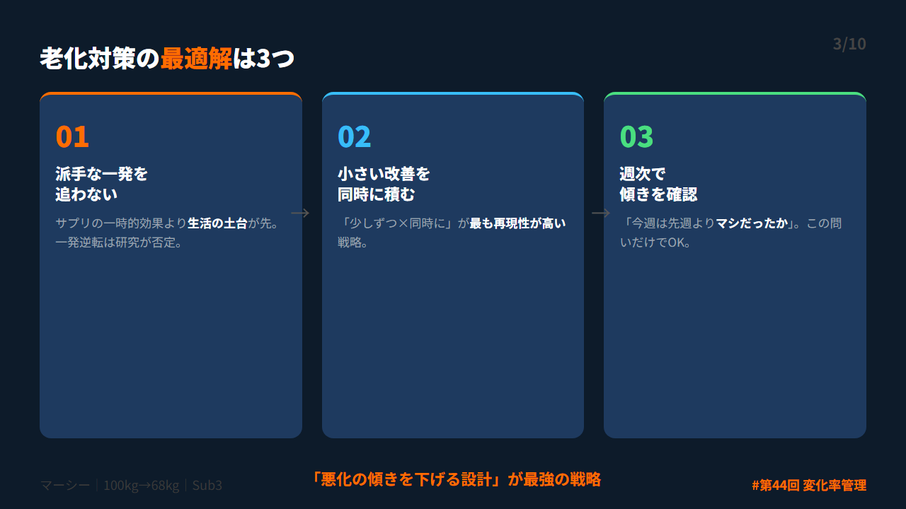
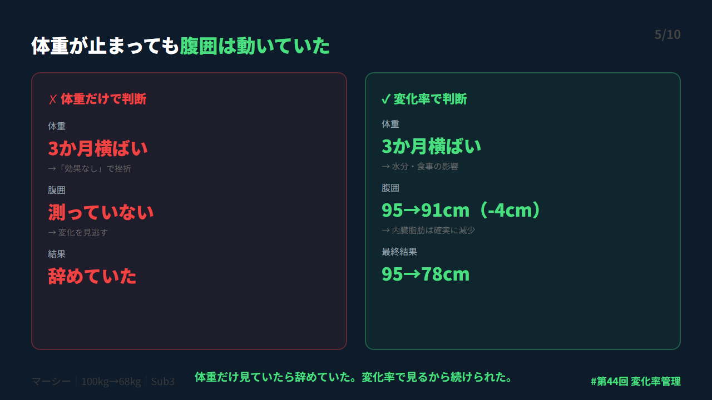
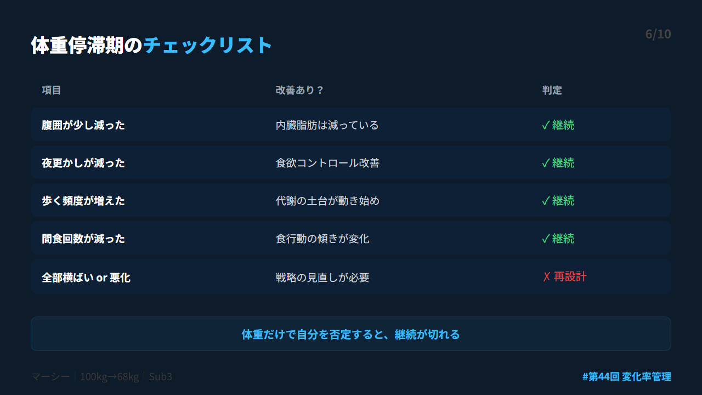
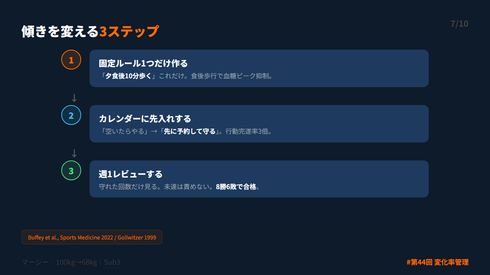

# 第44回 X投稿スレッド（10本）

## 投稿1/10｜共感

```
去年の健診、血糖値がギリギリ「セーフ」だった。

「もう大丈夫だろう」

3か月ダラけた翌年、E判定に逆戻り。
しかも前年より悪化。

1回の数字は何も保証しない。
大事なのは「どっちに動いているか」。

↓続き（2/10）
```


---

## 投稿2/10｜原因

```
Dunedin Study（Belsky et al., PNAS 2015）。
1,000人以上を38年追跡した結果：

同じ38歳でも、生物学的な老化速度が
速い人と遅い人で10年後の健康に大差。

「今何歳相当か」の単発値より
「悪化のスピードをどう抑えるか」が本質。

↓続き（3/10）
```



---

## 投稿3/10｜解決策

```
老化対策の最適解は3つ：

①派手な一発を追わない
②小さい改善を同時に積む
③週次で傾きを確認

「若返りの一発逆転」じゃなく
「悪化の傾きを下げる設計」。

これが忙しい会社員の現実解。

↓続き（4/10）
```



---

## 投稿4/10｜仕組み

```
高い検査の前に、まず4つだけ追う：

・体重（週2〜3回・朝イチ）
・腹囲（週1回・へその高さ）
・睡眠時刻（毎日ざっくり）
・活動量（歩数 or 運動時間）

完璧に記録しない。
週で傾きを見るだけ。

↓続き（5/10）
```


---

## 投稿5/10｜効果

```
100kgから落とす過程で
体重が3か月間まったく動かなかった。

「もう効果ないんじゃ…」と挫折しかけた。

でも腹囲は95cm→91cmに減っていた。
最終的に78cmまで到達。

体重だけ見てたら辞めてた。
変化率で見るから続けられた。

↓続き（6/10）
```



---

## 投稿6/10｜設計

```
体重が停滞しても、これが動いていれば勝ち：

✓ 腹囲が少し減った
✓ 夜更かしが減った
✓ 歩く頻度が増えた
✓ 間食回数が減った

体重だけで自分を否定すると継続が切れる。
行動の傾きを守った人が最後に勝つ。

↓続き（7/10）
```



---

## 投稿7/10｜実践

```
傾きを変える3ステップ：

STEP1：固定ルール1つ
→「夕食後10分歩く」だけ

STEP2：カレンダーに先入れ
→ 会議と同じ扱い

STEP3：週1レビュー
→ 8勝6敗で合格

食後10分歩行で血糖ピークが下がる
（Buffey et al., 2022）

↓続き（8/10）
```



---

## 投稿8/10｜復帰

```
崩れた日のリセットは2つだけ：

①カレンダーを翌日にスライド（消さない）
②翌日の食後に10分だけ歩く

「全部やり直し」は禁止。
1回戻せば他も自然に戻る。

8勝6敗でOK。
崩れることより戻れないことが本当の失敗。

↓続き（9/10）
```


---

## 投稿9/10｜深掘り

```
Dunedin Study（2015）の教訓：

老化速度が速い人の特徴は
「1つの数値が悪い」じゃなく
「複数の指標が同時にゆるく悪化」。

だから逆も同じ。
複数の指標を少しずつ同時に改善する。
これが最も再現性の高い戦略。

↓続き（10/10）
```


---

## 投稿10/10｜今夜やること

```
今日やること1つだけ：

今夜の食後10分歩行を
カレンダーに登録してください。
毎日同じ時刻で固定。

全部やらなくていい。
この1つが明日のあなたを変える。

noteで詳細👇
https://note.com/mash_anti_metabo
```


---

