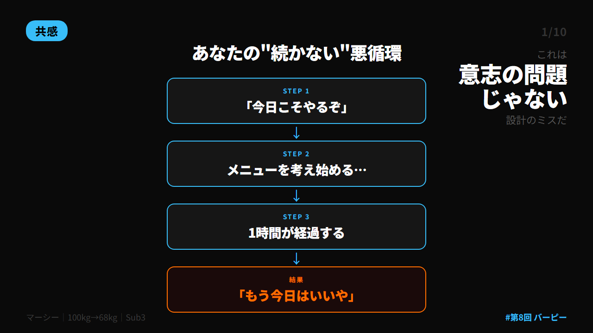
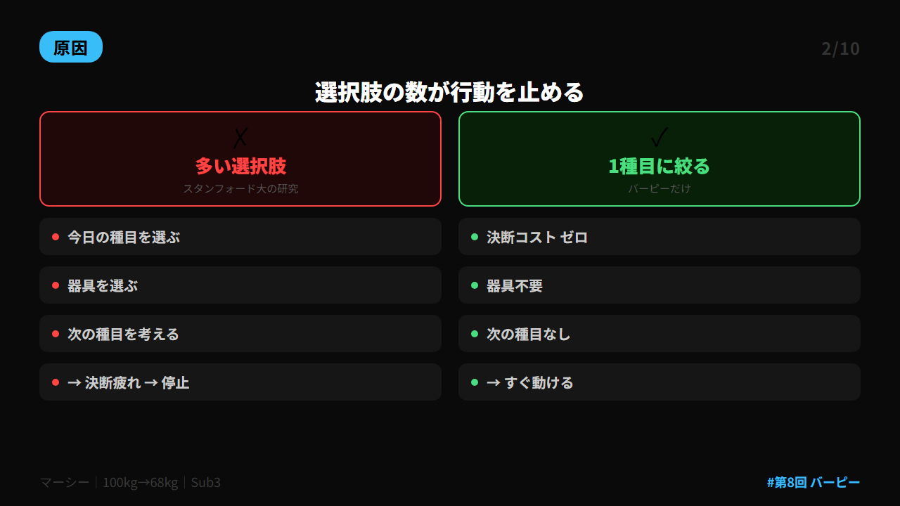
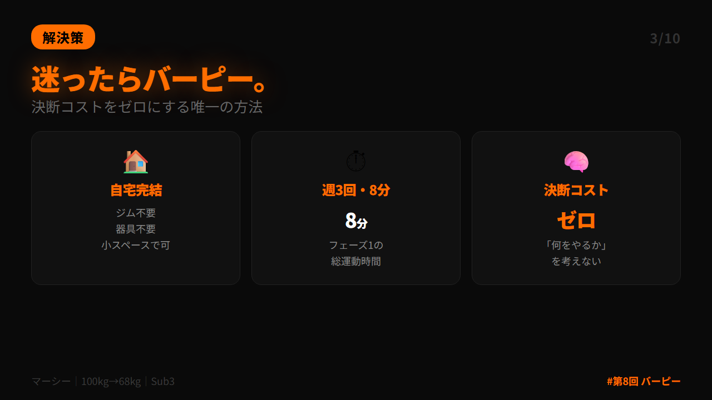
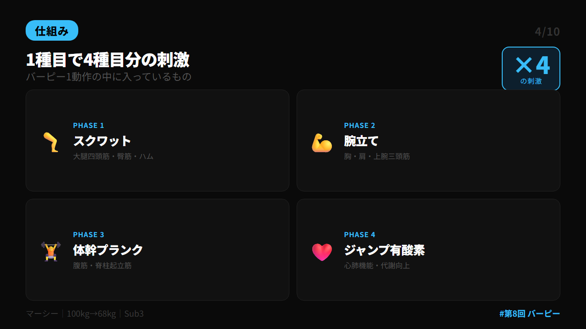
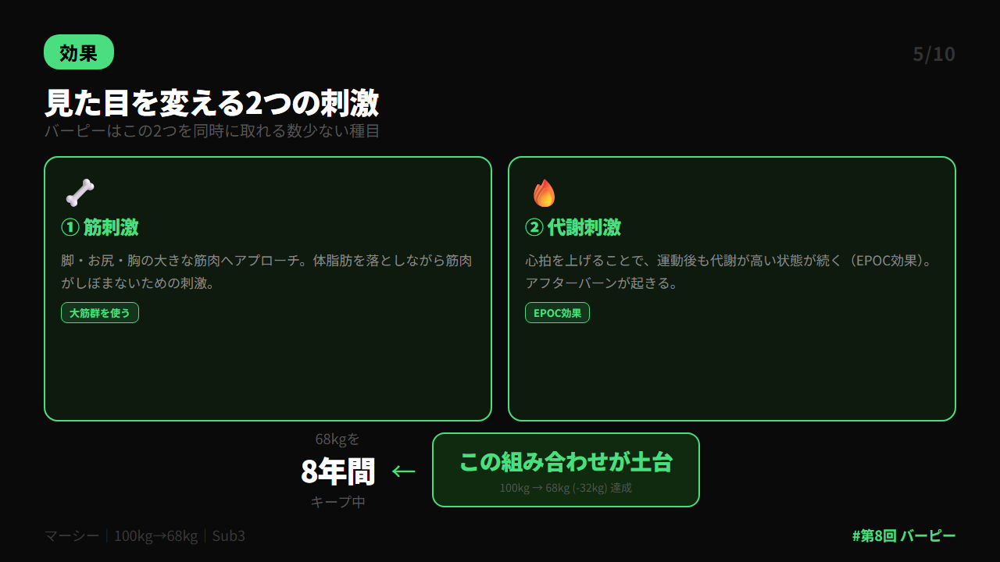
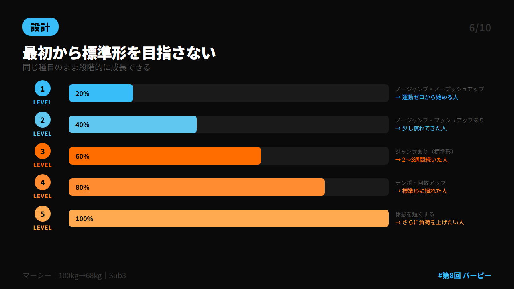
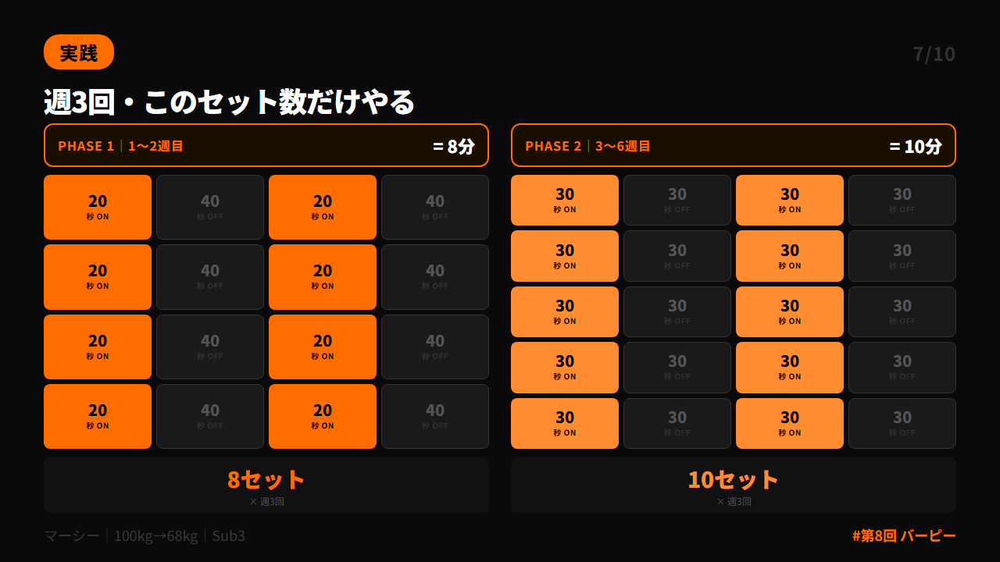
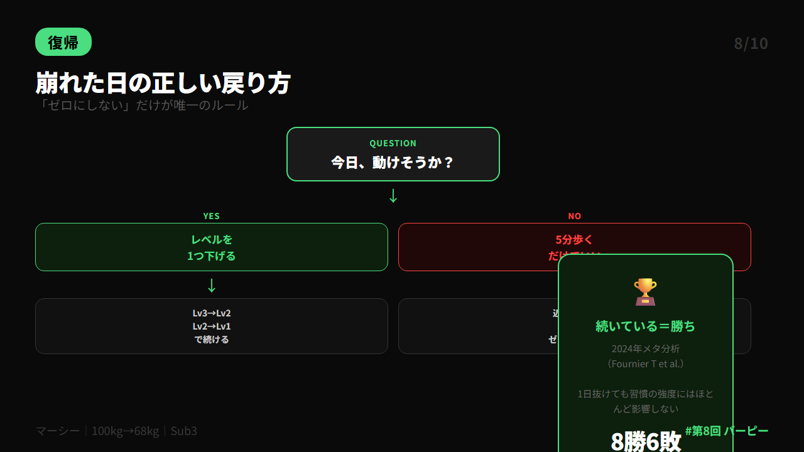
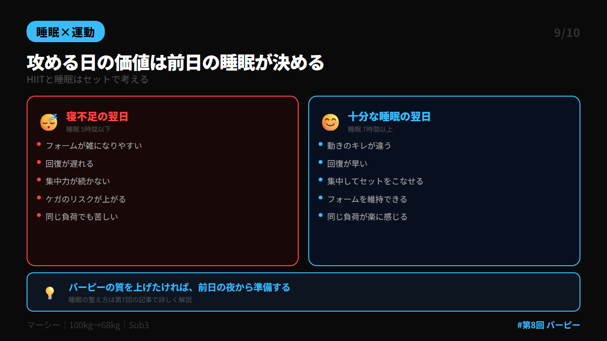
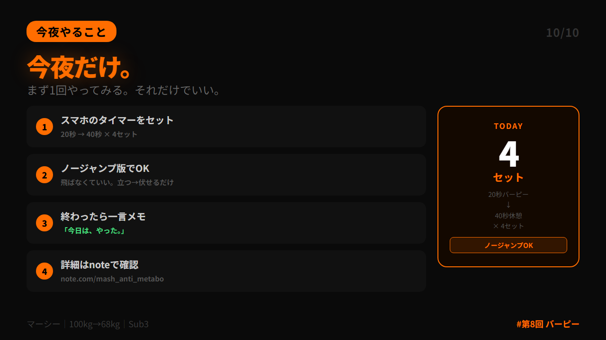

# 第 X投稿スレッド（10本）

## 投稿1/10｜共感

```
「今日こそやる」と思いながら、
メニューを考えているうちに1時間が過ぎてソファに倒れ込む。

100kgだった頃の自分がまさにそうでした。

これ、意志の弱さじゃないです。
設計のミスです。

↓続きを読む（2/10）
```



---

## 投稿2/10｜原因

```
「今日は何をやるか」を毎回考えなければいけない。

これが運動を止める最大の原因。

スタンフォード大の心理学者が示した「選択のパラドックス」。
選択肢が増えるほど、人は決断できなくなる。

運動も同じ。

↓解決策（3/10）
```



---

## 投稿3/10｜解決策

```
解決策はシンプル。

「迷ったらバーピー」と決めるだけ。

種目を1つに絞ると、始める前の決断コストがゼロになる。
ジム不要・器具不要・自宅の小スペースで完結。

週3回・8分から始める。

↓なぜバーピーか（4/10）
```



---

## 投稿4/10｜仕組み

```
バーピー1種目の中に
・スクワット（下半身）
・腕立て（上半身）
・プランク（体幹）
・ジャンプ（心肺）

が入っている。

4種目分の刺激が1種目で取れる。

↓見た目が変わる理由（5/10）
```



---

## 投稿5/10｜効果

```
見た目を変えるには2種類の刺激が必要。

①大きな筋肉への刺激（脚・お尻・胸）
②心拍を上げる代謝刺激（EPOC）

バーピーはこの2つを同時に取れる数少ない種目。

私が68kgを8年間キープできているのも
この組み合わせが土台にある。

↓段階化の設計（6/10）
```



---

## 投稿6/10｜設計

```
バーピーはきつい。
だから最初から標準形を目指さない。

レベル1：ノージャンプ・ノープッシュアップ
レベル2：ノージャンプ・プッシュアップあり
レベル3：ジャンプあり（標準形）

同じ種目のまま成長できる。
「種目を迷う」必要がない。

↓具体的なプロトコル（7/10）
```



---

## 投稿7/10｜実践

```
具体的にはこれだけ。

【フェーズ1（1〜2週目）】
20秒バーピー → 40秒休憩 × 8セット = 8分

【フェーズ2（3〜6週目）】
30秒バーピー → 30秒休憩 × 10セット

毎日やらなくていい。週3回で十分。

↓崩れた日の戻り方（8/10）
```



---

## 投稿8/10｜復帰

```
忙しくて動けなかった日の対処法は1つ。

負荷を落とすだけ。
レベルを1つ下げる。
それでもきつければ5分歩くだけでいい。

「やらなかった」と「ゼロにした」は違う。

8勝6敗で十分。続いているなら勝ち。

↓睡眠との連動（9/10）
```



---

## 投稿9/10｜睡眠×運動

```
見落とされがちなポイント。

バーピーの質を決める意外な要素がある。
前日の睡眠。

寝不足でやるとフォームが崩れやすく、
回復も遅れる。

攻める日の価値は、前日の夜が決める。
HIITと睡眠はセットで考える。

↓今夜やること（10/10）
```



---

## 投稿10/10｜今夜やること

```
まず今夜だけ試してみてください。

20秒バーピー → 40秒休憩 × 4セット
（ノージャンプOK）

終わったら一言だけメモ。
「今日は、やった。」

その4セットが、見た目を変える最初の1歩です。

詳細はnoteで👇
https://note.com/mash_anti_metabo
```



---


