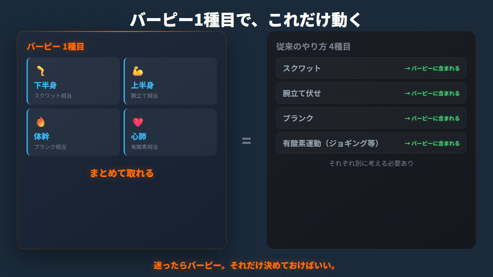
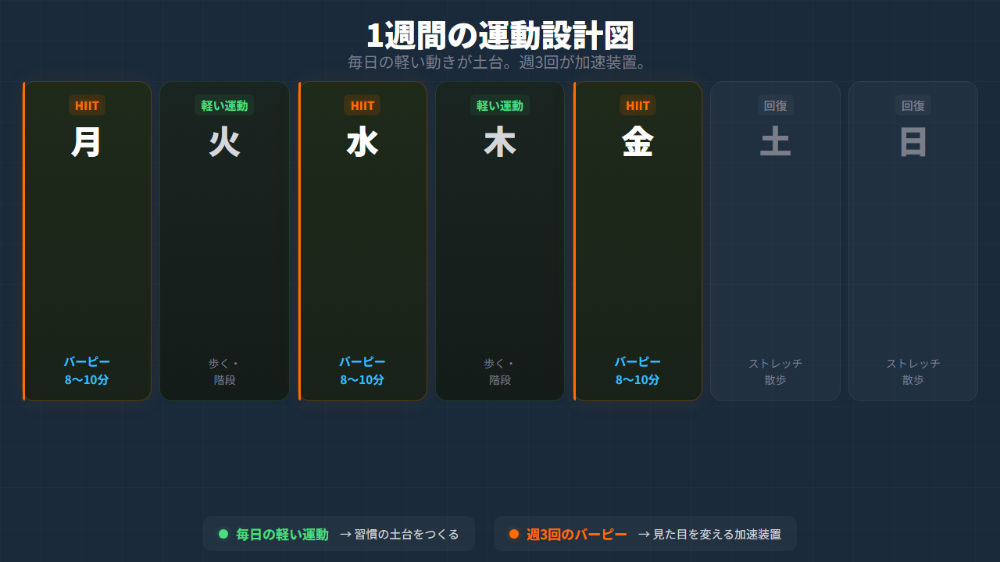
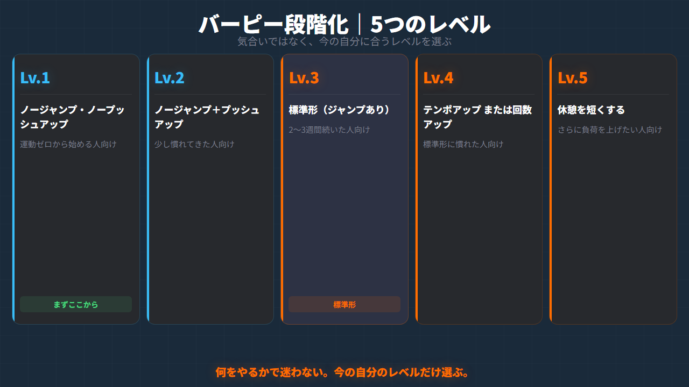
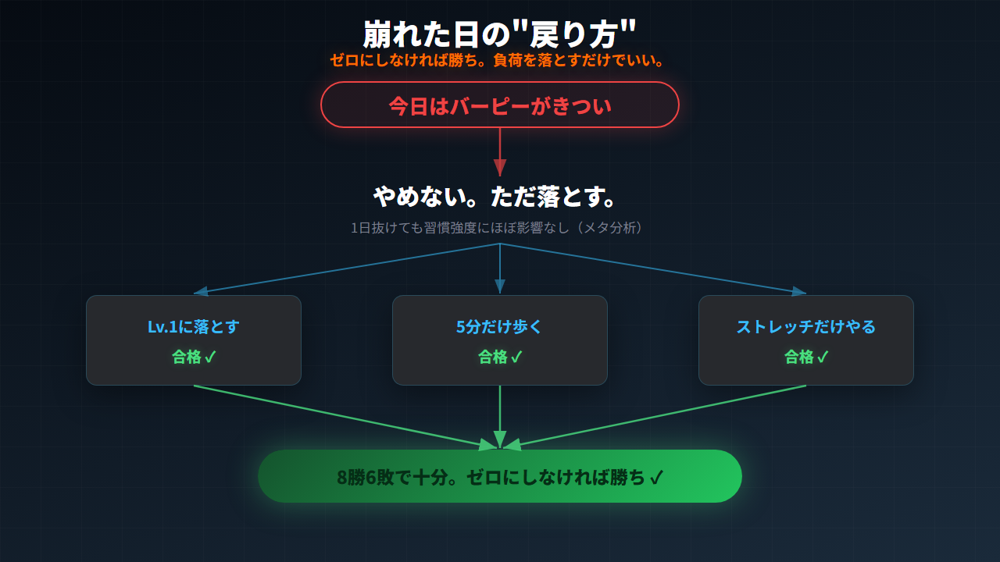

# 忙しい人ほど、種目を減らせ。週3回・8分のバーピーが見た目を変える理由

## 1. またメニューを考えているうちに、今日も動けなかった

スクワットもやった方がいい。
腕立てもやった方がいい。
走った方がいい。
体幹も鍛えた方がいい。

全部わかってます。

でも、わかった瞬間に止まる。

メニューを考えているうちに時間が過ぎて、「今日はもう遅いし明日からにしよう」。そういう夜が何週間も続く。

これ、意志が弱いんじゃないです。

100kgだった頃の自分が、まさにこれでした。「今日こそやるぞ」と思いながら、何をすればいいか迷っているうちに1時間が経ち、ソファに倒れ込む。翌朝また後悔する。このループに何ヶ月もいました。

当時の自分に伝えたいことが一つあります。

**あなたの問題は、意志の弱さじゃない。設計だ。**

---

## 2. 続かないのは意志のせいじゃない。選択肢が多すぎる設計のせいだ

心理学の世界に「選択のパラドックス」という概念があります。選択肢が増えると、人は決断できなくなるというものです。スタンフォード大学の心理学者バリー・シュワーツが著書でまとめたこの考え方は、運動の継続にもそのまま当てはまります。

「今日は何をやるか」を毎回考えなければならない。
「道具はどれを使うか」を判断しなければならない。
「次は何の種目か」を思い出しながらやらなければならない。

この小さな決断のコストが積み重なって、「もうやめた」につながる。

これは意志の弱さではなく、**設計のミス**です。

解決策はシンプルです。

**絞る。迷わない。すぐやる。**

「今日何やるか」をゼロにする。それだけで、始めるハードルが劇的に下がります。

---

## 3. 結論：迷ったらバーピー。週3回・8分から始める

今日の結論を先に言います。

**① バーピーは、1種目で全身を動かしやすい**
下半身・上半身・体幹・心肺。複数種目が必要な刺激を、1つの動きでまとめて取りにいける。

**② 見た目変化に必要な刺激が入りやすい**
大きい筋肉を使いながら心拍を上げる。短時間でも「今日はちゃんとやった」と言えるレベルの刺激が入る。

**③ 続くのは気合いではなく段階化の設計**
最初から標準形を目指さない。レベル1から始めて、同じ種目のまま成長できる。

ジム不要。器具不要。自宅の小スペースで完結。始めるまでの準備がいらない。だから続きやすい。

---

---

## 4. バーピーが時短最強な理由：1種目で全身を動かせる

バーピーの動作を分解すると、こうなります。

- **立った状態からしゃがんで手をつく**（体幹・下半身）
- **足を後ろに伸ばしてプランク姿勢**（体幹・上半身）
- **腕立て**（胸・肩・腕）
- **足を引き戻してジャンプ**（下半身・心肺）

1回の動作の中に、スクワット・腕立て・体幹・有酸素の要素がすべて入っています。

普通は4種目必要なところを、1種目でまとめられる。

これが忙しい人にとって何を意味するか。

「今日のメニューは何か」を考えなくていい。「道具はどれか」を選ばなくていい。「次はどの種目か」を思い出さなくていい。

**「バーピーをやる」とだけ決めておけば、あとは動くだけです。**

ジムに行く手間も、準備する時間も不要。この「始めるまでのラクさ」が、継続において意志力よりずっと強い武器になります。

100kgだった頃の私は、ジムの月会費を払い続けながら行けない日が続いていました。今思えば、「行くための準備」がすでに大きなコストだったんです。バーピーはそれがない。これだけで続きやすさがまったく違います。

---

## 5. なぜ見た目が変わるのか：筋刺激と代謝刺激を同時に取る

ただ汗をかけばいいわけではありません。

見た目を変えるには、2種類の刺激が必要です。

**① 筋肉への刺激**
体脂肪を落としながら、筋肉がしぼまないようにするための刺激です。脚の大きな筋肉（大腿四頭筋・ハムストリングス・臀筋）を使うバーピーは、ここに効きやすい。

**② 代謝を上げる刺激**
心拍を上げることで、運動後も一定時間代謝が高い状態が続きます。これを「アフターバーン効果（EPOC）」と呼びます。インターバル形式で行うバーピーは、この刺激を入れやすい。

私自身の運動設計でも、毎日の歩きや軽い動きを土台にしながら、週3回だけ少し追い込む日を作ることを大切にしています。

**毎日の軽い運動が土台。週3回のバーピーが加速装置。**

この組み合わせで、68kgを8年間キープできています。

また、見落とされがちですが、メンタルへの効果も大きいです。バーピーは終わったあとの「やった感」がかなり残る。しんどい。でも終わる。終わったらちょっと誇らしい。

この「自己効力感」の積み上げが、次回の実行をラクにします。「今日もやれた」が、「次もできそう」に変わる。それが習慣の正体です。

---

---

## 6. 続く理由は段階化にある：レベル1→5の設計

正直に言います。

バーピーは、きついです。

だからこそ、**最初から標準形を目指さない**ことが大切です。

| レベル | 内容 | こんな人に |
|---|---|---|
| レベル1 | ノージャンプ、ノープッシュアップ | 運動ゼロから始める人 |
| レベル2 | ノージャンプ、プッシュアップあり | 少し慣れてきた人 |
| レベル3 | ジャンプあり（標準形） | 2〜3週間続いた人 |
| レベル4 | テンポアップ、または回数アップ | 標準形に慣れた人 |
| レベル5 | 休憩を短くする | さらに負荷を上げたい人 |

何をやるかで迷わない。今の自分に合うレベルだけ選ぶ。これだけです。

膝や腰に不安がある方は、レベル1から始めてください。それで十分です。

**気合いではなく、段階化です。**

同じ種目のまま成長できる。これがバーピーを「続けやすい種目」にしている最大の理由です。

---

---

## 7. 8週間プロトコル：週3回、この3フェーズでやる

具体的なやり方です。

**週3回で構いません。** 毎日やる必要はありません。回復日があるほうが、次の1回の質が上がります。

---

**フェーズ1（1〜2週目）**
20秒バーピー → 40秒休憩 × 8セット
合計**8分**

**フェーズ2（3〜6週目）**
30秒バーピー → 30秒休憩 × 10セット
合計**10分**

**フェーズ3（7週目以降）**
40秒バーピー → 20秒休憩 × 10セット
合計**10分**
（余裕があればプランク30秒×2セットを追加）

---

最初から最強メニューはいりません。「次もやれる設計にする」。これが続く秘訣です。

フォームについて、4つだけ意識してください。

1. **着地は静かに**（膝と足首を守る）
2. **腰を反らせない**（お腹に軽く力を入れる）
3. **雑になったらペースダウン**（きつさはOK、フォーム崩れはNG）
4. **痛みがある日は中止**（低強度の動きに変える）

きつさと痛みは別物です。痛みのサインは必ず守ってください。

そして、もう一つ。バーピーの質を決める、意外な要素があります。

**前日の睡眠です。**

寝不足でバーピーをやると、フォームが雑になりやすく、回復も遅くなりがちです。逆に、しっかり眠れた翌日は、同じ負荷でも体の動きがまったく違います。

**攻める日の価値は、前日の睡眠で決まる。**

HIITは睡眠とセットで考える。この順番が、結果を出す最短ルートです。（睡眠の整え方は第7回の記事で詳しく書きました）

---

## 8. 崩れた日は、負荷を落とすだけでいい

残業で遅くなった。疲れ果てた。体が重い。そういう日は普通にあります。

そんな日の戻り方は、1つだけです。

**負荷を落とす。でもゼロにしない。**

バーピーがきつければ、その日はレベルを1つ下げる。レベル1もきつければ、5分間歩くだけでいい。

自己嫌悪は不要です。「やれなかった」より「少しでも動いた」のほうが、習慣の維持という観点では圧倒的に強い。

2024年のメタ分析（Fournier T et al., PMC掲載）でも、習慣形成において1日抜けても習慣の強度にはほとんど影響しないことが確認されています。

**8勝6敗で十分。ゼロにしなければ勝ちです。**

---

---

## 9. まとめ｜今夜やること、1つだけ

今日のポイントを3つに絞ります。

**① 続かないのは意志ではなく設計の問題**
種目を増やすほど、始める前に疲れる。「迷ったらバーピー」と決めてしまえば、選択のコストがゼロになる。

**② バーピー1種目で全身の刺激をまとめて取れる**
下半身・上半身・体幹・心肺を1動作で。ジム不要・器具不要・自宅完結。週3回・8分から始める。

**③ 段階化と睡眠の連動が継続のカギ**
最初はレベル1から。前日の睡眠が翌日の質を決める。崩れた日は負荷を落とすだけで続ける。

---

全部じゃなくていいです。まず1つだけ。

**今夜、20秒バーピー→40秒休憩を4セットやる。**

きつければノージャンプ版でOKです。

終わったら一言メモしてください。

「今日は、やった。」

その1回が、体と自信を変える最初の1歩です。

---

**▼ 前回の記事（睡眠編）**
[「痩せたいのに夜に崩れる人」は、寝る前の設計が間違っている。](https://note.com/longevity_navi)

**▼ Podcastで"聴く"バージョン**
🎙️ [日本を元気にする健康習慣ラジオ ― E判定からの逆転 ―](https://stand.fm/channels/6965ee968d01e8272cb34e15)

---

**Longevity Navigator（不老長寿ナビゲーター）**
100kg→68kgを8年間維持中 | サブ3ランナー | 30〜40代メタボ逆転を仕組みで支援

📝 note：https://note.com/longevity_navi
🎙️ Podcast：https://stand.fm/channels/6965ee968d01e8272cb34e15
🐦 X（Twitter）：@longevity_navi

---

【出典】
- Fournier T et al. Time to Form a Habit: A Systematic Review and Meta-Analysis. PMC. 2024.
- Schwartz B. The Paradox of Choice. Harper Perennial. 2004.

---

【免責事項】
この記事は個人の体験に基づく情報共有です。医療行為・診断・治療を目的としたものではありません。持病のある方、運動制限がある方、膝・腰・足首に不安がある方は、医師や専門家の指示を優先してください。
