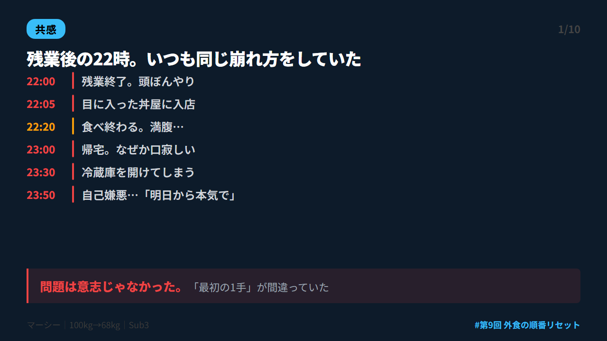
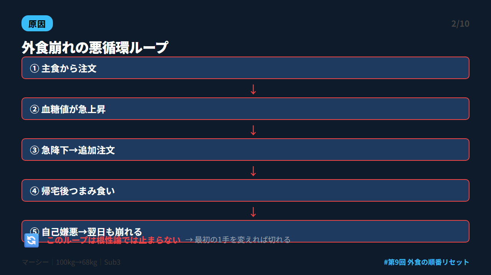
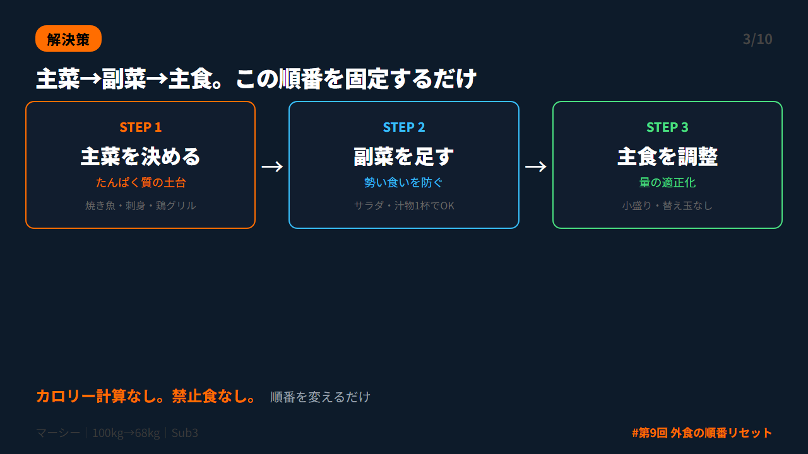
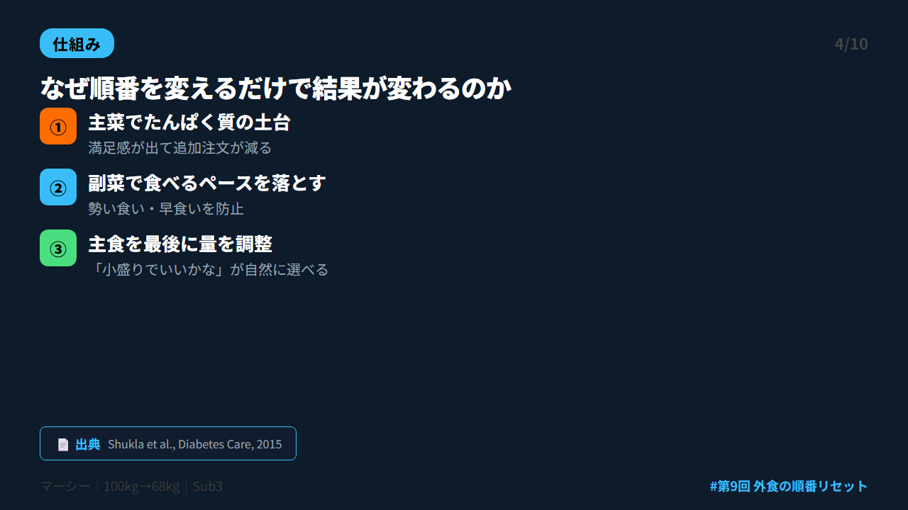
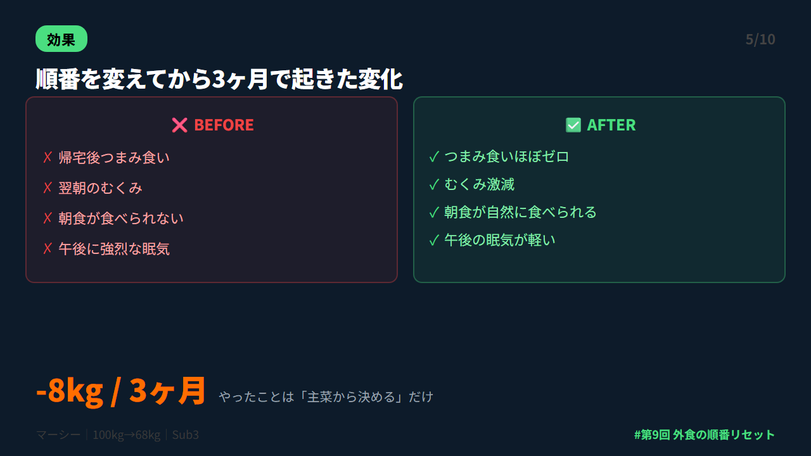
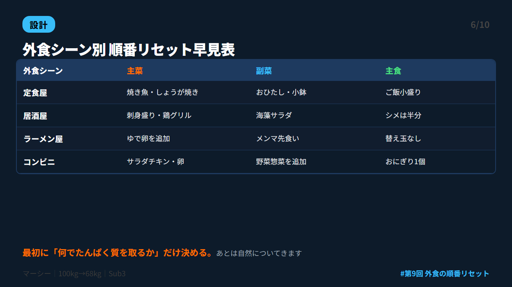
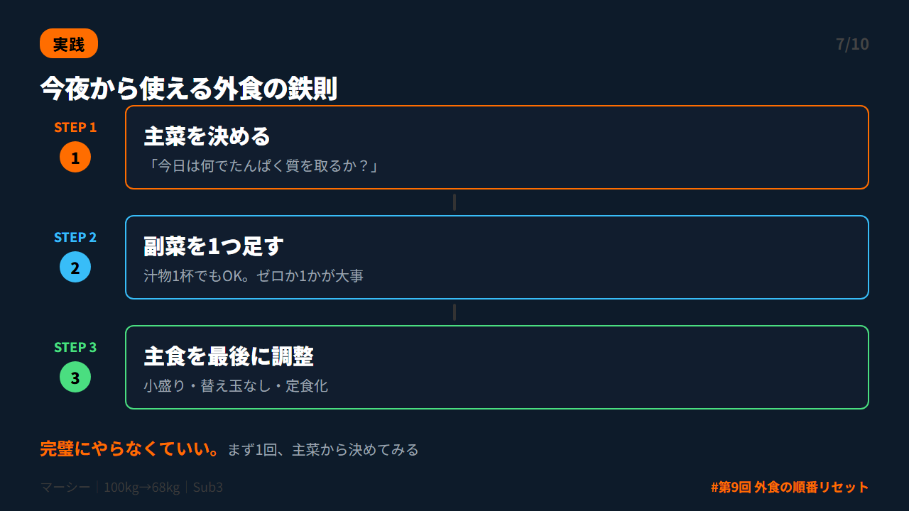
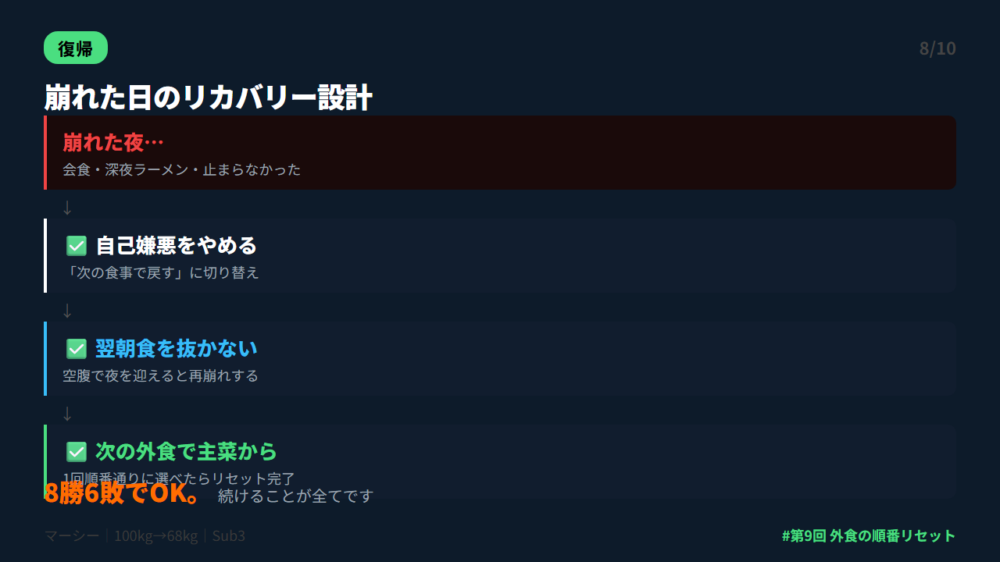
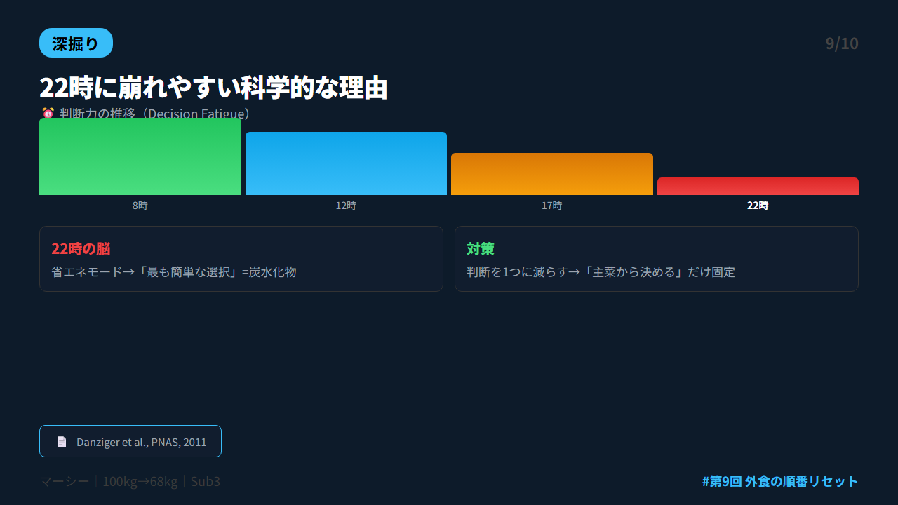
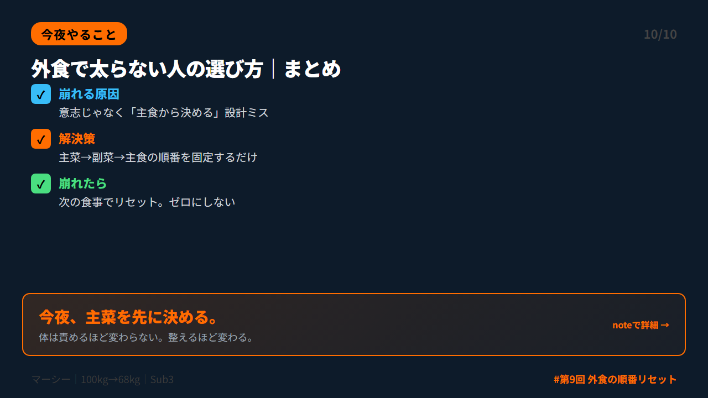

# 第 X投稿スレッド（10本）

## 投稿1/10｜共感

```
残業後の22時。
疲れた頭で駅前に出て、目に入った丼を頼む。
食べ終えた後の自己嫌悪、つらいですよね。

これ、意志が弱いんじゃないんです。
「主食から決める」という設計ミスが原因でした。

↓続き（2/10）
```



---

## 投稿2/10｜原因

```
主食（丼・麺）から食べ始めると何が起きるか。

血糖値が急上昇→急降下。
「もう少し食べたい」という衝動が出る。
追加注文→帰宅後のつまみ食い→自己嫌悪。

このループ、根性論では止まりません。
最初の1手を変えるだけで切れます。

↓続き（3/10）
```



---

## 投稿3/10｜解決策

```
外食崩れを止めた1つの変化。

主食から決める→主菜から決める

「今日は何でたんぱく質を取るか？」を最初に決める。
副菜を1つ足して、主食を最後に調整する。

主菜→副菜→主食。
この順番を固定するだけです。

↓続き（4/10）
```



---

## 投稿4/10｜仕組み

```
なぜ食べる順番で変わるのか。

①主菜（たんぱく質）先→満足感が出て追加注文が減る
②副菜を足す→食べるスピードが落ちて勢い食いを防ぐ
③主食を最後に→量を必要分だけ調整できる

2015年Diabetes Care の研究でも食べる順番が食後血糖値に有意な影響を与えることが示されています。

↓続き（5/10）
```



---

## 投稿5/10｜効果

```
順番を変えてから僕に起きた変化。

・帰宅後のつまみ食いがほぼゼロに
・翌朝のむくみが激減
・朝食が食べられるようになった
・午後の眠気が軽くなった
・3ヶ月で-8kg

やったことは「主菜から決める」だけ。
100kgから68kgになるまで、この習慣を続けました。

↓続き（6/10）
```



---

## 投稿6/10｜設計

```
疲れた夜の外食設計はシンプルに。

主菜の選び方：
焼き魚・刺身・鶏グリル・卵系・赤身肉

副菜の足し方：
サラダ・おひたし・味噌汁1杯でもOK

主食の調整：
小盛り・替え玉なし・丼→定食化

最初に「何でたんぱく質を取るか」だけ決める。
あとは自然についてきます。

↓続き（7/10）
```



---

## 投稿7/10｜実践

```
今夜から使える外食の鉄則。

店に入ったら最初に1つだけ決める。
「今日は、何でたんぱく質を取るか？」

焼き魚→決定。
次に副菜。
最後に主食の量。

これだけ。
全部完璧にやらなくていい。
「主菜から決める」1点だけ守れれば十分です。

↓続き（8/10）
```



---

## 投稿8/10｜復帰

```
崩れた日は、普通にあります。

会食で飲みすぎた。
残業でラーメン食べた。
それで終わりじゃない。

「昨日崩れたから今日は食べない」は逆効果。
空腹で夜を迎えるとまた崩れます。

次の食事で主菜→副菜→主食に戻すだけ。
8勝6敗でOK。続けることが全てです。

↓続き（9/10）
```



---

## 投稿9/10｜深掘り

```
22時に外食で崩れやすい理由は脳にあります。

1日中判断を繰り返した脳は夜になると「省エネモード」に。
省エネモードの脳が選ぶのは「最も簡単な選択」。
＝目に入ったもの＝炭水化物。

これを「決断疲れ（Decision Fatigue）」と呼びます。
意志が弱いのではなく、脳が疲れているだけ。
だから「最初の選択だけ固定する」設計が効くんです。

↓続き（10/10）
```



---

## 投稿10/10｜今夜やること

```
【まとめ｜外食で太らない人の選び方】

✅ 崩れる原因は意志じゃなく「主食から決める」設計ミス
✅ 主菜→副菜→主食の順番を固定するだけでいい
✅ 崩れたら次の食事でリセット。ゼロにしない

今夜の外食で1つだけ試す。
→「主菜を先に決める」

体は責めるほど変わらない。整えるほど変わります。

詳しくはnoteに書きました👇
https://note.com/mash_anti_metabo
```



---


