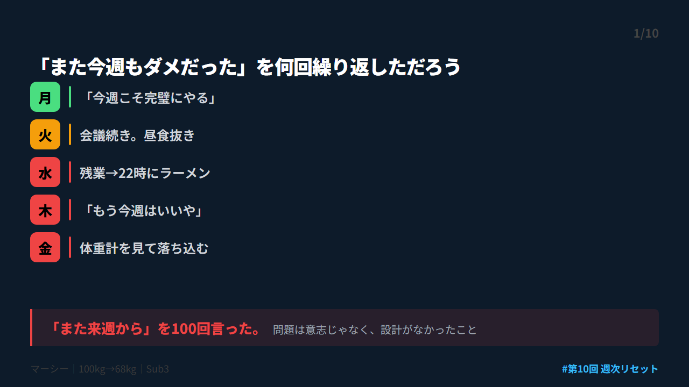
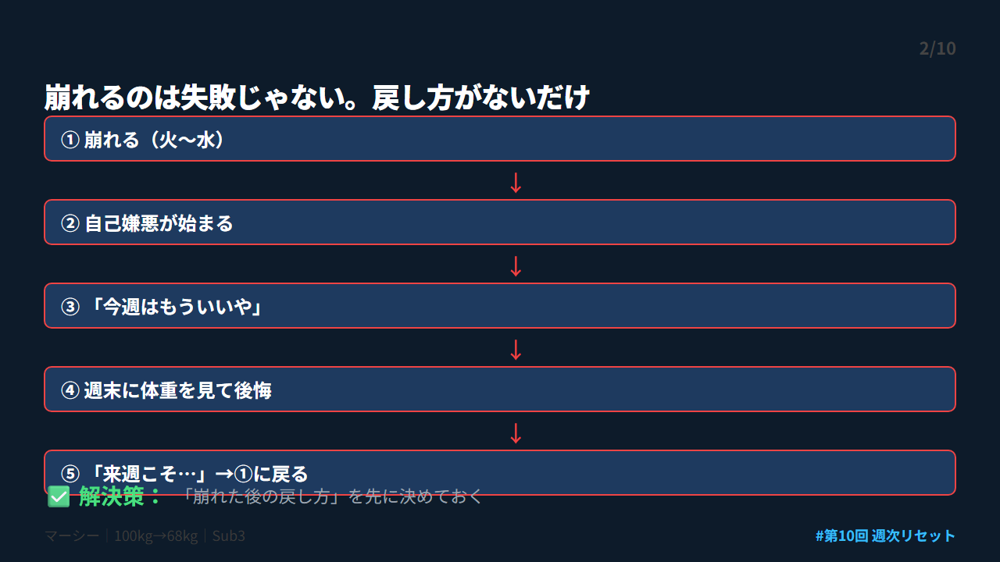
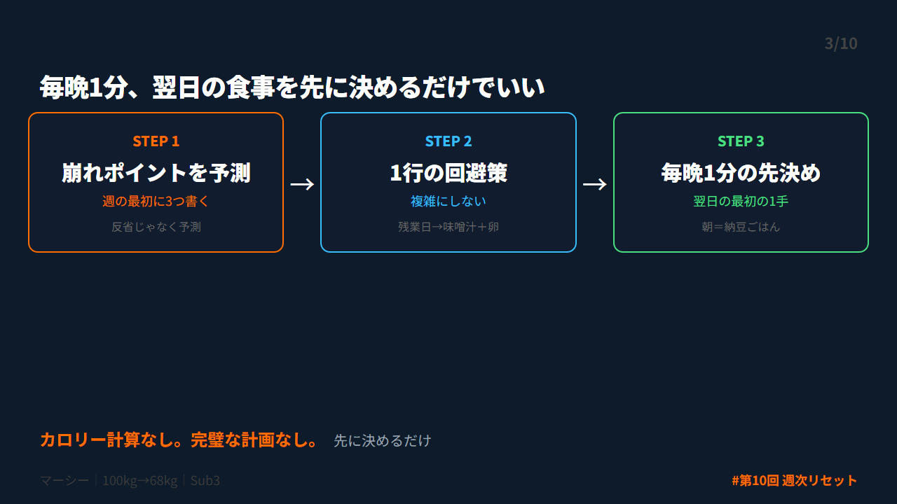
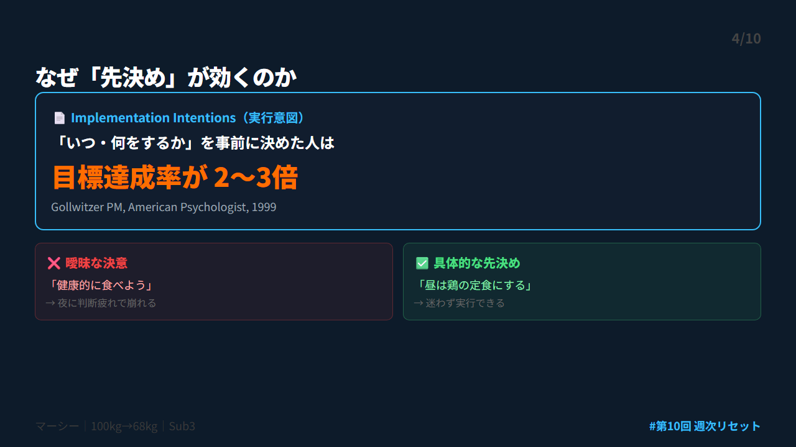
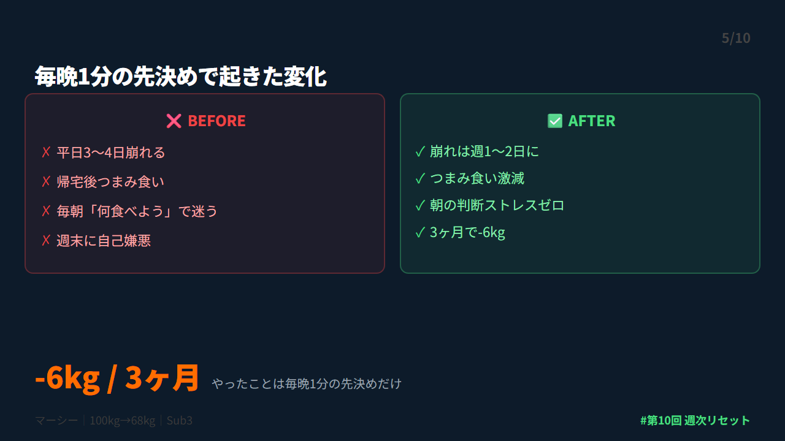
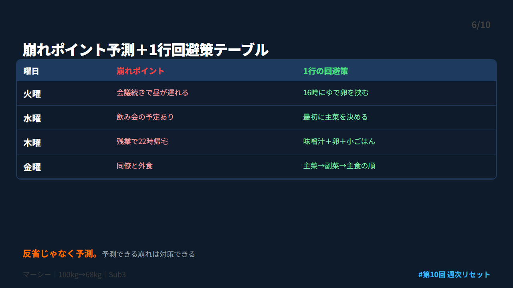
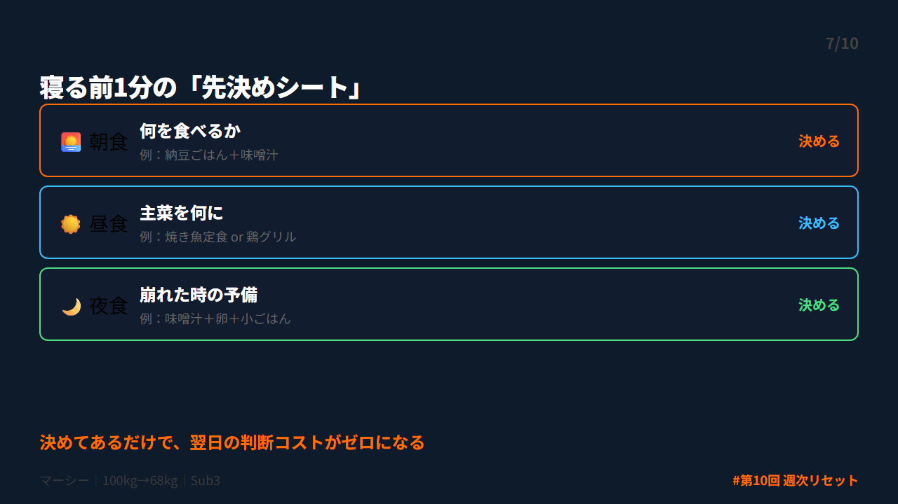
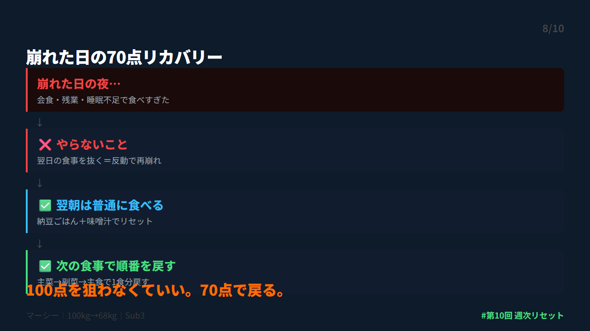
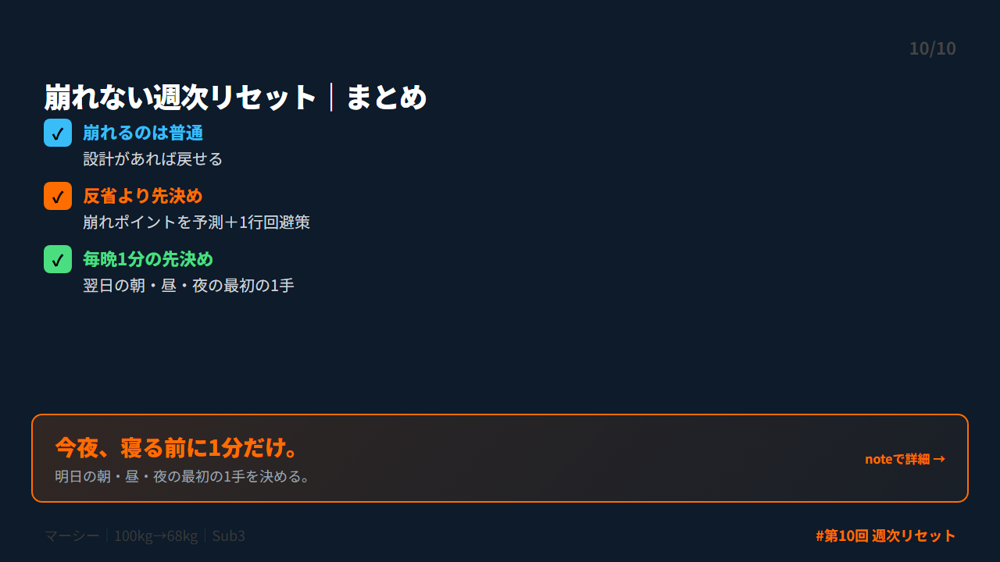

# 第 X投稿スレッド（10本）

## 投稿1/10｜共感

```
月曜に「今週こそは」と決める。
火曜に崩れる。
水曜に「もう今週はいいや」。
金曜に体重計を見て落ち込む。

「また来週から」

これ、何回言いましたか？
僕は100回以上言いました。100kgの頃の話です。

↓続き（2/10）
```



---

## 投稿2/10｜原因

```
崩れるのは普通です。

忙しい30〜40代で、
週5日完璧に食事をコントロールできる人のほうが珍しい。

問題は「崩れたこと」じゃない。
「崩れた後にどう戻すかが決まっていないこと」が問題だった。

設計があれば、崩れても戻せます。

↓続き（3/10）
```



---

## 投稿3/10｜解決策

```
平日崩れを止めた方法はシンプル。

毎晩1分、翌日の食事を先に決める。

・朝：何を食べるか
・昼：主菜を何にするか
・夜：崩れた時の予備プラン

これだけ。
先に決めてあるから、疲れた日でも迷わない。

↓続き（4/10）
```



---

## 投稿4/10｜仕組み

```
なぜ「先決め」が効くのか。

心理学者ゴルヴィッツァーの研究（1999）によると、
「いつ・何をするか」を事前に決めた人は
目標達成率が2〜3倍に上がる。

これを Implementation Intentions（実行意図）と呼ぶ。

「健康的に食べよう」より「昼は鶏定食」のほうが実行される。

↓続き（5/10）
```



---

## 投稿5/10｜効果

```
先決めを始めてから起きた変化。

・平日の崩れが週3〜4日→1〜2日に
・帰宅後のつまみ食いが激減
・朝の判断ストレスがゼロに
・3ヶ月で-6kg

やったことは毎晩1分の先決め。それだけ。
100kgから68kgへの-32kgは、こういう小さな習慣の積み上げ。

↓続き（6/10）
```



---

## 投稿6/10｜設計

```
崩れやすい日を先に知っておく。

週の最初に1分、崩れポイントを3つ書く。
・火曜＝会議続きで昼が遅れる
・木曜＝残業で22時帰宅
・金曜＝同僚と外食

反省じゃなく予測。
予測できる崩れは対策できる。

↓続き（7/10）
```



---

## 投稿7/10｜実践

```
対策は1行で十分。

・残業日→味噌汁＋卵＋小ごはん
・外食日→最初に主菜を決める
・昼遅れの日→16時にゆで卵を挟む

複雑にしないほうが現場で使える。
100kgの頃はExcelで完璧な計画を作って水曜に崩壊してた。
今は1行。それが8年続いてる。

↓続き（8/10）
```



---

## 投稿8/10｜復帰

```
崩れた日は普通にある。

やらないこと：
「昨日崩れたから今日は食べない」

やること：
次の食事で主菜→副菜→主食に戻す。

100点を狙わなくていい。
70点で戻る。8勝6敗でOK。

↓続き（9/10）
```



---

## 投稿9/10｜深掘り

```
平日に崩れやすい3つの原因。

①判断の先送り→疲れた脳が楽な選択に流れる
②完璧主義→1回崩れたら全部投げる
③記録のズレ→体重だけ見て行動を見ない

解決は全部同じ。
「先に決めておく」こと。
判断を減らすだけで、崩れにくくなる。

↓続き（10/10）
```


---

## 投稿10/10｜今夜やること

```
【まとめ｜崩れない週次リセット】

✅ 崩れるのは普通。設計があれば戻せる
✅ 反省より「先決め」が効く
✅ 毎晩1分、翌日の食事を先に決める

今夜、寝る前に1分だけ。
→「明日の朝・昼・夜の最初の1手」を決める

あなたは意志が弱いんじゃない。忙しいだけ。

詳しくはnoteに書きました👇
https://note.com/mash_anti_metabo
```



---


