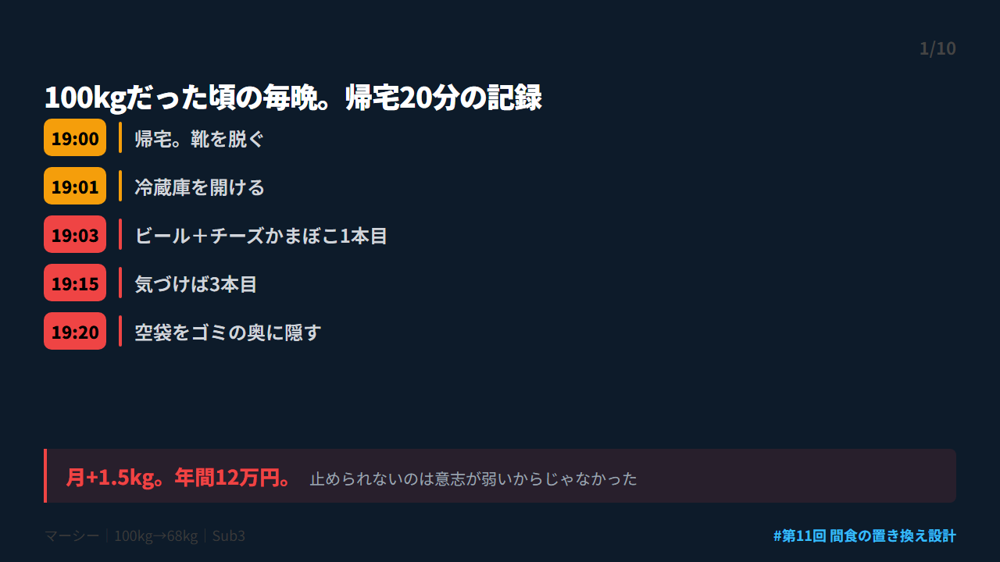
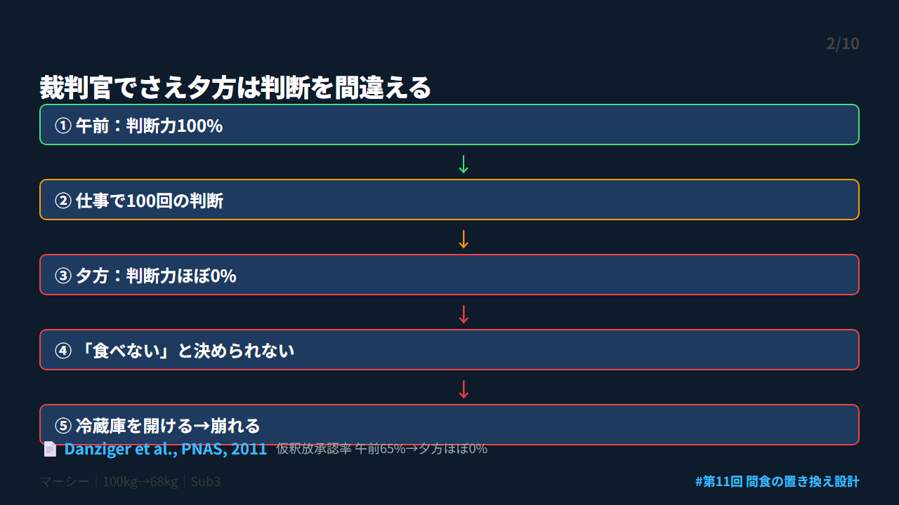
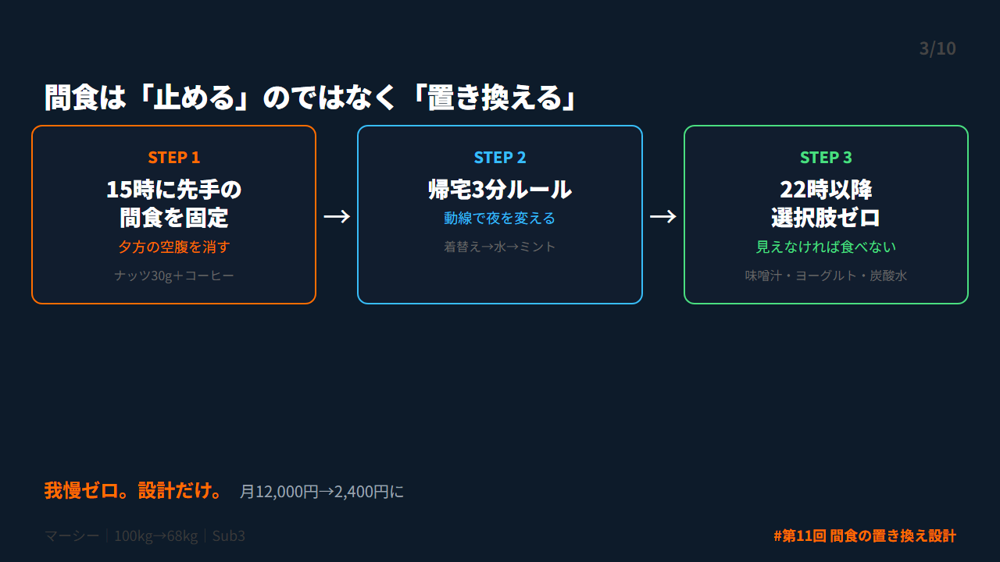
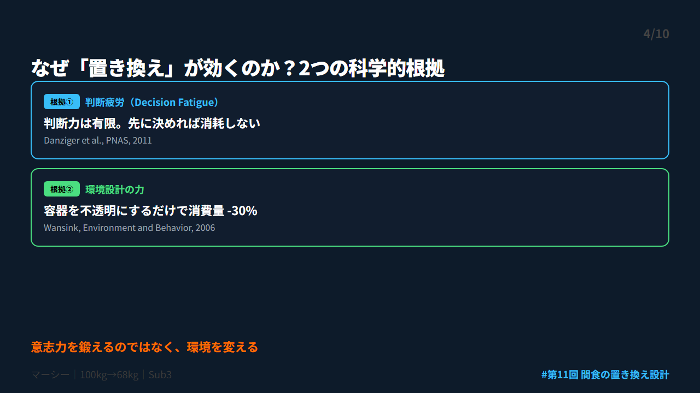
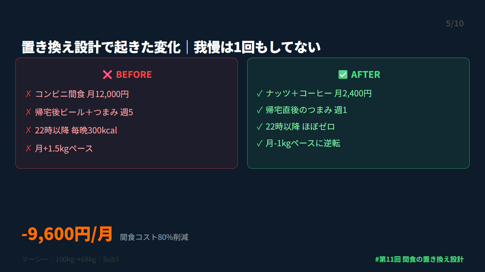
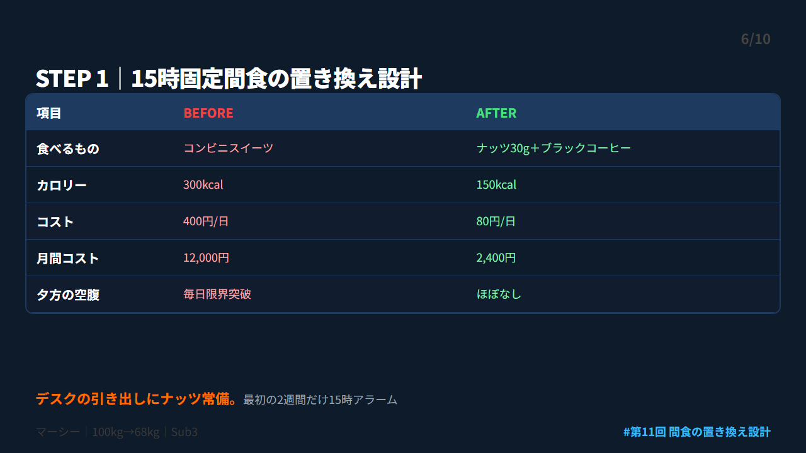
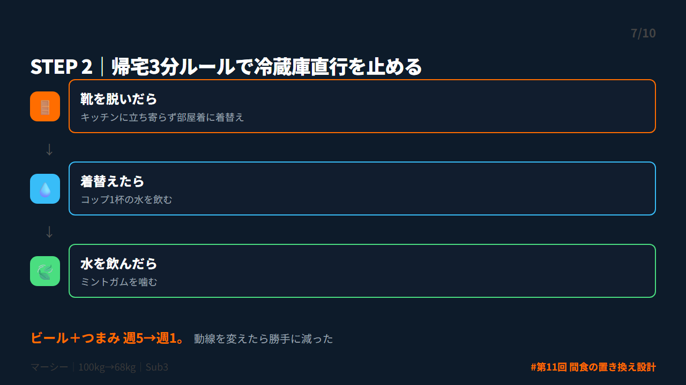
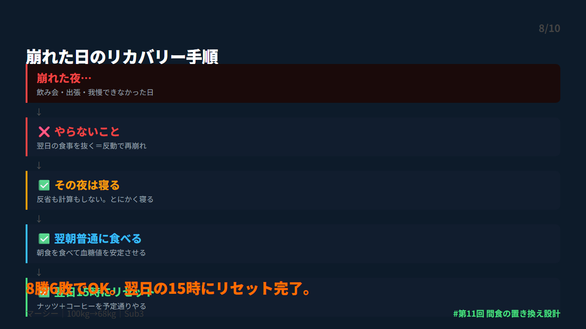
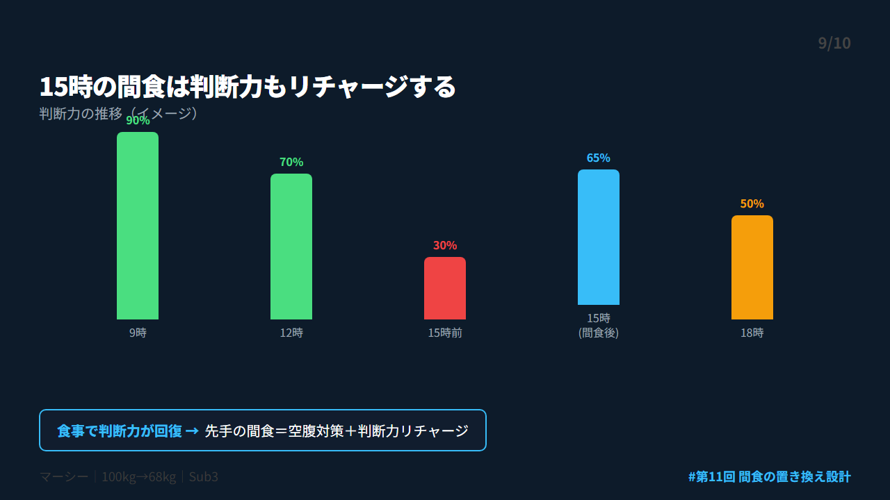
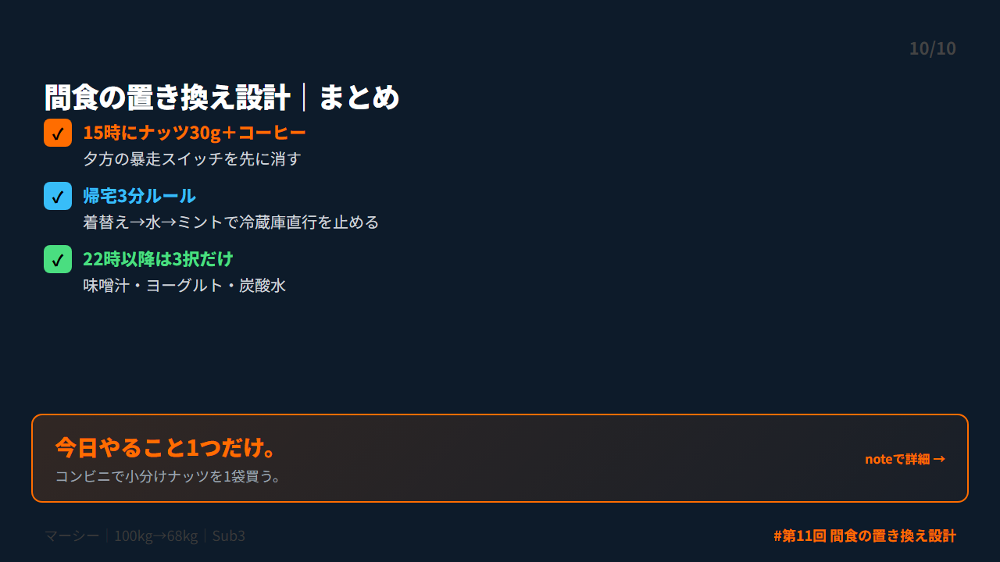

# 第 X投稿スレッド（10本）

## 投稿1/10｜共感

```
帰宅して冷蔵庫を開ける。
チーズかまぼこ1本、ビールと一緒に。

「1本だけ」のはずが3本。
空袋をゴミの奥に隠す。

100kgだった頃、毎晩これだった。
月+1.5kg。年間12万円。

止められないのは意志が弱いからじゃなかった。

↓続き（2/10）
```



---

## 投稿2/10｜原因

```
裁判官の判決データを調べた研究がある。

午前中の仮釈放承認率：65%
夕方：ほぼ0%

裁判官でさえ夕方は正しい判断ができなくなる。

これが「判断疲労」。
夕方に「食べない」と決められないのは当然。

意志の問題じゃない。設計の問題。

↓続き（3/10）
```



---

## 投稿3/10｜解決策

```
間食を「止める」のをやめた。
代わりに「置き換える」ことにした。

3つだけ決めた：
① 15時に先手の間食を固定
② 帰宅3分ルール
③ 22時以降、選択肢ゼロ

我慢はゼロ。設計だけ。
これで月12,000円→2,400円になった。

↓続き（4/10）
```



---

## 投稿4/10｜仕組み

```
コーネル大学のワンシンク博士の実験。

お菓子の容器を透明→不透明に変えただけで
消費量が30%減った。

意志力を鍛える必要はない。
見えなくするだけで食べなくなる。

環境を変えれば行動が変わる。
これが「置き換え設計」の科学的根拠。

↓続き（5/10）
```



---

## 投稿5/10｜効果

```
置き換え設計を始めて起きたこと：

❌ BEFORE
・コンビニ間食 月12,000円
・帰宅後のビール＋つまみ 週5
・22時以降 毎晩300kcal

✅ AFTER
・ナッツ30g＋コーヒー 月2,400円
・帰宅直後のつまみ 週1
・22時以降 ほぼゼロ

我慢は1回もしてない。

↓続き（6/10）
```



---

## 投稿6/10｜設計

```
STEP 1｜15時固定間食の実装

300kcal 400円のコンビニスイーツを
150kcal 80円のナッツ30g＋ブラックコーヒーに。

デスクの引き出しに小分けナッツ常備。
最初の2週間だけ15時にアラーム設定。

これだけで夕方の暴走スイッチが消えた。

↓続き（7/10）
```



---

## 投稿7/10｜実践

```
帰宅3分ルール。

靴を脱ぐ→部屋着に着替える
→コップ1杯の水→ミントガムを噛む

ポイントは「キッチンに立ち寄らない動線」を作ること。

玄関にミントガム。
着替えはリビング側に。

冷蔵庫を開ける前に3分稼ぐだけで夜が変わる。

↓続き（8/10）
```



---

## 投稿8/10｜復帰

```
これだけやっても崩れる日はある。
僕も月に4〜5回は崩れる。

崩れた夜のルール：
① 反省しない。計算しない。寝る
② 翌朝は普通に朝食を食べる
③ 翌日の15時にナッツ＋コーヒーを予定通りやる

8勝6敗でOK。
翌日の15時にリセット完了。

↓続き（9/10）
```



---

## 投稿9/10｜深掘り

```
判断疲労の研究で面白いのは、
「食事をした直後に承認率が回復する」こと。

つまり15時にナッツを食べるのは
空腹を満たすだけじゃなく、
判断力を回復させる効果もある。

「先手の間食」は二重の意味で効く。
空腹対策＋判断力リチャージ。

↓続き（10/10）
```



---

## 投稿10/10｜今夜やること

```
【まとめ｜間食の置き換え設計】

✅ 15時にナッツ30g＋コーヒー
✅ 帰宅3分ルール（着替え→水→ミント）
✅ 22時以降は味噌汁・ヨーグルト・炭酸水だけ

今日やること1つだけ：
→ コンビニで小分けナッツを1袋買う

詳しくはnoteに書きました👇
https://note.com/mash_anti_metabo
```



---


