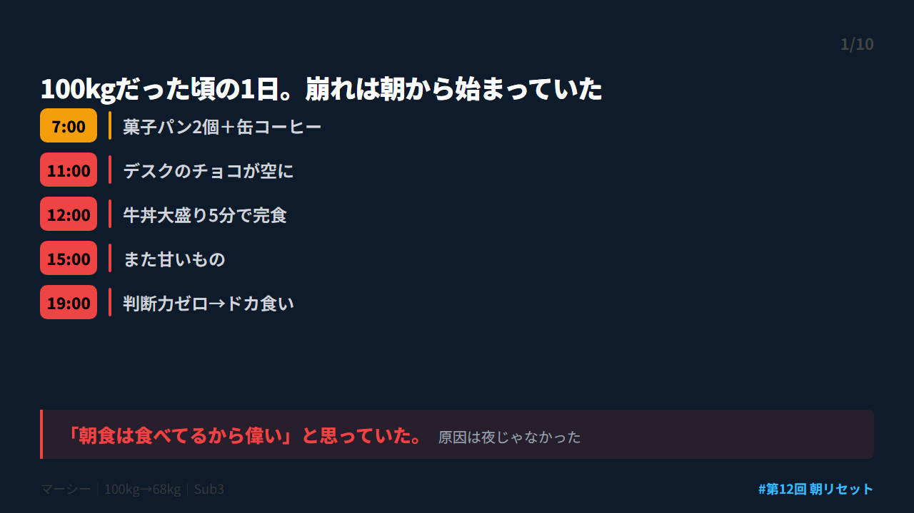
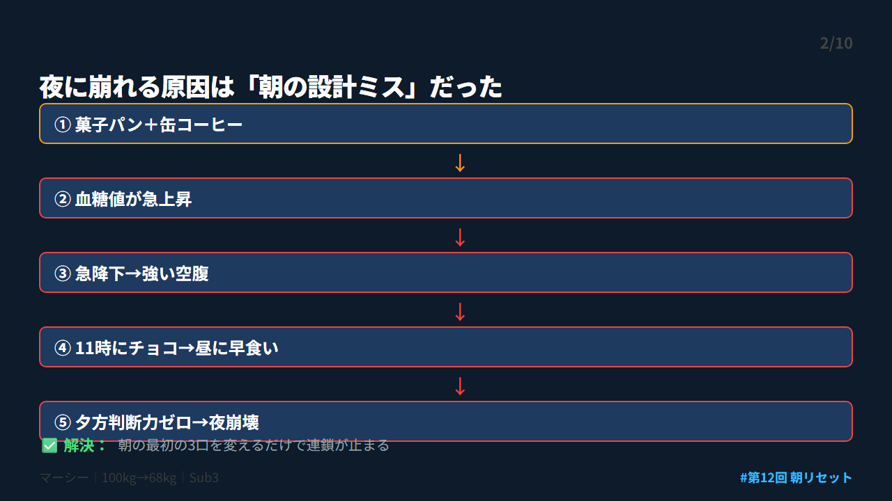
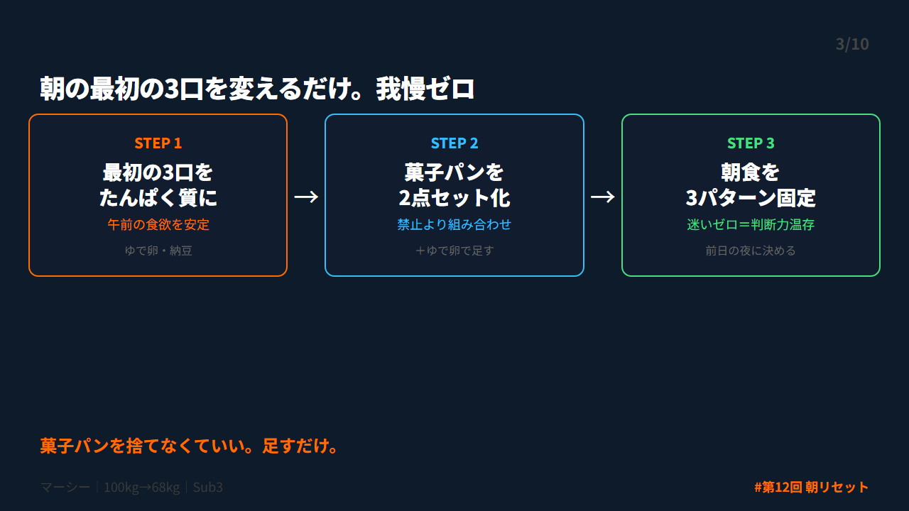
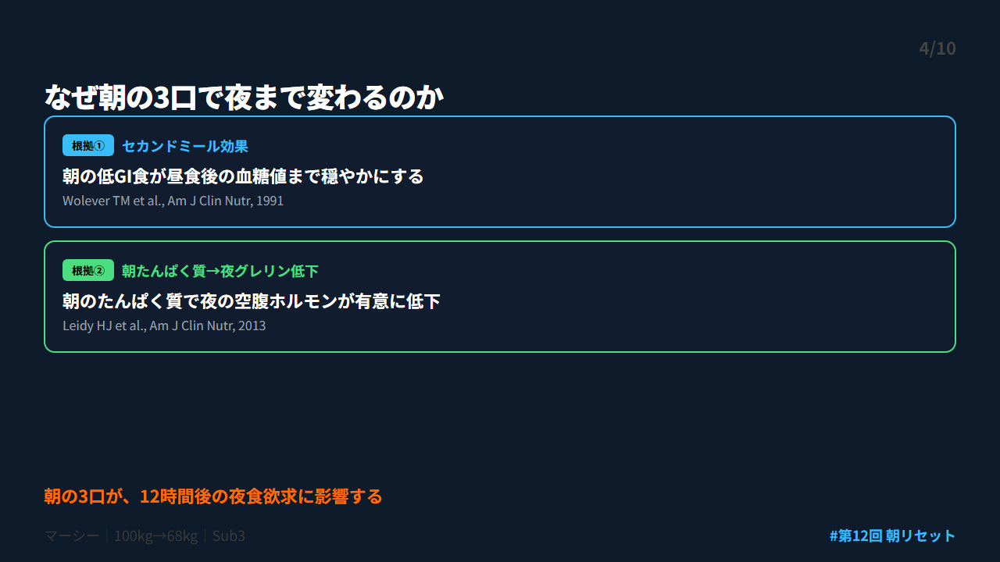
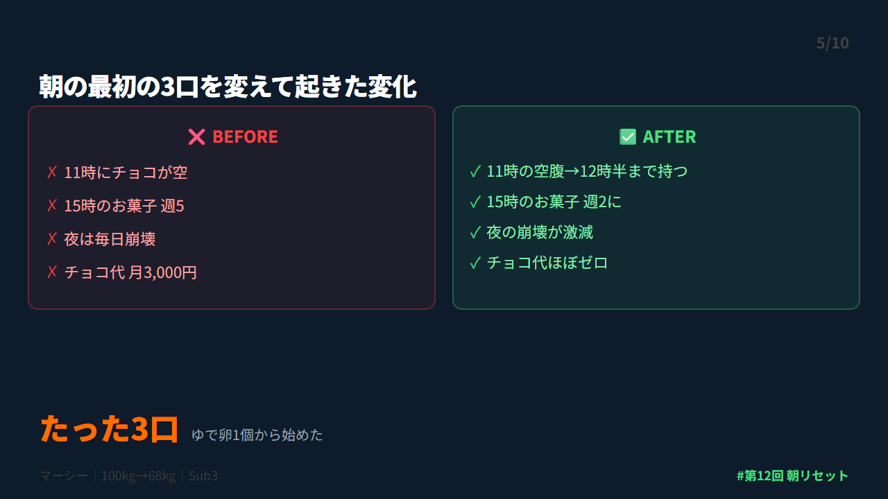
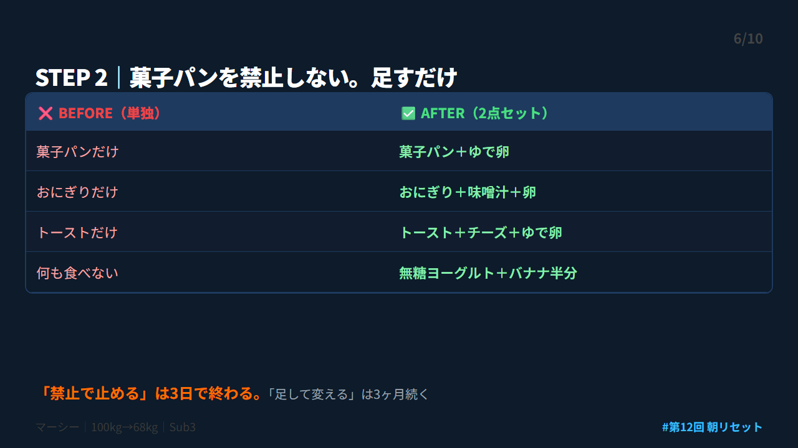
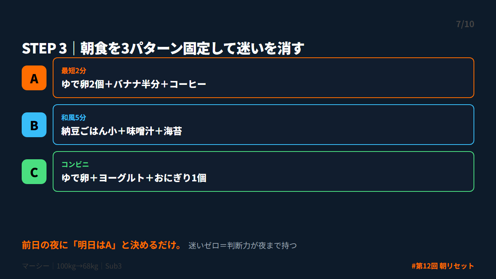
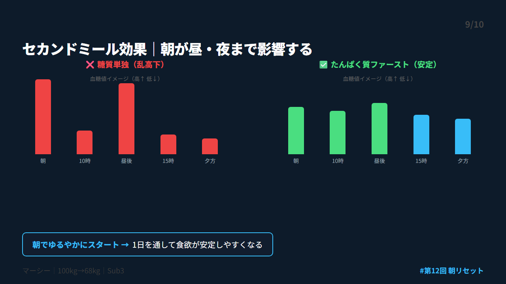

# 第 X投稿スレッド（10本）

## 投稿1/10｜共感

```
100kgだった頃の朝。
缶コーヒー＋菓子パン2個。
「朝食は食べてる。偉い」と思ってた。

でも11時にはチョコが空。
昼は牛丼大盛りを5分で流し込む。
夜は「今日くらいいいか」。

翌朝、体重計で自己嫌悪。
原因は夜じゃなかった。朝だった。

↓続き（2/10）
```



---

## 投稿2/10｜原因

```
菓子パン＋缶コーヒーの朝食。
糖質だけが一気に入る。

血糖値が急上昇→急降下。
この急降下が11時の「甘いもの欲しい」の正体。

夕方には判断力がゼロ。
コンビニに吸い込まれる。

夜の崩れは、朝で仕込まれていた。

↓続き（3/10）
```



---

## 投稿3/10｜解決策

```
朝食を変えて夜の食欲が減った方法。

① 最初の3口をたんぱく質にする
② 菓子パンを禁止せず2点セット化
③ 朝食を3パターン固定する

菓子パンを捨てなくていい。
足すだけ。
我慢ゼロ。設計だけ。

↓続き（4/10）
```



---

## 投稿4/10｜仕組み

```
なぜ朝の3口で夜まで変わるのか。

①セカンドミール効果（Wolever, 1991）
朝に低GI食を摂ると昼食後の血糖値まで穏やかになる。

②朝のたんぱく質→夜の食欲ホルモン低下（Leidy, 2013）
朝のたんぱく質で夜のグレリンが有意に低下。

朝の3口が12時間後に効く。

↓続き（5/10）
```



---

## 投稿5/10｜効果

```
朝食を変えて起きたこと：

❌ BEFORE
・11時にチョコ→空
・15時にお菓子 週5
・夜は毎日崩壊

✅ AFTER
・11時の空腹が12時半まで持つ
・15時のお菓子 週5→週2
・夜の崩壊が激減

チョコ代だけで月3,000円の節約。

↓続き（6/10）
```



---

## 投稿6/10｜設計

```
STEP 2｜菓子パンを禁止しない。

菓子パンだけ → 菓子パン＋ゆで卵
おにぎりだけ → おにぎり＋味噌汁＋卵
トーストだけ → トースト＋チーズ＋ゆで卵

量は変えない。足すだけ。
「禁止で止める」は3日で終わる。
「足して変える」は3ヶ月続く。

↓続き（7/10）
```



---

## 投稿7/10｜実践

```
STEP 3｜朝食を3パターンに固定する。

A（最短2分）：ゆで卵2個＋バナナ半分＋コーヒー
B（和風5分）：納豆ごはん小＋味噌汁＋海苔
C（コンビニ）：ゆで卵＋ヨーグルト＋おにぎり

前日の夜に「明日はA」と決めるだけ。
迷いがゼロになると判断力が夜まで持つ。

↓続き（8/10）
```



---

## 投稿8/10｜復帰

```
それでも朝が崩れる日はある。
僕も月3〜4回は菓子パン単独になる。

崩れた朝のルール：
① 責めない
② 昼の最初の1口を主菜にする
③ 15時にナッツ＋コーヒー

朝が崩れても昼でリセット完了。
8勝6敗でOK。

↓続き（9/10）
```


---

## 投稿9/10｜深掘り

```
セカンドミール効果の面白い点。

朝食は「朝だけに効く」んじゃない。
昼・夕方・夜まで連鎖的に影響する。

朝に糖質単独で乱高下させると、
その波が1日中続く。

逆に朝でゆるやかにスタートすれば、
1日を通して食欲が安定しやすくなる。

↓続き（10/10）
```



---

## 投稿10/10｜今夜やること

```
【まとめ｜朝リセット3ステップ】

✅ 最初の3口をたんぱく質に
✅ 菓子パンを禁止せず足すだけ
✅ 朝食を3パターン固定

今夜やること1つだけ：
→ ゆで卵を2個、茹でてください

あなたは意志が弱いんじゃない。
朝の設計を変えるだけで夜が変わる。

詳しくはnoteに書きました👇
https://note.com/mash_anti_metabo
```


---


